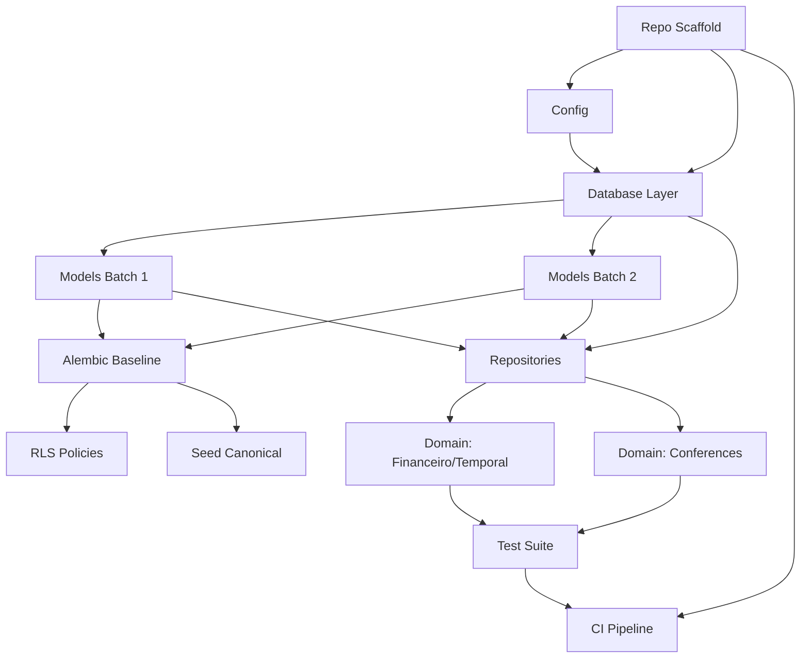

# Week 1: Foundation — Milestones & GitHub Issues (Docker-First, AWS in Week 4)

## Milestone: **Week 1 — Foundation (PostgreSQL + SQLAlchemy + RLS + CI/CD, Local Docker)**

**Target Date**: 7 days from start
**Success Criteria**:
- [ ] New repo `bancaemdia-api` scaffolded with all tooling
- [ ] **Local Docker**: PostgreSQL 16 + Redis via `docker-compose.yml` (no AWS yet)
- [ ] All 28 tables migrated via Alembic baseline + native partitioning
- [ ] SQLAlchemy 2.x async models for all entities
- [ ] RLS policies enforced on all per-user tables (CI verified via Testcontainers)
- [ ] `conferir_numeros.py` passes on migrated schema
- [ ] GitHub Actions: `test → build` green (deploy to AWS moved to Week 4)

---

## GitHub Issues (13 issues — removed AWS provisioning, simplified CI/CD)

### Issue 1: Repository Scaffold & Tooling
**Labels**: `week-1`, `infra`, `setup`
**Size**: M (2-3 hours)

**Tasks**:
- [ ] Create `bancaemdia-api` repo (already done: https://github.com/pradyumna-001/bancaemdia-api)
- [ ] `pyproject.toml` with Poetry, Python 3.12+, dependencies:
  - **Runtime**: `fastapi`, `uvicorn[standard]`, `sqlalchemy[asyncio]>=2.0`, `asyncpg`, `alembic`, `pydantic-settings`, `pydantic[email]`, `python-jose[cryptography]`, `passlib[bcrypt]`, `httpx`, `redis`, `celery`, `pybreaker`, `tenacity`, `slowapi`, `structlog`, `prometheus-client`, `opentelemetry-api`, `opentelemetry-sdk`, `opentelemetry-instrumentation-fastapi`, `opentelemetry-instrumentation-sqlalchemy`, `opentelemetry-instrumentation-httpx`, `opentelemetry-instrumentation-redis`, `opentelemetry-exporter-otlp`
  - **Dev**: `pytest`, `pytest-asyncio`, `pytest-xdist`, `pytest-cov`, `ruff`, `mypy`, `pre-commit`, `testcontainers[postgresql,redis]`, `pgloader`
- [ ] `Dockerfile` (multi-stage: builder → runtime non-root)
- [ ] `docker-compose.yml` (local dev: **API + PostgreSQL 16 + Redis** — single command `docker compose up`)
- [ ] `Makefile` shortcuts: `make test`, `make lint`, `make typecheck`, `make migrate`, `make dev`, `make seed`, `make up`, `make down`, `make logs`
- [ ] `.pre-commit-config.yaml` (ruff, mypy, pytest)
- [ ] `.gitignore` (`.env`, `__pycache__`, `.pytest_cache`, `.mypy_cache`, `dist`, `build`, `*.egg-info`)

**Acceptance**: `make up && make lint && make typecheck && make test` passes locally

---

### Issue 2: Configuration System (Pydantic Settings)
**Labels**: `week-1`, `config`
**Size**: S (1-2 hours)

**File**: `src/bancaemdia/config.py`

**Tasks**:
- [ ] `Settings` class with all env-driven config:
  - `DATABASE_URL` (primary), `DATABASE_URL_REPLICA` (read replica — same as primary for local dev)
  - `REDIS_URL`
  - `ANTHROPIC_API_KEY`, `ANTHROPIC_TIMEOUT`, `ANTHROPIC_MAX_RETRIES`
  - `JWT_SECRET_KEY`, `JWT_ALGORITHM=RS256`, `JWT_JWKS_URL`, `JWT_AUDIENCE`, `JWT_ISSUER`
  - `APP_ENV=development|staging|production`
  - `LOG_LEVEL=INFO`, `OTEL_EXPORTER_OTLP_ENDPOINT`
  - `RATE_LIMIT_STORAGE=memory://` (Redis in Week 2)
  - `STATEMENT_TIMEOUT_PRIMARY=5000`, `STATEMENT_TIMEOUT_REPLICA=30000`
- [ ] Validation: required fields, URL formats, positive ints
- [ ] `get_settings()` singleton with `@lru_cache`
- [ ] `.env.example` with all vars documented

**Acceptance**: `Settings()` loads from `.env`; validation errors on missing required

---

### Issue 3: Database Layer — Async Engine, Session, RLS Middleware
**Labels**: `week-1`, `database`, `rls`
**Size**: L (4-6 hours)

**Files**: 
- `src/bancaemdia/database.py`
- `src/bancaemdia/middleware/rls.py`

**Tasks**:
- [ ] `create_async_engine` with pool: `pool_size=10`, `max_overflow=20`, `pool_pre_ping=True`, `pool_recycle=300`
- [ ] `async_sessionmaker` with `expire_on_commit=False`
- [ ] **RLS Middleware**: ASGI middleware that:
  - Extracts `usuario_id` from request state (set by auth)
  - Executes `SET LOCAL app.current_user_id = '<usuario_id>'` on session
  - Resets on response/exception
- [ ] Dependency: `get_db() → AsyncSession` (yields session with RLS set)
- [ ] Health check: `SELECT 1` on primary (replica = same for local)

**Acceptance**: 
- `async with get_db() as session: await session.execute(text("SELECT current_setting('app.current_user_id')"))` returns test user ID
- Cross-tenant query returns 0 rows

---

### Issue 4: SQLAlchemy Models — Core Entities (Batch 1)
**Labels**: `week-1`, `models`, `domain`
**Size**: L (6-8 hours)

**Files**: `src/bancaemdia/models/*.py`

**Entities** (from ADR-002 Appendix A):
- [ ] `Usuario` — `id`, `email`, `nome`, `criado_em`, `ativo`
- [ ] `Banca` — `id`, `usuario_id`, `nome`, `saldo_inicial_centavos`, `criado_em`
- [ ] `ContaCasa` — `id`, `usuario_id`, `casa_id`, `apelido`, `desde`, `ate`, `ativa`
- [ ] `Unidade` — `id`, `usuario_id`, `valor_centavos`, `vigente_de`, `vigente_ate`
- [ ] `Movimento` — `id`, `usuario_id`, `conta_casa_id`, `tipo`, `valor_centavos`, `ocorrido_em`, `descricao`
- [ ] `Aposta` — `id`, `usuario_id`, `chave`, `chat_id`, `message_id`, `ordem_na_mensagem`, `midia_hash`, `banca_id`, `conta_casa_id`, `tipster_id`, `time_casa_id`, `time_fora_id`, `mercado_id`, `competicao_id`, `data_aposta`, `data_jogo`, `stake_unidades`, `stake_centavos`, `valor_aposta_centavos`, `odd`, `retorno_centavos`, `estado`, `origem`, `freebet`, `duvida_de_par`, `parceira_chave`, `revisao_grave`, `criada_em`, `atualizada_em`
- [ ] `Evento` — `id`, `usuario_id`, `tipo`, `payload_json`, `fonte`, `confianca`, `chat_id`, `message_id`, `criado_em`, `aposta_chave`

**Requirements**:
- All PK: `BIGSERIAL` (or `BIGINT GENERATED BY DEFAULT AS IDENTITY`)
- `centavos` fields: `BIGINT` (never float/decimal)
- Temporal: `vigente_de`, `vigente_ate`, `desde`, `ate` — `TIMESTAMPTZ`
- JSONB: `Evento.payload_json`
- Partitioned tables: `Evento`, `Movimento` — `PARTITION BY RANGE (criada_em/ocorrido_em)`
- Indexes per ADR-002 Appendix B
- CHECK constraints: `freebet = 0 OR stake_centavos = 0`, `stake_centavos >= 0`, `estado IN (...)`, `origem IN (...)`

**Acceptance**: Models import without error; `Base.metadata.create_all()` creates correct DDL

---

### Issue 5: SQLAlchemy Models — Canonical & Support (Batch 2)
**Labels**: `week-1`, `models`, `canonical`
**Size**: M (3-4 hours)

**Entities**:
- [ ] `Casa` — `id`, `nome`, `dominio`, `ativa`
- [ ] `Esporte` — `id`, `nome`, `icone`
- [ ] `Competicao` — `id`, `esporte_id`, `nome`, `pais`
- [ ] `Time` — `id`, `nome`, `apelidos` (JSONB array)
- [ ] `Mercado` — `id`, `nome`, `familia` (ENUM: GOLS, CARTOES, ESCANTEIOS, RESULTADO, HANDICAP, JOGADOR, AMBAS_MARCAM, OUTRO)
- [ ] `Tipster` — `id`, `nome`, `apelidos` (JSONB array)
- [ ] `Apelido` — `id`, `entidade_tipo`, `entidade_id`, `nome`, `confirmado`
- [ ] `Mensagem` — `id`, `chat_id`, `message_id`, `autor_bruto`, `texto`, `data`, `versao_atual`
- [ ] `MensagemVersao` — `id`, `mensagem_id`, `texto`, `criado_em`
- [ ] `Midia` — `id`, `mensagem_id`, `hash`, `tipo`, `bytes`, `criado_em`
- [ ] `ExtracaoCache` — PK `(chat_id, message_id, versao_prompt)`, `resultado_json`, `criado_em`
- [ ] `ChamadaIA` — `id`, `usuario_id`, `modelo`, `tokens_entrada`, `tokens_saida`, `custo_usd`, `criado_em`
- [ ] `ColetaCasa` — `id`, `usuario_id`, `casa_id`, `identidade`, `hash_conteudo`, `bruto_json`, `recebido_em`, `processado_em`
- [ ] `ColetaToken` — `id`, `usuario_id`, `token_hash`, `ativo`, `criado_em`, `expira_em`
- [ ] `RevisaoPendente` — `id`, `usuario_id`, `midia_hash`, `motivo`, `extracao_bruta`, `criado_em`, `resolvido_em`

**Acceptance**: All models defined; FKs match ADR-002 Appendix A

---

### Issue 6: Alembic Baseline Migration (028 migrations → 1)
**Labels**: `week-1`, `migration`, `database`
**Size**: M (2-3 hours)

**Tasks**:
- [ ] `alembic init alembic` (async config in `env.py`)
- [ ] Generate baseline: `alembic revision --autogenerate -m "baseline_028_from_sqlite"`
- [ ] Review generated migration — ensure:
  - All 28 tables created
  - Partitioning on `eventos`, `movimentos`, `mensagem_versoes`, `coletas_casa`
  - All indexes from ADR-002 Appendix B
  - All CHECK constraints
  - RLS policies (or separate migration)
- [ ] `alembic upgrade head` on local PG (via `docker compose up -d postgres`) → no errors
- [ ] `pg_partman` setup for monthly partitions (3 months ahead)

**Acceptance**: `alembic upgrade head` creates schema matching current SQLite 28 migrations

---

### Issue 7: RLS Policies Migration
**Labels**: `week-1`, `rls`, `security`
**Size**: M (2-3 hours)

**Tasks**:
- [ ] Create migration `002_rls_policies.sql` (or include in baseline)
- [ ] Enable RLS on all per-user tables: `usuarios`, `bancas`, `contas_casa`, `unidades`, `movimentos`, `apostas`, `eventos`, `revisao_pendente`, `coletas_casa`, `coleta_token`, `mensagens`, `mensagem_versoes`, `midias`, `extracoes_cache`, `chamadas_ia`
- [ ] Policy: `USING (usuario_id = current_setting('app.current_user_id')::int)`
- [ ] `FOR ALL` (SELECT, INSERT, UPDATE, DELETE)
- [ ] Canonical tables (`casas`, `esportes`, `competicoes`, `times`, `mercados`, `tipsters`, `apelidos`) — **no RLS** (shared)
- [ ] Test: `SET LOCAL app.current_user_id = '1'; SELECT * FROM apostas;` → only user 1 rows

**Acceptance**: `tests/test_rls.py` passes (see Issue 12)

---

### Issue 8: Canonical Data Seeding
**Labels**: `week-1`, `data`, `seed`
**Size**: S (1-2 hours)

**Files**: `scripts/seed_canonical.py`

**Tasks**:
- [ ] Seed `casas` (known: bet365, Betano, Betfair, Sportingbet, Novibet, Vupi, Esportes da Sorte, etc.)
- [ ] Seed `esportes` (Futebol, Basquete, Tênis, MMA, F1, Futebol Americano, Beisebol, Vôlei, Handebol, E-sports)
- [ ] Seed `mercados` (78 canonical from `MERCADOS_CANONICOS` in `planilhador/dominio/normalizacao.py`)
- [ ] Seed `competicoes` (major leagues)
- [ ] Seed `times` (31 mapped from `TIMES_MAP`)
- [ ] Idempotent: `ON CONFLICT DO NOTHING`

**Acceptance**: `make seed` runs without duplicates; canonical data queryable

---

### Issue 9: Repository Layer — Core Repos
**Labels**: `week-1`, `repositories`, `data-access`
**Size**: L (4-6 hours)

**Files**: `src/bancaemdia/repositories/*.py`

**Repos to implement** (thin, no business logic):
- [ ] `UsuarioRepo` — get_by_id, get_by_email, create
- [ ] `ApostaRepo` — get_by_chave, list_by_usuario (with filters), upsert_idempotent, update_estado
- [ ] `EventoRepo` — append, list_by_aposta_chave, list_by_usuario
- [ ] `MovimentoRepo` — append, list_by_usuario, list_by_conta_casa
- [ ] `ContaCasaRepo` — get_by_usuario_casa, create, update_ate
- [ ] `UnidadeRepo` — get_vigente(usuario_id, data), create
- [ ] `ColetaCasaRepo` — get_by_identidade, upsert_idempotent
- [ ] `RevisaoPendenteRepo` — create, list_by_usuario, resolve

**Pattern**: All methods take `session: AsyncSession`; return domain models (not ORM)

**Acceptance**: Unit tests with Testcontainers PG pass

---

### Issue 10: Domain Logic — Financeiro & Temporal (Port from planilhador)
**Labels**: `week-1`, `domain`, `porting`
**Size**: L (4-6 hours)

**Files**: `src/bancaemdia/domain/financeiro.py`, `src/bancaemdia/domain/temporal.py`

**Port from**: `planilhador/dominio/projecao.py`, `planilhador/dominio/caixa.py`

**Tasks**:
- [ ] `lucro = retorno - stake` (single formula)
- [ ] Freebet: `stake_centavos = 0`, `valor_aposta_centavos` = facial
- [ ] Estado → Retorno mapping:
  - `GREEN`: `stake * odd`
  - `RED`: `0`
  - `ANULADA`: `stake`
  - `MEIO_GREEN`: `stake/2 * odd + stake/2`
  - `MEIO_RED`: `stake/2`
  - `CASHOUT`: valor informado
- [ ] `saldo(usuario_id, casa_id, data_corte)` — temporal: only bets >= first movimento of that casa
- [ ] `unidade_vigente(usuario_id, data)` — `vigente_de <= data < vigente_ate`
- [ ] `conta_casa_vigente(usuario_id, casa_id, data)` — `desde <= data < ate`
- [ ] ROI denominator: freebet enters by `valor_aposta_centavos` (face value)
- [ ] `roi` and `roi_sem_bonus` side by side

**Acceptance**: `tests/test_financeiro.py` passes with known fixtures (centavo-exact)

---

### Issue 11: Domain Logic — 14 Conferences (Port from planilhador)
**Labels**: `week-1`, `domain`, `porting`, `conferences`
**Size**: L (4-6 hours)

**File**: `src/bancaemdia/domain/conferencias.py`

**Port from**: `planilhador/dominio/conferencias.py` + `planilhador/dominio/materializar.py`

**14 Conferences** (ADR-001, AGENTS.md §6):
1. Coerência das odds (múltipla: produto = total; simples: seleção = total) — 🔒 PROVA
2. Imagem legível — ERRO
3. Campos essenciais (odd total + ≥1 seleção) — ERRO
4. Odd ≠ linha do mercado — ERRO (OCR) / CONFIRMAR (IA)
5. Evento plausível — ERRO
6. Data do jogo próxima da mensagem — ERRO
7. Odd turbinada: riscada é menor — ERRO
8. Odd na faixa 1.01–1000 — ERRO
9. Teto de odd (50/perna, 500/múltipla) — CONFIRMAR
10. Texto aproveitável — TEXTO
11. Descrição aproveitável (seleção não é só número) — TEXTO
12. Confiança declarada pelo modelo — DÚVIDA
13. Casa da imagem × domínio do link — FRACA
14. Odd da imagem × odd citada no texto — FRACA

**Output**: `ConferenciaResultado` with `forca` (PROVA|ERRO|CONFIRMAR|TEXTO|DUVIDA|FRACA), `mensagem`, `campo`

**Acceptance**: `tests/test_conferencias.py` passes with fixtures covering all 14

---

### Issue 12: Test Suite — RLS, Idempotency, Financeiro, Conferences, Replay
**Labels**: `week-1`, `testing`, `ci`
**Size**: L (4-6 hours)

**Files**: `tests/*.py`

**Required test files**:
- [ ] `tests/test_rls.py` — Cross-tenant isolation (User A cannot read User B)
- [ ] `tests/test_idempotency.py` — Duplicate re-send for 5 origins + coleta casa
- [ ] `tests/test_financeiro.py` — Centavo-exact calculations, freebet, temporal
- [ ] `tests/test_conferencias.py` — All 14 conferences with fixtures
- [ ] `tests/test_replay.py` — `conferir_numeros.py` logic on 5 test banks
- [ ] `tests/conftest.py` — Testcontainers PG + Redis fixtures, `pytest-xdist` config

**CI Config**: `pytest -n 8 --tb=short -q` in GitHub Actions (uses Testcontainers, no external services)

**Acceptance**: All tests pass locally and in CI; coverage > 80% on domain

---

### Issue 13: CI Pipeline — Test → Build (Deploy to AWS in Week 4)
**Labels**: `week-1`, `ci-cd`, `github-actions`
**Size**: M (2-3 hours)

**Files**: `.github/workflows/ci.yml`

**CI (`ci.yml`)**:
- [ ] Trigger: push/PR to main
- [ ] Jobs (parallel):
  - `lint`: `ruff check . && ruff format --check .`
  - `typecheck`: `mypy src/`
  - `test`: `pytest -n 8 --cov=src/bancaemdia --cov-fail-under=80`
- [ ] Testcontainers for PG + Redis (service containers in GitHub Actions)
- [ ] Artifact: coverage report, test results
- [ ] `docker build` verification (no push, just build)

**Acceptance**: Push to main → CI green (lint + typecheck + test + docker build)

---

## Week 4 Preview: AWS Deployment (Moved from Week 1)

**New Issue (Week 4)**: `infra-aws-provisioning` — Provision RDS Multi-AZ, ElastiCache, ECS Fargate, ALB, Secrets Manager
**New Issue (Week 4)**: `cd-pipeline` — GitHub Actions CD: build → push GHCR → deploy ECS staging → promote to prod
**New Issue (Week 4)**: `load-test-k6` — 50 users, 200 bets/day, P95<1s

---

## Dependency Graph



---

## Suggested Execution Order (Day by Day)

| Day | Issues | Notes |
|-----|--------|-------|
| 1 | 1, 2 | Scaffold + config (parallel) |
| 2 | 3, 4 | DB layer + Models Batch 1 |
| 3 | 5, 6 | Models Batch 2 + Alembic baseline |
| 4 | 7, 8 | RLS policies + Seed canonical |
| 5 | 9, 10 | Repositories + Domain financeiro |
| 6 | 11, 12 | Conferences + Test suite |
| 7 | 13 | CI Pipeline + integration verification |

---

## Ready to Create in GitHub?

Run this to create all 13 issues + 1 milestone:

```bash
# Prereqs: gh auth login, repo exists
cd /path/to/bancaemdia-api

# Create milestone
gh api repos/pradyumna-001/bancaemdia-api/milestones \
  -f title="Week 1 — Foundation (PostgreSQL + SQLAlchemy + RLS + CI/CD, Local Docker)" \
  -f description="Schema migrated, models working, tenant isolation enforced, pipeline green. AWS deployment in Week 4." \
  -f due_on="$(date -d '+7 days' -u +%Y-%m-%dT%H:%M:%SZ)"

# Then create each issue (see script below)
```

Want me to generate the `gh` CLI script to create all 13 issues at once?