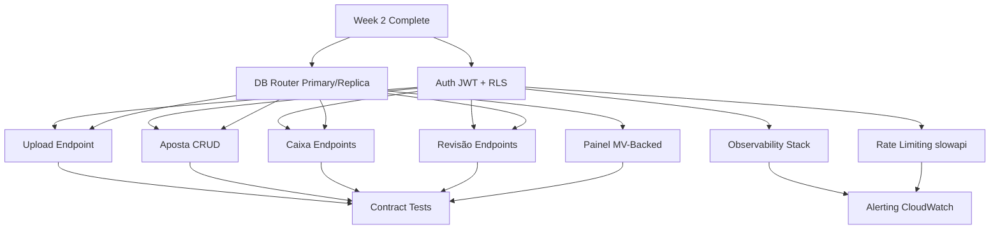

# Week 3: API Surface — Milestones & GitHub Issues

## Milestone: **Week 3 — API Surface (REST + Webhooks + Auth + Observability)**

**Target Date**: 7 days from Week 2 completion
**Depends on**: Week 2 Async Pipeline complete (Celery, extraction, materialization working)
**Success Criteria**:
- [ ] JWT auth (RS256, JWKS) with `usuario_id` in request state, RLS middleware integration
- [ ] Router: Primary for mutations (`POST/PUT/PATCH/DELETE`), Replica for reads (`GET /painel, /apostas, /export`)
- [ ] Read-after-write: 5s Primary routing after write by same session
- [ ] Endpoints: `/upload` (export), `/coleta` (casa webhook), `/apostas` CRUD, `/caixa` CRUD, `/revisao`, `/painel`
- [ ] OpenAPI spec generated; contract tests pass
- [ ] Full OTel stack: auto-instrument + custom spans, structlog JSON, Prometheus metrics, health/ready
- [ ] Rate limiting: `slowapi` by `usuario_id` (`/coleta` 10/min, `/api` 100/min, `/upload` 1/5min)
- [ ] Alerting: CloudWatch alarms on P99>1s, error>1%, lag>30s, queue>100, breaker open
- [ ] All endpoints return structured JSON errors; rate limit headers present

---

## GitHub Issues (11 issues)

### Issue 1: Authentication — JWT RS256 + JWKS + RLS Integration
**Labels**: `week-3`, `auth`, `security`
**Size**: L (5-6 hours)

**Files**:
- `src/bancaemdia/auth/jwt.py`
- `src/bancaemdia/auth/middleware.py`
- `src/bancaemdia/middleware/rls.py` (update from Week 1)
- `src/bancaemdia/config.py` (add JWT settings)

**Tasks**:
- [ ] `Settings` additions: `JWT_SECRET_KEY`, `JWT_ALGORITHM=RS256`, `JWT_JWKS_URL`, `JWT_AUDIENCE`, `JWT_ISSUER`, `JWT_EXPIRY_MINUTES=60`
- [ ] JWT validation middleware:
  - Extract `Authorization: Bearer <token>` header
  - Verify signature via JWKS (cache keys, refresh on rotation)
  - Validate `exp`, `aud`, `iss`, `sub` (maps to `usuario_id`)
  - Set `request.state.usuario_id = token.sub`
  - Return 401 with `WWW-Authenticate: Bearer` on failure
- [ ] Integration with RLS middleware: `SET LOCAL app.current_user_id = '<usuario_id>'` runs after auth
- [ ] Token refresh endpoint: `POST /auth/refresh` (rotate access + refresh tokens)
- [ ] Admin impersonation: `X-Impersonate-User` header (admin only, audit logged)
- [ ] Tests: valid token → 200; expired → 401; wrong audience → 401; missing → 401

**Acceptance**: `curl -H "Authorization: Bearer <valid>" /api/v1/apostas` → 200 with user's data only

---

### Issue 2: Database Router — Primary/Replica Routing Middleware
**Labels**: `week-3`, `database`, `router`, `read-replica`
**Size**: M (3-4 hours)

**Files**:
- `src/bancaemdia/database.py` (add replica engine + session)
- `src/bancaemdia/middleware/router.py`
- `src/bancaemdia/config.py` (add `DATABASE_URL_REPLICA`)

**Tasks**:
- [ ] Two async engines: `primary_engine` (writes), `replica_engine` (reads)
- [ ] Two session makers: `PrimarySession`, `ReplicaSession`
- [ ] **Router Middleware** (runs after auth, before route):
  - Mutating methods (`POST`, `PUT`, `PATCH`, `DELETE`) → `PrimarySession`
  - Safe methods (`GET`, `HEAD`, `OPTIONS`) → `ReplicaSession`
  - **Exceptions** (force Primary):
    - `GET /api/v1/apostas/{chave}` if written by same session < 5s ago
    - `GET /api/v1/painel` if `?fresh=true` query param
    - Any route with `X-Read-Replica: false` header
- [ ] Read-after-write tracking: in-memory `TTLCache` (user_id → set of written keys, TTL 5s)
- [ ] Replica lag check: `SELECT pg_last_xact_replay_timestamp()`; if lag > 30s, log warning
- [ ] Dependency overrides: `get_db_primary()`, `get_db_replica()` for explicit control

**Acceptance**: 
- `POST /apostas` → uses primary (verified via `current_setting('app.current_user_id')` on primary)
- `GET /apostas` → uses replica (verified via `pg_is_in_recovery()` = true)
- User creates bet → immediately visible via `GET /apostas/{chave}` for 5s

---

### Issue 3: Upload Endpoint — Telegram Export Ingestion
**Labels**: `week-3`, `api`, `upload`, `telegram`
**Size**: L (5-6 hours)

**Files**:
- `src/bancaemdia/api/v1/upload.py`
- `src/bancaemdia/domain/upload.py` (parsing logic port from `planilhador/parser/`)
- `src/bancaemdia/workers/extraction.py` (chain trigger)

**Tasks**:
- [ ] `POST /api/v1/upload`:
  - Multipart: `file` (ZIP/JSON), optional `chat_filter` (list of chat_ids)
  - Max size: 50MB (configurable)
  - Validates: Telegram export format (messages.json + photos/)
  - Creates `Upload` record: `id`, `usuario_id`, `filename`, `status`, `total_messages`, `estimated_bets`, `estimated_cost_usd`, `criado_em`
  - Returns `202 {job_id, estimated_bets, estimated_cost_usd, status_url}`
- [ ] Background processing:
  - Parse export → extract messages with photos
  - For each message: create `Mensagem` + `Midia` records
  - Enqueue `extraction` task per bilhete (chain: extract → materialize)
  - Update `Upload` status: `pending` → `processing` → `completed`/`failed`
- [ ] Webhook: `POST /webhook/upload-complete` (internal, called by worker)
  - Payload: `{job_id, status, bets_processed, bets_failed, cost_usd}`
  - Updates `Upload` record
- [ ] Status endpoint: `GET /api/v1/upload/{job_id}` → progress, results
- [ ] Cost estimation: `messages_with_photos * cost_per_bet` (from `precos.py`)
- [ ] Rate limit: 1 upload per 5 min per user

**Acceptance**: Upload 10-message export → 202 response; webhook fires; bets appear in DB; status shows completed

---

### Issue 4: Aposta CRUD Endpoints — Full Lifecycle
**Labels**: `week-3`, `api`, `apostas`, `crud`
**Size**: L (5-6 hours)

**Files**:
- `src/bancaemdia/api/v1/apostas.py`
- `src/bancaemdia/domain/aposta_service.py` (business logic)

**Endpoints**:
- [ ] `GET /api/v1/apostas` — List with filters:
  - Query params: `desde`, `ate`, `estado`, `casa_id`, `tipster_id`, `mercado_id`, `competicao_id`, `origem`, `revisao_grave`, `page`, `page_size` (max 100)
  - Uses **Replica** (router middleware)
  - Response: `{data: [...], pagination: {page, page_size, total}}`
- [ ] `GET /api/v1/apostas/{chave}` — Detail:
  - Uses **Primary** if written < 5s ago (router), else Replica
  - Response: full `Aposta` + `Selecoes` + `Eventos` + `RevisaoPendente` (if any)
- [ ] `PATCH /api/v1/apostas/{chave}` — Edit (user corrections):
  - **Primary** + `FOR UPDATE` (router + repo)
  - Updatable fields: `casa_id`, `tipster_id`, `time_casa_id`, `time_fora_id`, `mercado_id`, `odd`, `stake_unidades`, `data_jogo`, `selecoes`, `estado` (if `revisao_grave`)
  - Creates `Evento` tipo `APOSTA_ATUALIZADA` with diff
  - Returns updated `Aposta`
- [ ] `POST /api/v1/apostas/{chave}/resultado` — Settle result:
  - **Primary** + `FOR UPDATE` on `Aposta` + `ContaCasa`
  - Body: `{estado: GREEN|RED|ANULADA|MEIO_GREEN|MEIO_RED|CASHOUT, retorno_centavos?, cashout_valor_centavos?}`
  - Validates: `CASHOUT` requires `cashout_valor_centavos`; others compute `retorno` from formula
  - Creates `Evento` tipo `RESULTADO_REGISTRADO` + `Movimento` (if cashout/green/red)
  - Updates `Aposta.estado`, `retorno_centavos`, `atualizada_em`
  - Triggers projection refresh
- [ ] `DELETE /api/v1/apostas/{chave}` — Soft delete (mark `revisao_grave=true`, create `Evento` `APOSTA_EXCLUIDA`)
- [ ] `POST /api/v1/apostas` — Manual create (optional, for manual origin)

**Acceptance**: All CRUD operations work; RLS enforced; events appended; projection updates

---

### Issue 5: Caixa Endpoints — Depósitos, Saques, Transferências
**Labels**: `week-3`, `api`, `caixa`, `financeiro`
**Size**: M (3-4 hours)

**Files**:
- `src/bancaemdia/api/v1/caixa.py`
- `src/bancaemdia/domain/caixa_service.py`

**Endpoints**:
- [ ] `POST /api/v1/caixa` — Create movimento:
  - Body: `{tipo: DEPOSITO|SAQUE|TRANSFERENCIA|AJUSTE, conta_casa_id?, valor_centavos, ocorrido_em, descricao}`
  - **Primary** + `FOR UPDATE` on `ContaCasa` (if `conta_casa_id` provided)
  - Validates: `DEPOSITO/SAQUE` → `conta_casa_id` required; `TRANSFERENCIA` → `conta_casa_id` + `conta_casa_destino_id`
  - Creates `Movimento` + `Evento` tipo `MOVIMENTO_CAIXA`
  - Updates `ContaCasa` balance (denormalized for speed)
- [ ] `GET /api/v1/caixa` — List movimentos:
  - Filters: `conta_casa_id`, `tipo`, `desde`, `ate`, `page`, `page_size`
  - Uses **Replica**
- [ ] `GET /api/v1/caixa/saldo` — Current balances:
  - Per `ContaCasa`: `saldo_atual_centavos` (denormalized)
  - Per `Banca`: `saldo_total_centavos` (sum of contas_casa + banca.saldo_inicial)
  - Temporal: `saldo(usuario_id, casa_id, data_corte)` from domain
  - Uses **Replica** (denormalized cols updated on Primary)
- [ ] `GET /api/v1/caixa/extrato` — Consolidated statement (movimentos + apostas settled)

**Acceptance**: Movimentos created atomically; balances correct; temporal queries work

---

### Issue 6: Revisão Pendente Endpoints — Review Queue
**Labels**: `week-3`, `api`, `revisao`, `queue`
**Size**: M (3-4 hours)

**Files**:
- `src/bancaemdia/api/v1/revisao.py`
- `src/bancaemdia/domain/revisao_service.py`

**Endpoints**:
- [ ] `GET /api/v1/revisao` — List pending reviews:
  - Filters: `motivo`, `desde`, `ate`, `page`, `page_size`
  - Uses **Replica**
  - Response includes: `midia_hash`, `motivo`, `extracao_bruta`, `criado_em`, `foto_url` (signed S3 URL)
- [ ] `GET /api/v1/revisao/{id}` — Detail with image
- [ ] `POST /api/v1/revisao/{id}/resolver` — Resolve review:
  - Body: `{acao: CORRIGIR|DESCARTAR, aposta_corrigida?}`
  - **Primary** + transaction
  - `CORRIGIR`: creates/updates `Aposta` from `aposta_corrigida`, marks `RevisaoPendente.resolvido_em`
  - `DESCARTAR`: marks resolved, no aposta created
  - Creates `Evento` tipo `REVISAO_RESOLVIDA`
- [ ] `GET /api/v1/revisao/stats` — Counts by motivo, aging

**Acceptance**: Review queue visible; resolution creates correct aposta or discards; events logged

---

### Issue 7: Painel Endpoint — Dashboard Aggregates (MV-Backed)
**Labels**: `week-3`, `api`, `painel`, `analytics`
**Size**: L (5-6 hours)

**Files**:
- `src/bancaemdia/api/v1/painel.py`
- `src/bancaemdia/domain/painel.py` (queries against MVs)
- `alembic/versions/xxx_materialized_views.py` (migration)

**Tasks**:
- [ ] **Materialized Views** (migration):
  - `mv_painel_resumo` — ROI, lucro, saldo, total_bets, win_rate per usuario
  - `mv_painel_por_casa` — aggregates per casa
  - `mv_painel_por_tipster` — aggregates per tipster
  - `mv_painel_por_mercado` — aggregates per mercado/familia
  - `mv_painel_por_periodo` — daily/weekly/monthly time series
  - `mv_painel_evolucao_banca` — bankroll evolution over time
  - All MVs: `REFRESH CONCURRENTLY` every 5 min via `pg_cron`
- [ ] `GET /api/v1/painel` — Main dashboard:
  - Query params: `periodo` (7d|30d|90d|1y|all), `casa_id`, `tipster_id`, `mercado_id`
  - Uses **Replica** (router)
  - Response: `{resumo, por_casa, por_tipster, por_mercado, evolucao, atualizado_em}`
  - Badge: `atualizado_há_Xs` = `now() - pg_last_xact_replay_timestamp()`
- [ ] `GET /api/v1/painel/export` — Excel export (streaming, uses Replica)
- [ ] `GET /api/v1/painel/metricas` — Raw metrics for charts (Chart.js compatible)
- [ ] Cache-Control: `public, max-age=30, stale-while-revalidate=60`

**Acceptance**: Painel loads < 500ms (P95); data < 30s stale; badge shows correct lag

---

### Issue 8: Observability Stack — OTel + Structlog + Prometheus + Health
**Labels**: `week-3`, `observability`, `otel`, `logging`
**Size**: L (5-6 hours)

**Files**:
- `src/bancaemdia/observability/logging.py`
- `src/bancaemdia/observability/metrics.py`
- `src/bancaemdia/observability/tracing.py`
- `src/bancaemdia/observability/health.py`
- `src/bancaemdia/main.py` (wire up)

**Tasks**:
- [ ] **Structured Logging** (`structlog`):
  - JSON output to stdout
  - Fields: `timestamp`, `level`, `logger`, `message`, `request_id`, `usuario_id`, `trace_id`, `span_id`
  - Middleware: binds `request_id` (UUID), `usuario_id` (from auth) to log context
- [ ] **Prometheus Metrics** (`prometheus-fastapi-instrumentator` + custom):
  - HTTP: `http_request_duration_seconds{method,path,status}`, `http_requests_total`
  - Business: `apostas_created_total{origem,estado}`, `caixa_movimentos_total{tipo}`
  - Extraction: (from Week 2)
  - System: `process_cpu_seconds`, `process_memory_bytes`
- [ ] **OpenTelemetry Tracing**:
  - Auto-instrument: `opentelemetry-instrument` (FastAPI, SQLAlchemy, httpx, Redis)
  - Custom spans:
    - `upload.parse` (attributes: `file_size`, `message_count`)
    - `extraction.chamar_anthropic` (attributes: `model`, `versao_prompt`, `chat_id`, `message_id`)
    - `materializacao.upsert` (attributes: `origem`, `usuario_id`)
    - `cruzamento.pareador` (attributes: `aposta_nova_id`, `aposta_existente_id`, `resultado`)
    - `coleta.casa` (attributes: `casa`, `quantidade`, `usuario_id`)
  - Exporter: OTLP → CloudWatch / Jaeger / Grafana Tempo
- [ ] **Health Checks**:
  - `GET /health` (liveness): process alive, returns `{"status": "ok"}`
  - `GET /ready` (readiness): PG primary writable, PG replica readable, Anthropic reachable (HEAD), Redis ping, Celery queue depth < threshold
  - Returns 503 if not ready

**Acceptance**: 
- Logs in CloudWatch are JSON, searchable by `request_id` / `usuario_id`
- Traces show full request flow (upload → extraction → materialization → painel)
- `/ready` returns 503 when PG primary down
- Metrics at `/metrics` include all custom metrics

---

### Issue 9: Rate Limiting — slowapi by usuario_id
**Labels**: `week-3`, `rate-limiting`, `api`
**Size**: M (3-4 hours)

**Files**:
- `src/bancaemdia/middleware/rate_limit.py`
- `src/bancaemdia/config.py` (rate limit settings)

**Tasks**:
- [ ] `slowapi.Limiter` with key function: `request.state.usuario_id` (set by auth middleware)
- [ ] Limits:
  - `/api/v1/coleta`: 10/min (extension token based, separate limiter)
  - `/api/v1/upload`: 1/5min + 50MB body limit
  - `/api/v1/*`: 100/min (general API)
  - `/auth/*`: 20/min
- [ ] Storage: in-memory (MVP, single worker); Redis (`slowapi.RedisBackend`) when multi-worker
- [ ] Response headers: `X-RateLimit-Limit`, `X-RateLimit-Remaining`, `X-RateLimit-Reset`
- [ ] Exceeded response: 429 with `Retry-After` header, JSON body `{error: "rate_limited", retry_after: 60}`
- [ ] AWS WAF: Managed rules only (CommonRuleSet); no custom rate rules

**Acceptance**: Load test 200 req/min per user → 429 after limit; headers present; WAF rules attached

---

### Issue 10: Alerting — CloudWatch Alarms + SNS → Slack
**Labels**: `week-3`, `alerting`, `cloudwatch`, `ops`
**Size**: M (3-4 hours)

**Files**:
- `infra/alarms.yaml` (or Terraform)
- `src/bancaemdia/observability/alerts.py` (custom metric alarms)

**Alarms to create** (CloudWatch):
- [ ] `API_P99_Latency`: `http_request_duration_seconds{quantile="0.99"}` > 1s for 5 min
- [ ] `API_Error_Rate`: `http_requests_total{status=~"5.."}` / `http_requests_total` > 1% for 5 min
- [ ] `Replica_Lag`: `pg_replication_lag_seconds` > 30s for 5 min
- [ ] `Extraction_Queue_Depth`: `celery_queue_depth{queue="extraction"}` > 100 for 10 min
- [ ] `Materialization_Queue_Depth`: `celery_queue_depth{queue="materialization"}` > 50 for 10 min
- [ ] `Circuit_Breaker_Open`: `circuit_breaker_state{breaker="anthropic"}` == 1 (OPEN)
- [ ] `Anthropic_Daily_Cost`: `anthropic_cost_usd_total` > 80% of daily limit
- [ ] `Revisao_Pendente_Spike`: `revisao_pendente_created_total` > 100/hr
- [ ] `DLQ_Depth`: `celery_queue_depth{queue="dead_letter"}` > 0 for 5 min

**Notifications**:
- [ ] SNS topic → Slack webhook (critical) + email (warning)
- [ ] Runbook links in alarm description (point to `/docs/runbooks/incident.md`)

**Acceptance**: Inject failure → alarm fires in < 5 min; Slack notification received; runbook linked

---

### Issue 11: Contract Tests — API Schema Validation
**Labels**: `week-3`, `testing`, `contract`, `openapi`
**Size**: M (3-4 hours)

**Files**:
- `tests/contract/test_openapi.py`
- `tests/contract/schemas/` (generated from OpenAPI)

**Tasks**:
- [ ] Generate OpenAPI spec: `GET /openapi.json` from FastAPI
- [ ] Schema validation tests:
  - All endpoints have: summary, description, response models (2xx, 4xx, 5xx)
  - All request bodies have examples
  - All path/query params have descriptions
  - No `any` types; all schemas strict
- [ ] Contract test: `schemathesis` or `pytest-openapi` against running API
  - Property-based testing: generates valid/invalid requests
  - Validates response matches schema
- [ ] Breaking change detection: compare spec vs `main` branch on PR
- [ ] Documentation: `/docs/API.md` auto-generated from OpenAPI (Redoc/Stoplight)

**Acceptance**: `pytest tests/contract/ -v` passes; PR with breaking change fails CI

---

## Dependency Graph

---

## Suggested Execution Order (Day by Day)

| Day | Issues | Notes |
|-----|--------|-------|
| 1 | 1, 2 | Auth + DB Router (foundation for all endpoints) |
| 2 | 3, 4 | Upload + Aposta CRUD (core write paths) |
| 3 | 5, 6 | Caixa + Revisão (supporting write paths) |
| 4 | 7 | Painel (read path, MV-backed) |
| 5 | 8, 9 | Observability + Rate Limiting (cross-cutting) |
| 6 | 10 | Alerting (depends on metrics) |
| 7 | 11 | Contract Tests (validates all endpoints) |

---

## Ready to Create in GitHub?