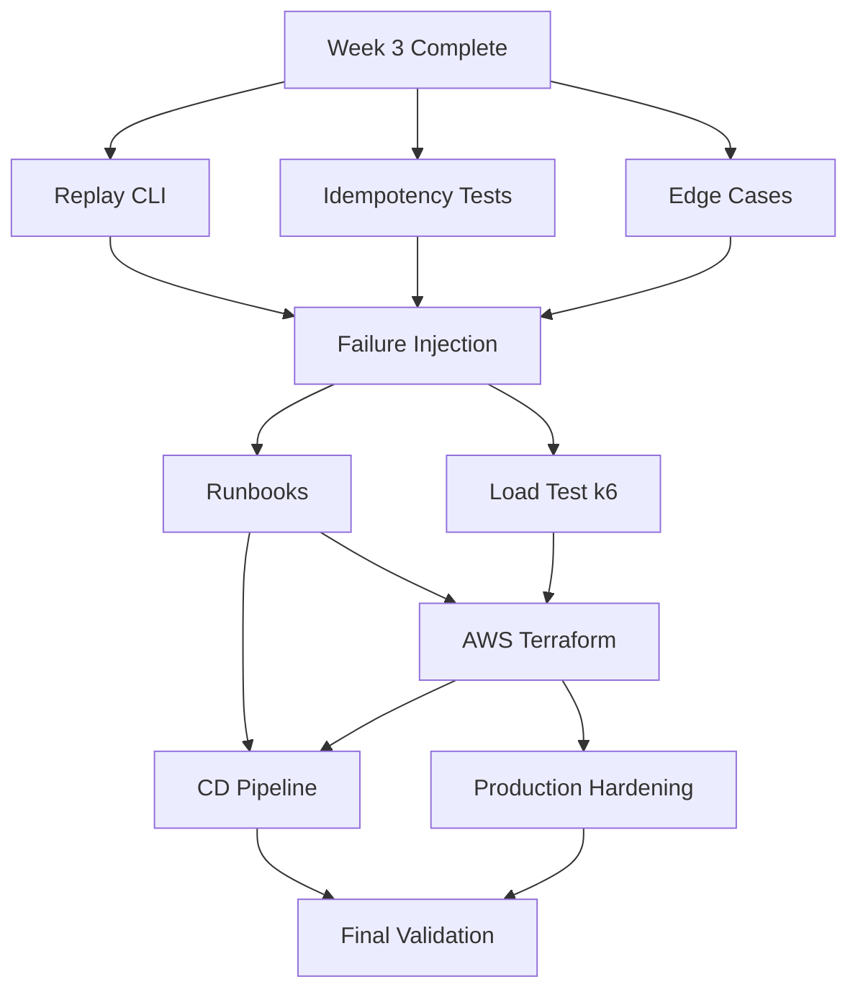

# Week 4: Hardening & AWS Deploy — Milestones & GitHub Issues

## Milestone: **Week 4 — Hardening & AWS Deploy (Replay, Idempotency, Edge Cases, Production Deploy)**

**Target Date**: 7 days from Week 3 completion
**Depends on**: Week 3 API Surface complete (all endpoints, observability, auth working)
**Success Criteria**:
- [ ] Replay/Reprojeção CLI: `reprocessar_usuario`, `reler_todas` working
- [ ] Idempotency test suite: duplicate re-send for all 5 origins + coleta casa passes
- [ ] Edge cases covered: freebet stake=0, meia-green/red, cashout, anulada, temporal queries
- [ ] Failure injection: kill worker mid-tx, PG primary failover, Anthropic 5xx, Redis down → no data loss
- [ ] Runbooks written: deploy, rollback, migration, incident response, scaling
- [ ] Load test (k6): 50 users, 200 bets/day, P95<1s API, zero errors
- [ ] Production staging deploy: Multi-AZ RDS, 2 API tasks, 4 extraction workers, 8 materialization
- [ ] `conferir_numeros.py` passes on staging (5 banks, 16k+ bets replay)
- [ ] Rollback tested: bad deploy → rollback < 5 min

---

## GitHub Issues (10 issues)

### Issue 1: Replay & Reprojeção CLI — Full Rebuild from Event Log
**Labels**: `week-4`, `replay`, `cli`, `data-integrity`
**Size**: L (5-6 hours)

**Files**:
- `src/bancaemdia/cli/replay.py`
- `scripts/reprocessar_usuario.py` (enhance from Week 2)
- `scripts/reler_todas.py` (new)
- `src/bancaemdia/domain/projecao.py` (port from `planilhador/dominio/projecao.py`)

**Tasks**:
- [ ] `reconstruir_usuario(usuario_id, desde=None, ate=None)`:
  - Delete user's `apostas` + `movimentos` (keep `eventos` + `coletas_casa`)
  - Replay `eventos` in `id` order → rebuild `apostas` + `movimentos`
  - Respects temporal: `unidades` (vigente_de/ate), `contas_casa` (desde/ate)
  - Progress bar + ETA; logs every 100 events
- [ ] `reler_todas(versao_prompt, chunk_size=1000)`:
  - Admin only; full releitura with new prompt version
  - Pagination: `LIMIT chunk_size OFFSET ...`
  - Re-enqueues to `extraction` queue with new `versao_prompt`
  - Cost estimation before run
- [ ] `reconstruir_tudo()` — nuclear option (dev only, requires `--confirm`)
- [ ] Dry-run mode: `--dry-run` shows what would be rebuilt
- [ ] Validation: after replay, run `conferir_numeros.py` → must pass

**Acceptance**: 
- Delete user's apostas → replay → `conferir_numeros.py` ✅
- Releitura with new prompt → bets updated, old versions in `eventos`

---

### Issue 2: Idempotency Test Suite — Exhaustive Duplicate Testing
**Labels**: `week-4`, `testing`, `idempotency`, `data-integrity`
**Size**: L (5-6 hours)

**Files**:
- `tests/idempotency/test_all_origins.py`
- `tests/idempotency/conftest.py` (fixtures)
- `tests/fixtures/idempotency/` (payloads per origin)

**Tasks**:
- [ ] Test matrix: 5 origins × 3 scenarios (exact duplicate, updated timestamp, partial update)
- [ ] **Origin: telegram** (export)
  - Key: `(usuario_id, chat_id, message_id, ordem_na_mensagem)`
  - Same payload → no new row, `atualizada_em` updated
  - Newer `atualizada_em` → updates fields; older → ignored
- [ ] **Origin: print** (photo upload)
  - Key: `(usuario_id, midia_hash, ordem)` partial index
  - Same image hash → no duplicate
- [ ] **Origin: manual** (typed)
  - Key: `(usuario_id, chave)` where `chave` = UUID
- [ ] **Origin: planilha** (Excel import)
  - Key: `(usuario_id, linha_hash)`
- [ ] **Origin: casa** (extension webhook)
  - Key: `(usuario_id, casa_id, identidade)` + `hash_conteudo` for open→settled
  - Same identidade + same hash → 200 no-op
  - Same identidade + different hash → updates (settled)
- [ ] **Coleta casa** dedup edge cases:
  - `open` → `settled` transition (different `hash_conteudo`)
  - Duplicate `settled` → no-op
  - Race condition: concurrent same identidade → serializable via PG lock
- [ ] Concurrent test: 10 parallel requests same payload → exactly 1 row created
- [ ] CI: runs in every PR; must pass

**Acceptance**: `pytest tests/idempotency/ -v` passes; zero duplicate rows in any scenario

---

### Issue 3: Edge Cases — Financial & Temporal Correctness
**Labels**: `week-4`, `edge-cases`, `financeiro`, `temporal`
**Size**: L (5-6 hours)

**Files**:
- `tests/edge_cases/test_financeiro.py`
- `tests/edge_cases/test_temporal.py`
- `src/bancaemdia/domain/financeiro.py` (fixes if needed)
- `src/bancaemdia/domain/temporal.py` (fixes if needed)

**Test Cases to Cover**:
- [ ] **Freebet**: `stake_centavos=0`, `valor_aposta_centavos=10000` (R$ 100)
  - Green: `retorno = stake/2 * odd + stake/2` → `0 * odd + 0 = 0`? No! Freebet green = `valor_aposta * (odd - 1)` = profit only
  - Wait: AGENTS.md says `stake_centavos=0`, `retorno = stake/2 * odd + stake/2` for MEIO_GREEN
  - Verify: Freebet green = `valor_aposta_centavos * (odd - 1)` (profit only)
  - Freebet red = `0` (no loss)
- [ ] **Meio Green**: `stake=100`, `odd=2.0` → `retorno = 50*2 + 50 = 150`, `lucro = 50`
- [ ] **Meio Red**: `stake=100` → `retorno = 50`, `lucro = -50`
- [ ] **Cashout**: user provides `cashout_valor_centavos`; `retorno = cashout_valor_centavos`
- [ ] **Anulada**: `retorno = stake`, `lucro = 0`
- [ ] **Temporal Unidade**: 
  - Jan: unidade=R$ 100; Feb: unidade=R$ 200
  - Bet in Jan uses R$ 100; bet in Feb uses R$ 200
  - Change in Mar doesn't affect Jan/Feb bets
- [ ] **Temporal ContaCasa**:
  - Conta created 15/01; bet on 10/01 → not counted in that casa's saldo
  - Saldo only counts bets >= first movimento of that casa
- [ ] **ROI Denominator**: Freebet enters by `valor_aposta_centavos` (face value)
  - `roi = lucro_total / (stake_total + freebet_face_total)`
  - `roi_sem_bonus = lucro_total / stake_total` (excludes freebet face)
- [ ] **Saldo Negativo**: Returns `None` (unknown), not negative number
  - `deposito_faltante_centavos` tells how much missing
- [ ] **Concorrência Pareador**: Two bets paired simultaneously → lock ordering prevents deadlock

**Acceptance**: All edge case tests pass; centavo-exact match expected values

---

### Issue 4: Failure Injection & Chaos Testing
**Labels**: `week-4`, `chaos`, `resilience`, `testing`
**Size**: L (5-6 hours)

**Files**:
- `tests/chaos/test_failure_injection.py`
- `scripts/chaos_inject.py` (orchestrator)

**Scenarios to Inject**:
- [ ] **Worker killed mid-transaction**:
  - Start materialization task
  - Kill Celery worker process (SIGKILL)
  - Verify: no partial commit; task requeued (Celery `task_reject_on_worker_lost=True`)
  - DLQ captures if max retries exceeded
- [ ] **PG Primary failover**:
  - Use RDS `failover-db-instance` (staging)
  - Verify: API returns 503 briefly, then recovers
  - No data loss; in-flight requests retry (idempotent)
- [ ] **Anthropic 5xx / timeout**:
  - Mock Anthropic to return 500 / timeout
  - Verify: circuit breaker opens after 5 failures
  - Tasks queued, not lost; resume when breaker closes
- [ ] **Redis down**:
  - Stop Redis container
  - Verify: rate limiting falls back to in-memory (or blocks)
  - Cache misses (no crash); queue pauses, resumes on Redis recovery
- [ ] **Network partition (client → API)**:
  - Client sends request, drops connection before response
  - Verify: idempotency key prevents double-processing on retry
- [ ] **Disk full / PG storage full**:
  - Simulate via `pg_fill_cache` or quota
  - Verify: graceful degradation, alert fires

**Metrics to Verify**:
- [ ] Zero silent data corruption (run `conferir_numeros.py` after each)
- [ ] DLQ captures only truly failed tasks
- [ ] Recovery time < 30s for transient failures

**Acceptance**: All chaos scenarios tested; `conferir_numeros.py` passes after each

---

### Issue 5: Runbooks — Operations Documentation
**Labels**: `week-4`, `docs`, `runbooks`, `ops`
**Size**: M (3-4 hours)

**Files**:
- `docs/runbooks/deploy.md`
- `docs/runbooks/rollback.md`
- `docs/runbooks/migration.md`
- `docs/runbooks/incident.md`
- `docs/runbooks/scaling.md`
- `docs/RUNBOOKS.md` (index)

**Runbook Contents**:
- [ ] **Deploy Runbook**:
  - Prerequisites: CI green, migration reviewed, staging validated
  - Steps: `gh workflow run cd.yml -f sha=<commit>`
  - Verification: `/ready` green, smoke tests pass, metrics normal
  - Rollback trigger: error rate > 1% or P99 > 2s for 5 min
- [ ] **Rollback Runbook**:
  - Command: `gh workflow run cd.yml -f sha=<previous_sha> -f environment=production`
  - Target: < 5 min from decision to healthy
  - Post-rollback: verify data integrity, notify stakeholders
- [ ] **Migration Runbook**:
  - Pre: backup snapshot, `pg_dump` schema, staging rehearsal
  - During: `alembic upgrade head` (expand-only, no data migration in same step)
  - Post: `conferir_numeros.py`, index analysis, `ANALYZE`
  - Rollback: `alembic downgrade -1` (only if expand-only)
- [ ] **Incident Response Runbook**:
  - Severity levels: SEV1 (data loss, downtime) → SEV3 (degraded performance)
  - On-call escalation: Slack → PagerDuty → phone
  - Common scenarios: high replica lag, extraction queue backup, Anthropic breaker open
  - Debugging: trace IDs, log queries, metric dashboards
- [ ] **Scaling Runbook**:
  - Horizontal: ECS service `desired_count` (API, extraction, materialization)
  - Vertical: RDS instance class, Redis node type
  - Triggers: CPU > 70%, queue depth > 100, replica lag > 30s
  - Cost impact estimation

**Acceptance**: All 5 runbooks written, < 2 pages each, linked in `RUNBOOKS.md`

---

### Issue 6: Load Test — k6 Script + CI Integration
**Labels**: `week-4`, `load-test`, `k6`, `performance`
**Size**: L (5-6 hours)

**Files**:
- `k6/load-test.js`
- `k6/config.js` (stages, thresholds)
- `k6/scenarios/` (per-endpoint scenarios)
- `.github/workflows/load-test.yml`

**Test Scenarios**:
- [ ] **Scenario 1: Steady State** (50 users, 30 min)
  - 50 VUs, ramp up 5 min, steady 20 min, ramp down 5 min
  - Each VU: login → upload small export → wait → painel → logout
  - Target: 200 bets/day equivalent throughput
- [ ] **Scenario 2: Spike** (200 users, 10 min)
  - 200 VUs, ramp up 2 min, steady 6 min, ramp down 2 min
  - Tests auto-scaling, queue handling
- [ ] **Scenario 3: Coleta Casa Burst** (extension webhook flood)
  - 100 VUs, each POST `/coleta` 10 req/min for 5 min
  - Tests rate limiting, materialization queue
- [ ] **Scenario 4: Painel Read Heavy** (dashboard refresh)
  - 100 VUs, `GET /painel` every 10s for 10 min
  - Tests replica, MV refresh, cache

**Thresholds (must pass)**:
- [ ] `http_req_duration{p95} < 1000` (1s)
- [ ] `http_req_duration{p99} < 2000` (2s)
- [ ] `http_req_failed < 0.01` (1%)
- [ ] `extraction_queue_depth < 100`
- [ ] `replica_lag < 30`
- [ ] `checks_pass_rate > 0.99`

**CI Integration**:
- [ ] GitHub Action: `workflow_dispatch` (manual) + scheduled (weekly)
- [ ] Runs against staging environment
- [ ] Fails PR if thresholds not met
- [ ] Results uploaded as artifact (HTML report)

**Acceptance**: `k6 run k6/load-test.js` passes all thresholds on staging

---

### Issue 7: AWS Production Staging Provisioning (Terraform)
**Labels**: `week-4`, `aws`, `terraform`, `infra`, `production`
**Size**: L (6-8 hours)

**Files**:
- `infra/terraform/` (full Terraform project)
- `infra/terraform/main.tf`
- `infra/terraform/modules/` (vpc, rds, elasticache, ecs, alb, secrets, monitoring)
- `infra/terraform/environments/staging/`
- `infra/terraform/environments/production/`

**Resources to Provision**:
- [ ] **VPC**: 2 AZs, 2 private subnets (RDS/Redis), 2 public (ALB), NAT Gateways
- [ ] **RDS PostgreSQL 16 Multi-AZ**: `db.r6g.large`, 200 GB GP3, automated backups 35 days, cross-region replica
- [ ] **ElastiCache Redis Cluster Mode**: `cache.r6g.large` (2 shards, 1 replica each), encryption in-transit/at-rest
- [ ] **ECS Cluster**: Fargate, capacity providers `FARGATE` + `FARGATE_SPOT`
- [ ] **ECS Services**:
  - `api`: 2 tasks (FARGATE), ALB target group, health check `/ready`
  - `extraction-workers`: 4 tasks (FARGATE_SPOT), `extraction` queue
  - `materialization-workers`: 8 tasks (FARGATE_SPOT), `materialization` queue
  - `beat-scheduler`: 1 task (FARGATE), Celery Beat for periodic tasks
- [ ] **ALB**: HTTPS (ACM cert), WAF (CommonRuleSet), access logs → S3
- [ ] **Secrets Manager**: `bancaemdia/staging/*` and `bancaemdia/production/*`
- [ ] **CloudWatch**: Log groups, metric filters, dashboards, alarms (from Issue 10 Week 3)
- [ ] **S3 Buckets**: `bancaemdia-uploads`, `bancaemdia-exports`, `bancaemdia-backups`
- [ ] **IAM**: Task execution roles, least privilege policies

**Terraform Best Practices**:
- [ ] Remote state: S3 + DynamoDB locking
- [ ] Modules for each component (reusable staging/prod)
- [ ] `terraform plan` in PR comments (via GitHub Action)
- [ ] `terraform apply` only on merge to `main` (staging) / tag (prod)

**Acceptance**: `terraform apply` creates staging env; API deploys and passes health checks

---

### Issue 8: CD Pipeline — Build → Staging → Canary → Production
**Labels**: `week-4`, `ci-cd`, `github-actions`, `deployment`
**Size**: L (5-6 hours)

**Files**:
- `.github/workflows/cd.yml`
- `.github/workflows/load-test.yml` (from Issue 6)

**Pipeline Stages**:
- [ ] **Build** (on push to main):
  - `docker build -t ghcr.io/pradyumna-001/bancaemdia-api:${{ github.sha }}`
  - `docker push ghcr.io/...`
  - SBOM generation (`syft`), vulnerability scan (`grype`)
- [ ] **Staging Deploy** (auto on main):
  - ECS service update (rolling, 50% at a time)
  - Health check: `/ready` 200 for 30s
  - Smoke tests: `GET /health`, `POST /auth/login`, `GET /painel`
  - `conferir_numeros.py` on staging DB
- [ ] **Canary Deploy** (manual, for production):
  - Deploy new version to 10% traffic (ALB weighted target groups)
  - Monitor 10 min: error rate, latency, business metrics
  - Auto-promote if healthy; auto-rollback if not
- [ ] **Production Promote** (manual approval):
  - Shift 10% → 50% → 100% over 30 min
  - Rollback button at each stage
- [ ] **Rollback** (manual, any time):
  - `gh workflow run cd.yml -f sha=<previous> -f environment=production`
  - Target < 5 min

**Notifications**:
- [ ] Slack on: deploy started, staging ready, canary promoted, rollback triggered
- [ ] Include: commit SHA, author, changed files summary

**Acceptance**: Push to main → staging deployed in < 10 min; canary → prod in < 30 min; rollback < 5 min

---

### Issue 9: Production Hardening — Security, Compliance, Cost Controls
**Labels**: `week-4`, `security`, `compliance`, `hardening`
**Size**: M (4-5 hours)

**Files**:
- `src/bancaemdia/security/` (headers, validation)
- `infra/terraform/modules/security/`
- `docs/SECURITY.md`

**Tasks**:
- [ ] **Security Headers** (middleware):
  - CSP: `default-src 'self'; script-src 'self'; style-src 'self' 'unsafe-inline'`
  - HSTS: `max-age=31536000; includeSubDomains; preload`
  - X-Frame-Options: `DENY`
  - X-Content-Type-Options: `nosniff`
  - Referrer-Policy: `strict-origin-when-cross-origin`
- [ ] **Input Validation**:
  - Request body size limits (configured per endpoint)
  - SQL injection: SQLAlchemy ORM only (no raw SQL with user input)
  - XSS: JSON API only (no HTML rendering)
- [ ] **Secrets Management**:
  - No secrets in code, env, or Docker images
  - All secrets in AWS Secrets Manager
  - Rotation: Anthropic key (quarterly), JWT keys (annual)
- [ ] **Audit Logging**:
  - All mutating endpoints log: `usuario_id`, `action`, `resource_id`, `diff`, `timestamp`
  - Immutable log (append-only table `audit_log`)
- [ ] **LGPD Compliance** (prep for M5):
  - Data encryption at rest (RDS, S3, Redis) — enabled
  - Data encryption in transit (TLS 1.2+) — enforced
  - Right to deletion: `DELETE /api/v1/usuario/me` → anonymize (keep events for audit)
  - Data export: `GET /api/v1/usuario/me/export` → JSON + Excel
- [ ] **Cost Controls**:
  - Daily Anthropic budget alert (80%, 100%)
  - ECS Spot Instance interruption handling (SIGTERM 2 min warning)
  - RDS storage autoscaling (max 500 GB)

**Acceptance**: Security scan passes; secrets audit clean; LGPD endpoints implemented

---

### Issue 10: Final Validation — Staging = Production Mirror
**Labels**: `week-4`, `validation`, `staging`, `go-live`
**Size**: L (5-6 hours)

**Files**:
- `scripts/final_validation.py`
- `scripts/conferir_numeros.py` (run on staging)

**Validation Checklist**:
- [ ] **Data Integrity**: `conferir_numeros.py` passes on staging (5 banks, 16k+ bets replay)
- [ ] **API Contracts**: All endpoints return correct schemas (contract tests pass)
- [ ] **Performance**: k6 load test passes (P95 < 1s, error < 1%)
- [ ] **Observability**: 
  - Traces: upload → extraction → materialization → painel visible
  - Metrics: all custom metrics reporting
  - Logs: JSON, searchable by `request_id` / `usuario_id`
  - Alerts: test alarm fires → Slack notification
- [ ] **Resilience**:
  - Circuit breaker test: Anthropic 5xx → opens → recovers
  - Rate limit test: 429 with headers
  - Failover test: RDS reboot → API recovers < 30s
- [ ] **Security**:
  - RLS: cross-tenant query returns 0 rows
  - Auth: expired token → 401; invalid → 401
  - Headers: CSP, HSTS, X-Frame-Options present
- [ ] **Deploy & Rollback**:
  - Deploy staging → healthy < 10 min
  - Rollback → healthy < 5 min
- [ ] **Cost Projection**:
  - Staging 24h run → extrapolate production cost
  - Anthropic cost/bet ≈ $0.0054
  - Infrastructure cost matches estimate (~$151/month for 50 users)

**Go-Live Gate** (all must pass):
- [ ] All validation checks ✅
- [ ] No SEV1/SEV2 bugs open
- [ ] Runbooks reviewed and accessible
- [ ] On-call schedule confirmed
- [ ] Stakeholder sign-off

**Acceptance**: All gates pass; ready for production traffic

---

## Dependency Graph

---

## Suggested Execution Order (Day by Day)

| Day | Issues | Notes |
|-----|--------|-------|
| 1 | 1, 2 | Replay CLI + Idempotency tests (core correctness) |
| 2 | 3, 4 | Edge cases + Failure injection (hardening) |
| 3 | 5, 6 | Runbooks + Load test (ops readiness) |
| 4 | 7 | AWS Terraform (infrastructure) |
| 5 | 8 | CD Pipeline (deploy automation) |
| 6 | 9 | Production hardening (security/compliance) |
| 7 | 10 | Final validation (go-live gate) |

---

## Ready to Create in GitHub?