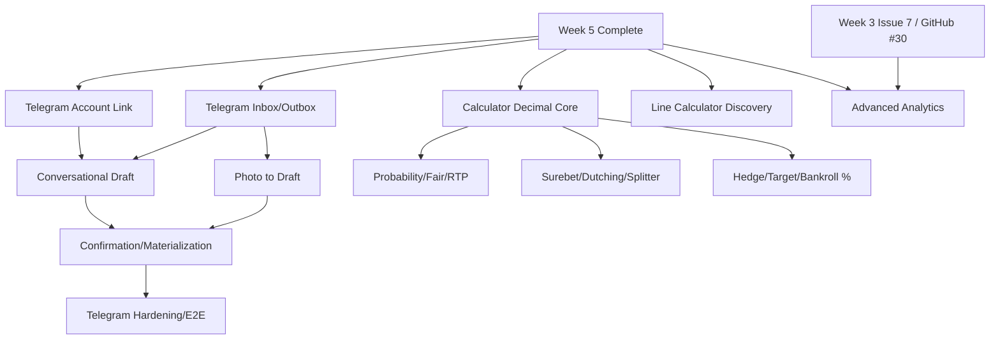

# Week 6: Telegram Intake, Calculators & Advanced Analytics — Milestones & GitHub Issues

## Milestone: **Week 6 — Telegram Intake + Calculator APIs + Advanced Analytics**

**Target Date**: 7 days from Week 5 completion
**Depends on**: Week 5 account-holder and collection foundations complete; Week 3 Issue 7 / GitHub #30 dashboard aggregates available
**Scope Boundary**: Backend and Telegram integration only — no website frontend, templates, pages, CSS, or JavaScript
**Success Criteria**:
- [ ] A user can link a private Telegram chat to exactly one Banca em Dia account through a short-lived, single-use code
- [ ] Production receives Telegram updates by authenticated webhook; local development can use polling without changing domain behavior
- [ ] Every inbound update and outbound bot message is durable, retryable, observable, and idempotent
- [ ] A photo creates one resumable bet draft; it never creates a financial bet before explicit user confirmation
- [ ] When extraction is incomplete, the bot asks only for the missing information and never asks the user to resend the photo
- [ ] Replayed updates, repeated confirmations, worker restarts, and Telegram outages never duplicate a bet or lose a reply
- [ ] All nine requested calculator APIs use pure `Decimal` domain functions, deterministic cent allocation, and explicit validation
- [ ] The line-calculator work ends in an approved model/data decision; no Poisson assumption and no implementation issue before that gate passes
- [ ] Advanced analytics adds only capabilities absent from GitHub #30 and keeps deposits/withdrawals separate from betting profit
- [ ] Authenticated financial responses are never publicly cacheable
- [ ] RLS, privacy, rate-limit, contract, and end-to-end tests pass in CI
- [ ] No website frontend code is added by any issue in this milestone

---

## GitHub Issues (12 issues)

### Issue 1: Telegram Account Link — One-Time Code, Revocation & Tenant Binding
**Labels**: `week-6`, `telegram`, `auth`, `security`
**Size**: M (3-4 hours)

**Files**:
- `src/bancaemdia/models/telegram_link.py`
- `src/bancaemdia/repositories/telegram_link.py`
- `src/bancaemdia/services/telegram_link.py`
- `src/bancaemdia/api/v1/telegram.py`
- `alembic/versions/xxx_telegram_account_link.py`
- `tests/integration/test_telegram_link.py`

**Tasks**:
- [ ] Add tenant-owned `TelegramLink` with `usuario_id`, `telegram_user_id`, `telegram_chat_id`, `linked_at`, `revoked_at`, and last-use timestamps
- [ ] Add `TelegramLinkCode` with an 8-character human-readable code, 30-minute expiry, single-use state, failed-attempt counter, and issuer `usuario_id`
- [ ] Store only a keyed hash of the code; never persist or log the plaintext code, bot token, or Telegram identifiers in structured log fields
- [ ] Add authenticated `POST /api/v1/telegram/link-codes`:
  - Invalidates any still-open code for the same user
  - Returns plaintext only once with `expires_at`
  - Is rate-limited per user and collision-safe
- [ ] Support `/vincular <codigo>` in a private Telegram chat:
  - Reject groups, channels, expired codes, used codes, and excessive attempts
  - Consume the code and create/re-activate the link in one transaction
  - Never trust a forwarded message's author as the Banca em Dia identity
- [ ] Add authenticated `GET /api/v1/telegram/link` and `DELETE /api/v1/telegram/link` for status and revocation
- [ ] Enforce one active Banca em Dia user per Telegram identity and prevent cross-tenant reads through RLS
- [ ] Audit link, re-link, failed redemption, and revocation without recording secrets
- [ ] Return neutral errors so an attacker cannot discover whether a code or account exists

**Acceptance**: A fresh code links one private chat exactly once; the same, expired, brute-forced, group-sent, or cross-tenant code cannot create a link, and revocation immediately blocks new intake

---

### Issue 2: Telegram Transport — Authenticated Webhook, Durable Inbox & Transactional Outbox
**Labels**: `week-6`, `telegram`, `webhook`, `reliability`
**Size**: L (5-6 hours)

**Files**:
- `src/bancaemdia/models/telegram_message.py`
- `src/bancaemdia/integrations/telegram/client.py`
- `src/bancaemdia/integrations/telegram/webhook.py`
- `src/bancaemdia/workers/telegram.py`
- `alembic/versions/xxx_telegram_inbox_outbox.py`
- `tests/integration/test_telegram_transport.py`

**Tasks**:
- [ ] Add a durable `TelegramInbox` record with unique `update_id`, normalized event type, sender/chat/message identifiers, minimal encrypted/raw payload, status, attempts, and timestamps
- [ ] Add a tenant-owned `TelegramOutbox` record with deterministic idempotency key, destination chat, message payload, status, next-attempt time, attempts, and last error
- [ ] Implement `POST /api/v1/integrations/telegram/webhook`:
  - Validate `X-Telegram-Bot-Api-Secret-Token` with constant-time comparison
  - Enforce body-size and content-type limits
  - Persist the inbox row before returning success
  - Return quickly and defer extraction/business work to a worker
- [ ] Provide polling only for local development; webhook and polling modes must be mutually exclusive and feed the same inbox contract
- [ ] Process inbox rows with row locking, bounded exponential backoff, poison-message/DLQ state, and crash-safe retry
- [ ] Deliver outbox rows only after their originating database transaction commits; a Telegram outage must not lose the response
- [ ] Treat Telegram `update_id` as transport deduplication and domain idempotency keys as the protection for business effects
- [ ] Redact bot tokens, codes, photo bytes, captions, Telegram names, and raw payloads from logs and traces
- [ ] Add metrics for inbox age/depth, outbox age/depth, retries, DLQ count, webhook rejection, and Telegram API latency/error rate

**Acceptance**: Replaying the same update 10 times stores one inbox item and produces one business effect; stopping Telegram delivery or killing the worker preserves queued work and sends the reply once after recovery

---

### Issue 3: Telegram Bet Draft — Resumable Conversation for Missing Fields
**Labels**: `week-6`, `telegram`, `domain`, `conversation`
**Size**: L (5-6 hours)

**Files**:
- `src/bancaemdia/models/rascunho_aposta.py`
- `src/bancaemdia/domain/rascunho_aposta.py`
- `src/bancaemdia/repositories/rascunho_aposta.py`
- `src/bancaemdia/services/telegram_conversation.py`
- `alembic/versions/xxx_bet_draft.py`
- `tests/unit/test_telegram_conversation.py`

**Tasks**:
- [ ] Add tenant-owned `RascunhoAposta` with UUID, Telegram origin, media reference/hash, extracted fields, per-field confidence/source, missing-field list, status, version, and timestamps
- [ ] Define states: `AWAITING_EXTRACTION`, `AWAITING_INFORMATION`, `AWAITING_CONFIRMATION`, `CONFIRMED`, `CANCELLED`, `FAILED`
- [ ] Allow at most one active draft per linked private chat; a new photo while one is pending must offer continue/cancel instead of silently replacing data
- [ ] Reuse the canonical bet validation rules to calculate missing/invalid fields; do not maintain a second, weaker list inside the bot
- [ ] Generate a concise summary of everything already understood and ask only for fields that are still missing or ambiguous
- [ ] Never ask the user to resend the photo; accept one or several missing values in a reply and patch only the fields supplied
- [ ] Support `/continuar`, `/corrigir <campo> <valor>`, and `/cancelar`; returning later must restore the same active draft
- [ ] Preserve correction history and optimistic versioning so two replies cannot overwrite each other silently
- [ ] Resolve `conta_casa_id` from the account active at the bet occurrence time when exactly one exists; ask which account only when resolution is absent or ambiguous
- [ ] Keep the resolver interface cardinality-safe for future simultaneous accounts, while this milestone enforces the current one-account-in-use rule
- [ ] Keep incomplete drafts outside all balances, profit, turnover, ROI, and dashboard aggregates

**Acceptance**: Given an extracted draft missing house and stake, the bot summarizes known values, asks only for house/stake, accepts the reply without a new photo, survives a restart, and still has created zero financial bets

---

### Issue 4: Telegram Photo Intake — Extraction into One Draft, Never Directly into Finance
**Labels**: `week-6`, `telegram`, `extraction`, `ai`
**Size**: L (5-6 hours)

**Files**:
- `src/bancaemdia/integrations/telegram/media.py`
- `src/bancaemdia/services/telegram_photo_intake.py`
- `src/bancaemdia/workers/telegram_extraction.py`
- `tests/integration/test_telegram_photo_intake.py`
- `tests/fixtures/telegram/`

**Tasks**:
- [ ] Accept one photo per private message, including a photo forwarded by the linked user; the linked sender remains the tenant owner
- [ ] For the first version, explicitly reject albums, multiple photos in one intake, and text-only bet creation with a clear supported-flow message
- [ ] Select the largest Telegram photo variant, download through Telegram `file_id`, validate MIME/size, hash the actual bytes, and store it through the existing protected media path
- [ ] Preserve source metadata (`update_id`, chat/message IDs, forward metadata, `file_unique_id`, content hash) without treating it as trusted bet data
- [ ] Reuse the Week 2 OCR → Haiku → Sonnet extraction ladder and its cache; do not create a Telegram-specific extractor or prompt contract
- [ ] Map extraction output into `RascunhoAposta`, including field-level source/confidence, but never call the financial materializer from the extraction worker
- [ ] Use origin-aware deduplication so the same update/photo retry resumes the existing draft instead of starting another one
- [ ] If no field can be read, keep the draft and ask for the required values; do not request a new upload
- [ ] If the image appears to contain more than one coupon/bet, keep it pending and ask the user which single bet is intended; never silently materialize several
- [ ] After extraction, route to either missing-field conversation or confirmation summary through the outbox
- [ ] Record extraction failure/cost/latency using existing observability without exposing image contents

**Acceptance**: A direct or forwarded single-bet photo produces one deduplicated draft and a persisted bot response; incomplete/unreadable input enters the question flow, while no path creates an `Aposta` before confirmation

---

### Issue 5: Telegram Confirmation — Idempotent Draft Materialization & Saved-Data Reply
**Labels**: `week-6`, `telegram`, `materialization`, `idempotency`
**Size**: L (5-6 hours)

**Files**:
- `src/bancaemdia/services/telegram_confirmation.py`
- `src/bancaemdia/workers/telegram_materialization.py`
- `src/bancaemdia/domain/materializar.py`
- `tests/integration/test_telegram_confirmation.py`

**Tasks**:
- [ ] Render an explicit confirmation summary from the latest persisted draft version, including house/account, event, market/selection, odds, stake, dates, and any uncertainty still requiring correction
- [ ] Accept confirmation only when canonical validation reports no missing or invalid required field
- [ ] Treat ambiguous text as a correction/question, never as implicit confirmation; support explicit confirm, correct, and cancel actions
- [ ] Materialize in one transaction using deterministic key `telegram_draft:<draft_uuid>` and a unique database constraint
- [ ] In that transaction:
  - Lock and re-read the draft version
  - Resolve canonical entities and the account valid at `data_aposta`
  - Append the source event and create/update the bet through the existing materializer
  - Mark the draft `CONFIRMED`
  - Enqueue the success response in the outbox
- [ ] Use origin `telegram_bot` (or the reviewed canonical equivalent) without colliding with Telegram-export message keys
- [ ] Build the success message from committed/saved values, not from extraction memory, so the user sees exactly what entered the ledger
- [ ] If materialization fails, keep the draft resumable and do not send a success reply
- [ ] Replaying the confirmation, retrying after timeout, or receiving two simultaneous confirmations must return the already-created bet without a second financial effect
- [ ] Emit trace links from update → draft → event → bet → outbox while redacting content

**Acceptance**: Ten concurrent/replayed confirmations for one complete draft commit exactly one bet and one financial effect; the eventual Telegram reply matches the row read back from the database

---

### Issue 6: Telegram Bot Hardening — Privacy, Abuse Controls, E2E & Runbook
**Labels**: `week-6`, `telegram`, `testing`, `security`
**Size**: L (5-6 hours)

**Files**:
- `tests/e2e/test_telegram_bot.py`
- `tests/security/test_telegram_security.py`
- `tests/fixtures/telegram/`
- `docs/runbooks/telegram-bot.md`
- `docs/privacy/telegram-data.md`

**Tasks**:
- [ ] Add end-to-end scenarios with a fake Telegram API and real PostgreSQL/Redis:
  - Link → photo → complete extraction → confirm → one saved bet
  - Link → incomplete extraction → provide only missing values → confirm
  - Forwarded photo, unreadable photo, multiple-bet ambiguity, correction, cancellation, and resume after restart
  - Duplicate update/photo/confirmation and concurrent replies
  - Telegram API outage, extraction timeout, worker crash, and outbox recovery
- [ ] Add per-chat, per-user, and global rate limits for link attempts, photos, corrections, and confirmations
- [ ] Reject group/channel intake, unlinked chats, forged webhook secrets, oversized files/bodies, unsupported MIME, and stale callback actions
- [ ] Define configurable retention for raw Telegram payloads and media, implement scheduled purge, and retain only the minimum audit/idempotency metadata afterward
- [ ] Verify RLS isolation for links, drafts, inbox/outbox tenant views, media, and materialized bets
- [ ] Verify secrets and personal content are absent from logs, traces, metrics labels, error reports, and DLQ summaries
- [ ] Add alert thresholds for backlog age, DLQ growth, extraction failure, delivery failure, and suspicious link attempts
- [ ] Write setup/rotation/recovery procedures for bot token, webhook secret, webhook registration, polling mode, queue replay, and unlink/privacy requests
- [ ] Document user-facing constraints: private chat, one bet/photo at a time, no album/text-only intake in v1, explicit confirmation required

**Acceptance**: The complete and missing-field E2E journeys pass; replay/failure tests prove zero duplicate bets and zero lost durable messages, and the security suite finds no public or cross-tenant Telegram data

---

### Issue 7: Calculator Core — Decimal Precision, Validation & Deterministic Allocation
**Labels**: `week-6`, `calculators`, `domain`, `testing`
**Size**: M (3-4 hours)

**Files**:
- `src/bancaemdia/domain/calculators/core.py`
- `src/bancaemdia/api/v1/schemas/calculators.py`
- `src/bancaemdia/api/v1/calculators.py`
- `tests/unit/calculators/test_core.py`

**Tasks**:
- [ ] Implement calculator logic as pure functions with typed input/output; HTTP handlers only validate, call the domain, and serialize
- [ ] Use `Decimal` constructed from strings for all odds, probabilities, percentages, money, and intermediate operations; prohibit binary `float` in calculator domain code
- [ ] Define shared precision policy:
  - Money allocated in integer centavos
  - Display money rounded with `ROUND_HALF_UP`
  - Probabilities/percentages retain configurable decimal precision
  - Intermediate calculations use a documented higher precision context
- [ ] Implement largest-remainder cent allocation with stable input-order tie-breaking so allocated legs always sum exactly to the requested total
- [ ] Add canonical validation/errors for odds `> 1`, positive stakes/bankroll/targets, percentages in range, finite values, complete-market requirements, and maximum selection count
- [ ] Return both machine values and formula metadata (`method`, `precision`, `rounding`, warnings); never return formatted Brazilian currency strings from the domain
- [ ] Keep calculator calls stateless and separate from user bankroll/bet records; calculation must never create a bet or movement
- [ ] Add a `/api/v1/calculadoras` router and a consistent response/error envelope for follow-up issues
- [ ] If exposed without authentication for future acquisition pages, enforce strict per-IP limits and no persistence; frontend pages remain out of scope
- [ ] Add example-based, boundary, invariant, and property tests for rounding and allocation

**Acceptance**: Core tests prove no float use, invalid inputs fail consistently, and randomized allocations always return non-negative cent values whose sum equals the requested stake exactly

---

### Issue 8: Probability Calculators — Implied Probability, Fair/No-Vig Market & RTP
**Labels**: `week-6`, `calculators`, `probability`, `api`
**Size**: M (3-4 hours)

**Files**:
- `src/bancaemdia/domain/calculators/probability.py`
- `src/bancaemdia/api/v1/calculators.py`
- `tests/unit/calculators/test_probability.py`
- `tests/contract/test_calculator_probability_api.py`

**Tasks**:
- [ ] Add `POST /api/v1/calculadoras/probabilidade-implicita`:
  - Input decimal odd
  - Output `1 / odd` as fraction and percentage
- [ ] Add `POST /api/v1/calculadoras/mercado-justo`:
  - Require all mutually exclusive outcomes of one market
  - Calculate raw implied probabilities and overround
  - Remove margin with an explicitly named proportional normalization method
  - Return fair probabilities and corresponding fair decimal odds in original input order
- [ ] Add `POST /api/v1/calculadoras/rtp`:
  - Require a complete mutually exclusive market; one isolated odd is insufficient
  - Calculate theoretical RTP as `1 / sum(implied_probabilities)` and expose bookmaker margin separately
  - Permit RTP above 100% as a mathematically valid arbitrage signal rather than clamping it
- [ ] Reject decimal odds `<= 1`, incomplete/one-outcome fair-market requests, non-finite values, and unsupported odds formats
- [ ] Make clear in schemas that no-vig is margin removal, not a predictive estimate of the event's true probability
- [ ] Add vectors for two-way, three-way, high-overround, zero-overround, and arbitrage markets
- [ ] Add invariants: fair probabilities sum to exactly 1 within declared precision and results do not change under equivalent string scale (`2.0` vs `2.00`)

**Acceptance**: Known vectors match independently calculated Decimal results; fair probabilities sum to 100% at the declared precision, and RTP refuses an incomplete market instead of inventing missing outcomes

---

### Issue 9: Allocation Calculators — Surebet, Dutching & Stake Splitter
**Labels**: `week-6`, `calculators`, `allocation`, `api`
**Size**: L (4-5 hours)

**Files**:
- `src/bancaemdia/domain/calculators/allocation.py`
- `src/bancaemdia/api/v1/calculators.py`
- `tests/unit/calculators/test_allocation.py`
- `tests/contract/test_calculator_allocation_api.py`

**Tasks**:
- [ ] Add `POST /api/v1/calculadoras/surebet` for all mutually exclusive outcomes:
  - Detect arbitrage through the inverse-odds sum
  - Allocate a total stake to equalize gross return
  - Return cent-exact stakes, per-outcome return/profit, guaranteed minimum profit, ROI, and non-arbitrage status
- [ ] Add `POST /api/v1/calculadoras/dutching`:
  - Allocate the requested total across selections to equalize gross return
  - Return the realized rounded return/profit for every outcome, not only an ideal unrounded number
  - Allow negative/equalized profit with an explicit warning instead of calling it a surebet
- [ ] Add `POST /api/v1/calculadoras/dividir-stake`:
  - Split a total stake by user-supplied percentages or positive weights
  - Normalize weights only when explicitly requested
  - Return each cent-exact allocation, remainder decision, and projected return when odds are supplied
- [ ] Reuse the same inverse-odds and deterministic largest-remainder primitives across surebet/dutching; no duplicated formulas in API handlers
- [ ] Preserve caller selection order and stable tie-breaking under equal remainders
- [ ] Require at least two distinct outcomes for surebet/dutching and positive total stake; reject weights that cannot satisfy the requested mode
- [ ] Add examples for two/three outcomes, one-cent remainders, equal odds, no arbitrage, high odds, and reordered inputs
- [ ] Add invariants: allocations sum to total, guaranteed profit is the minimum rounded scenario profit, and advertised surebet remains positive after cent rounding

**Acceptance**: Every endpoint returns deterministic cent allocations that reconcile to the input total; a surebet is reported only when every rounded outcome remains profitable

---

### Issue 10: Planning Calculators — Live Hedge, Target Profit & Bankroll Percentage
**Labels**: `week-6`, `calculators`, `risk`, `api`
**Size**: L (4-5 hours)

**Files**:
- `src/bancaemdia/domain/calculators/planning.py`
- `src/bancaemdia/api/v1/calculators.py`
- `tests/unit/calculators/test_planning.py`
- `tests/contract/test_calculator_planning_api.py`

**Tasks**:
- [ ] Add `POST /api/v1/calculadoras/cobertura-ao-vivo`:
  - Input original cash stake/odd, current opposing odd, and optional commission
  - Solve the hedge stake for the reviewed objective (`equalize_profit` or `protect_stake`)
  - Return both rounded scenarios: original outcome wins and hedge outcome wins
  - Never hide a residual loss caused by price, commission, or cent rounding
- [ ] Keep v1 live hedge to a two-outcome, cash-stake contract; reject freebets, partial cashouts, Asian pushes, and multi-way markets with an explicit unsupported response
- [ ] Add `POST /api/v1/calculadoras/lucro-alvo`:
  - Input decimal odd and desired net profit
  - Return required cash stake using `target_profit / (odd - 1)` plus rounded realized profit
  - Explicitly exclude freebet/commission/multiple semantics from v1
- [ ] Add `POST /api/v1/calculadoras/percentual-banca`:
  - Forward mode: bankroll + percentage → cent-exact stake
  - Reverse mode: bankroll + stake → bankroll percentage
  - Reject non-positive bankroll and percentages outside the reviewed 0–100 range
- [ ] Return assumptions and both ideal/rounded values wherever cent rounding changes the objective
- [ ] Add vectors for hedge gain/loss, commission, impossible protection, minimum cent, high percentage, and target-profit rounding
- [ ] Add cross-checks showing the reported scenario profits can be recomputed from returned stakes/odds

**Acceptance**: For every returned hedge, the two scenario profits recompute exactly at cent precision; target-profit and bankroll results declare rounding/unsupported cases instead of overstating certainty

---

### Issue 11: Line Calculator Discovery — Market Model, Dataset, Calibration & Go/No-Go
**Labels**: `week-6`, `calculators`, `research`, `decision`
**Size**: L (6-8 hours)

**Files**:
- `docs/discovery/line-calculator.md`
- `docs/adrs/xxx-line-calculator-model-decision.md`
- `research/line-calculator/README.md`
- `research/line-calculator/schema.json`
- `research/line-calculator/fixtures/` (sanitized, non-sensitive samples)

**Tasks**:
- [ ] Treat this as a decision/research issue only: do not create an API endpoint, production model, or implementation issue in this milestone
- [ ] Write the exact product question using the motivating example: given market `shots`, quoted `over 4.5 @ 1.86`, what additional information is required to estimate a fair `over 6.5` price?
- [ ] Prove and document that one quoted line alone may be underdetermined; the system must return `unsupported/insufficient_data` rather than invent a curve
- [ ] Define candidate supported market families separately (shots, goals, corners, cards, player props, etc.); approval for one family must not silently authorize another
- [ ] Define “fair” precisely, including vig removal, source market completeness, push probability, integer/half/quarter Asian lines, and over/under complement rules
- [ ] Design a sanitized dataset contract with, when available:
  - Simultaneous prices for several neighboring lines and both sides
  - Sport, league, event/player, market family, bookmaker, and timestamp
  - Pre-match/live state and live clock/state variables
  - Closing/result data used only where scientifically valid
- [ ] Gather a representative user-provided sample jointly with the product owner and record consent/provenance without credentials or personal account data
- [ ] Compare owner-approved distributional and non-parametric approaches empirically; explicitly reject a Poisson-only shortcut and do not privilege Poisson as the default or baseline
- [ ] Use temporal/event-separated train-validation-test splits to prevent prices or outcomes from the same event leaking across sets
- [ ] Define evaluation gates: calibration curve/error, log loss/Brier score where applicable, price/line error, coverage, stability by market/league, and baseline comparison
- [ ] Test sensitivity to bookmaker margin, stale/non-simultaneous prices, sparse neighboring lines, live-state drift, and market-definition mismatch
- [ ] Produce a proposed input/output/error contract with confidence/coverage and explicit unsupported cases
- [ ] End with an ADR containing per-market Go/No-Go, approved dataset version/hash, chosen method, limitations, and required monitoring
- [ ] Only after owner/admin approval of both model and dataset may a separate implementation issue be proposed

**Acceptance**: The review produces a reproducible dataset/schema, benchmark report, calibration evidence, explicit unsupported cases, and an approved ADR; absent that approval, no line-calculator implementation issue exists

---

### Issue 12: Advanced Analytics Backend — Cashflow-Safe Series, Missing Insights & Private Caching
**Labels**: `week-6`, `analytics`, `api`, `data-integrity`
**Size**: L (6-8 hours)

**Files**:
- `src/bancaemdia/api/v1/painel.py`
- `src/bancaemdia/domain/analytics.py`
- `src/bancaemdia/models/meta_desempenho.py`
- `alembic/versions/xxx_advanced_analytics.py`
- `tests/integration/test_advanced_analytics.py`
- `tests/contract/test_analytics_api.py`

**Tasks**:
- [ ] Preserve GitHub #30 as the canonical base: extend its backing view/schema/output where required and do not create parallel definitions of summary, by-house, by-tipster, by-market, generic period, bankroll evolution, export, or raw chart data
- [ ] Correct GitHub #30 caching before adding data:
  - Replace `Cache-Control: public, max-age=30, stale-while-revalidate=60`
  - Authenticated financial/dashboard responses use `Cache-Control: private, no-store`
  - Add `Vary: Authorization, Cookie` and tests proving shared caches cannot reuse one tenant's response for another
- [ ] Add `GET /api/v1/painel/analises` with the existing period/filter semantics and only the missing analytics below
- [ ] Extend GitHub #30's existing bankroll-evolution output with reconciled cashflow components, rather than adding a second competing series, using separate lines for:
  - Cumulative betting profit (settled bets only)
  - Cumulative deposits
  - Cumulative withdrawals
  - Resulting bankroll balance
- [ ] Enforce at every time point: `balance = initial_balance + deposits - withdrawals + betting_profit`; deposits/withdrawals must never be labeled or counted as profit
- [ ] Add odds-band distribution with bet count, turnover, profit, ROI, and hit rate; use reviewed stable bands and an explicit `unknown` bucket
- [ ] Add weekday × period-of-day heatmap with count, profit, ROI, and hit rate; derive bucket in the user's configured timezone, never server-local time
- [ ] Add by-sport performance with an explicit `unknown` bucket; do not infer a sport in the analytics query when canonical data is absent
- [ ] Add average odds and profit factor using the canonical financial inclusion rules; no-loss profit factor returns `null`, not infinity
- [ ] Add adaptive stake quartiles based on observed face value; identical boundaries collapse rather than producing fake empty quartiles, and freebets use face value for bucket placement
- [ ] Add group progression (`profit / configured_group_capital`) only for groups with capital; return `null` plus reason when capital is absent or zero
- [ ] Add tenant-owned performance goals (`MetaDesempenho`) and backend CRUD/progress for reviewed metrics, date interval, target, baseline, status, and archival; no goal UI in this issue
- [ ] Make every bucket reconcilable to the same filtered population, with explicit `unknown/not_applicable` counts rather than silently dropping rows
- [ ] Use replica/materialized-view strategy only where it preserves the reconciliation identities; document refresh timestamp and staleness in the response
- [ ] Add fixtures covering freebet, pending, cancelled, severe-review, deposit, withdrawal, cashout, missing sport/odds, timezone boundary, identical stakes, and absent group capital

**Acceptance**: Contract tests prove tenants cannot share cached responses; deposits/withdrawals never change betting profit; every series/bucket reconciles to canonical totals; and all new insights are absent from, rather than duplicates of, GitHub #30

---

## Dependency Graph

---

## Suggested Execution Order (Day by Day)

| Day | Issues | Notes |
|-----|--------|-------|
| 1 | 1, 2, 7, 11 | Link/transport foundations, Decimal core, and independent line-model discovery |
| 2 | 3, 4, 8 | Draft state machine + photo extraction in parallel with probability calculators |
| 3 | 5, 9 | Idempotent Telegram materialization + allocation calculators |
| 4 | 6, 10 | Telegram hardening/E2E + planning calculators |
| 5 | 12 | Cashflow-safe advanced analytics and cache correction |
| 6 | 6, 8, 9, 10, 12 | Contract, security, reconciliation, and failure-path verification |
| 7 | 11 | Dataset/model review and explicit Go/No-Go; no line implementation without approval |

---

## Review Gate Before Creating GitHub Issues

This document is the proposal the administrator reviews in a pull request. It does **not** authorize automatic issue creation. After the PR is approved and merged, create the 12 GitHub issues from the reviewed text; changes requested in review must be reflected here first.
