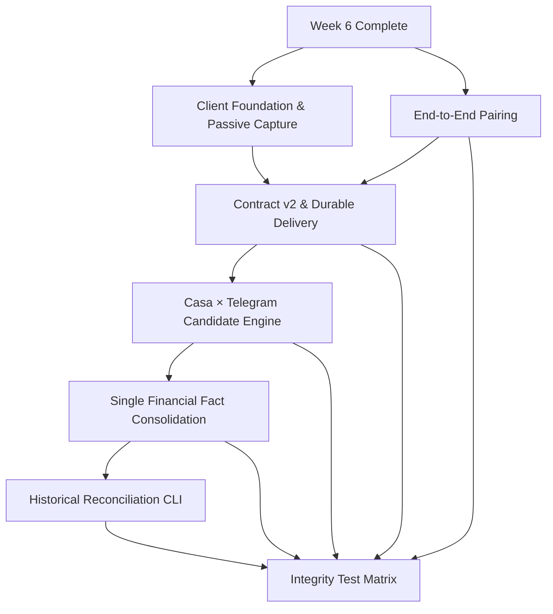

# Week 7: Collection Integrity & Extension Contract — Milestones & GitHub Issues

## Milestone: **Week 7 — Collection Integrity & Extension Contract (Device Pairing + Casa/Telegram Reconciliation)**

**Target Date**: 7 days from Week 6 completion

**Depends on**: Week 5 account ownership and temporal assignment contracts complete; Week 6 intake foundations complete

**Review Workflow**: This ADR is the proposal submitted for administrator review. This pull request does **not** create or edit GitHub issues. The issue set is created only after the proposal is accepted and merged.

**Scope Guard**: Backend/API and the dedicated browser-extension client only. No website frontend work belongs to this milestone.

**Success Criteria**:
- [ ] The browser extension has a dedicated private repository, `wfcgit-hub/bancaemdia-extension`, while `bancaemdia-api` remains the owner of the versioned collection contract
- [ ] The legacy extension is imported with traceable provenance and preserved history; the first distribution path is a reproducible ZIP plus SHA-256 checksum
- [ ] Every extension installation has its own revocable token; one user can pair and manage multiple devices independently
- [ ] Contract v2 supports explicit collection sessions, a `coletar_desde` boundary, batched delivery, per-item acknowledgements, and optional `conta_casa_ref`
- [ ] Casa × Telegram matching produces deterministic, explainable candidates without immediately changing financial totals
- [ ] A confirmed pair becomes exactly one financial fact: the Casa record owns financial truth and Telegram remains linked as tipster/message context
- [ ] Both arrival orders are safe: Casa after Telegram and Telegram after Casa run the same reconciliation rules
- [ ] Historical reconciliation is available through a dry-run-first CLI with a reviewed report before any apply
- [ ] Race, retry, replay, token, boundary, tenant-isolation, and double-counting tests pass in CI

---

## GitHub Issues (7 issues)

### Issue 1: Extension Client Foundation — MV3 + TypeScript + Passive Capture
**Labels**: `week-7`, `extension`, `client`, `architecture`
**Size**: L (6-8 hours)

**Files**:
- `bancaemdia-extension/package.json`
- `bancaemdia-extension/tsconfig.json`
- `bancaemdia-extension/manifest.json`
- `bancaemdia-extension/src/background/`
- `bancaemdia-extension/src/content/`
- `bancaemdia-extension/src/injected/`
- `bancaemdia-extension/src/contracts/`
- `bancaemdia-extension/tests/`
- `bancaemdia-extension/.github/workflows/ci.yml`
- `bancaemdia-extension/docs/architecture/`

**Tasks**:
- [ ] Complete the already-created private `wfcgit-hub/bancaemdia-extension` repository, preserving its imported subtree history while migrating the legacy JavaScript prototype to strict TypeScript
- [ ] Separate service worker, isolated content script, page-world bridge, contracts, storage, and adapters into explicit modules with a reproducible lockfile
- [ ] Configure lint, format, typecheck, unit tests, production build, dependency audit, and deterministic ZIP + SHA-256 artifact generation in CI
- [ ] Keep the manifest minimal: no `<all_urls>`, cookies, browsing-history, remote executable code, or bookmaker host permission enabled by default
- [ ] Document and enforce the trust boundary: passively observe only responses caused by the user's own navigation; never place bets, click controls, collect credentials, infer the bookmaker login, bypass protections, or call private endpoints independently
- [ ] Add environment configuration for approved local/staging/production API origins without embedding secrets in the bundle
- [ ] Port the minimum fetch/XHR observation path still required by the prototype without changing the response or behavior seen by the page
- [ ] Validate page message source, per-installation nonce, exact hostname, endpoint matcher, HTTP method, content type, payload size, and adapter/schema version before forwarding any capture
- [ ] Produce a structured-clone-safe envelope with capture ID, exact-host provenance, captured-at time, endpoint metadata, adapter/schema version, sanitization version, content hash, and the minimum raw body required for backend replay
- [ ] Strip headers, cookies, authorization fields, storage tokens, credential-shaped values, and unrelated personal data before local persistence
- [ ] Bound body size and message rate; unknown endpoints or schemas fail closed with metadata-only diagnostics
- [ ] Add a redacted logger and tests proving page behavior is unchanged and session/credential material never enters envelopes, local storage, build artifacts, logs, or diagnostics

**Acceptance**: CI produces a reproducible strict-TypeScript MV3 ZIP and checksum; an allowlisted fixture response is captured once into a sanitized, versioned envelope without altering the page, while unknown endpoints, undeclared hosts, and any credential/session material are rejected before persistence

---

### Issue 2: Extension Pairing — End-to-End Installation Identity, Rotation & Revocation
**Labels**: `week-7`, `extension`, `auth`, `security`
**Size**: L (6-8 hours)

**Files**:
- `src/bancaemdia/api/v1/coleta_pairing.py`
- `src/bancaemdia/models/coleta_instalacao.py`
- `src/bancaemdia/repositories/coleta_instalacao.py`
- `src/bancaemdia/services/coleta_tokens.py`
- `alembic/versions/*_coleta_instalacoes.py`
- `tests/integration/coleta/test_pairing.py`
- `tests/security/test_coleta_tokens.py`
- `bancaemdia-extension/src/pairing/`
- `bancaemdia-extension/src/storage/credentials.ts`
- `bancaemdia-extension/tests/pairing/`

**Tasks**:
- [ ] Replace the “one live token per user” assumption with a first-class, RLS-protected `ColetaInstalacao` that permits multiple independently managed installations per user
- [ ] Persist installation identity, user, optional device label, token hash/prefix, creation/pairing/last-use/rotation/revocation timestamps, and unique `(usuario_id, instalacao_publica_id)` without storing browser fingerprints or bookmaker identity
- [ ] Implement short-lived, single-use pairing codes: an authenticated user creates a code; the extension exchanges it with a locally generated opaque installation ID and optional label; plaintext codes/tokens are returned once and never persisted by the API
- [ ] Rate-limit code creation/exchange, use neutral errors, make concurrent exchange consume the code exactly once, and keep the maximum code lifetime at 30 minutes
- [ ] Add backend endpoints for pairing-code creation, exchange, installation listing, token rotation, and per-installation revocation; website UI remains out of scope
- [ ] Issue high-entropy, least-privilege installation tokens stored only as keyed hashes server-side and usable only for collection/session/status endpoints
- [ ] Authenticate collection requests into both `usuario_id` and `instalacao_id`; rotation atomically invalidates the prior token and revocation affects only the selected installation
- [ ] Implement the approved pairing flow in the extension, store the credential only in extension-local storage inaccessible to page-world code, and attach installation/contract/idempotency metadata to authenticated requests
- [ ] Require TLS and an approved API origin, reject credential-bearing redirects, support explicit disconnect/re-pair, and retain queued captures without transmitting when credentials expire or are revoked
- [ ] Redact codes/tokens from logs, traces, errors, metrics, and audit diffs while recording safe pair/rotate/revoke/rejected-auth metadata
- [ ] Provide a migration path for legacy `ColetaToken` rows without silently sharing one credential across multiple devices
- [ ] Add cross-repository contract tests for wrong/expired/reused codes, concurrent exchange, cross-tenant tokens, multiple devices, rotation, revocation, reconnect, and retry

**Acceptance**: One code pairs exactly one opaque installation; a user can pair two devices, rotate one, and revoke the other independently; revoked or rotated credentials cannot send; queued data survives re-pairing; and no plaintext secret, bookmaker identity, or browser fingerprint is persisted or exposed to page code

---

### Issue 3: Collection Contract v2 — API Boundary, Sessions, Durable Outbox & Per-Item ACK
**Labels**: `week-7`, `coleta-casa`, `extension`, `contract`, `idempotency`
**Size**: L (6-8 hours)

**Files**:
- `docs/architecture/browser-extension.md`
- `docs/contracts/coleta-v2.md`
- `docs/runbooks/extension-contract-release.md`
- `openapi/extension-collection-v2.json`
- `src/bancaemdia/api/v1/coleta_sessoes.py`
- `src/bancaemdia/api/v1/coleta.py`
- `src/bancaemdia/schemas/coleta_v2.py`
- `src/bancaemdia/models/coleta_sessao.py`
- `src/bancaemdia/domain/coleta_casa.py`
- `alembic/versions/*_coleta_contract_v2.py`
- `tests/contract/test_coleta_v2.py`
- `tests/contract/test_extension_contract_compatibility.py`
- `bancaemdia-extension/src/contracts/`
- `bancaemdia-extension/src/outbox/`
- `bancaemdia-extension/tests/outbox/`

**Tasks**:
- [ ] Record one explicit component boundary:
  - `bancaemdia-extension` is an untrusted client that captures, sanitizes, queues, and submits versioned transport envelopes
  - `bancaemdia-api` authenticates installations, owns and publishes the canonical contract, parses captures, derives bookmaker/ticket identity, deduplicates, reconciles, and materializes financial state
  - Settlement, balances, matching, holder assignment, and financial totals never exist only in the extension
- [ ] Publish canonical schemas/examples from the API and make API CI verify schema/runtime equality; extension CI consumes a pinned released version/hash instead of maintaining a divergent contract
- [ ] Support current (`N`) and previous (`N-1`) contract versions; breaking changes require a new major version, coexistence/deprecation window, compatibility record, and rollback behavior
- [ ] Publish release metadata covering API contract/schema hash, supported extension/browser range, artifact checksum, permission set, known coverage, and deprecation date
- [ ] Encode non-negotiable trust rules: exact-host provenance, bounded payloads, no credential/session material, no automated bookmaker action, and explicit rejection of unknown versions
- [ ] Add `ColetaSessao`, owned by one installation, with immutable `coletar_desde`; reconnect resumes the explicit open session or starts a new one without silently widening the boundary
- [ ] Define contract v2 batch and item envelopes with contract/batch/session identifiers, stable `client_event_id`, exact hostname, observed transport metadata, `capturado_em`, raw sanitized payload, content hash, and optional `conta_casa_ref`
- [ ] Keep bookmaker, ticket identity, lifecycle state, and canonical hash authoritative only after API parsing; client hints are diagnostic, never financial truth
- [ ] Persist every sanitized envelope in an IndexedDB outbox before delivery; stable capture IDs and hashes must survive service-worker suspension, browser restart, reconnect, and repeated observation
- [ ] Send bounded batches and retain each item until its own durable ACK; implement capped exponential backoff with jitter, offline awareness, `Retry-After`, poison-item quarantine, storage limits that never silently discard unsent financial captures, and metadata-only diagnostics
- [ ] Preserve per-host ordering when lifecycle reconstruction requires it while allowing fair progress across hosts
- [ ] Enforce `coletar_desde` from trustworthy source occurrence/ticket time: older items become `ignored_before_boundary`; capture time alone never makes an old ticket eligible; missing/untrustworthy time goes to review
- [ ] Apply transport idempotency by `(instalacao_id, client_event_id)` and business idempotency by `(usuario_id, casa_id, identidade)`; identical content is a no-op, a valid later lifecycle may advance state, and stale content cannot regress it
- [ ] Return one deterministic per-item submission ACK—`accepted`, `duplicate`, or `rejected`—with stable reason, retryability, and job reference, plus terminal status such as `materialized`, `updated`, `ignored_before_boundary`, `needs_review`, or `failed`
- [ ] Ensure an ACK for an older content version cannot delete a newer queued capture and retry only unacknowledged or explicitly retryable items, never the already accepted subset
- [ ] Validate optional `conta_casa_ref` ownership, bookmaker, and temporal validity; absent or ambiguous resolution goes to review rather than a first-active fallback, preserving future simultaneous-account compatibility without enabling it now
- [ ] Preserve raw bookmaker payload losslessly with a verified hash for replay/parser evolution and emit low-cardinality metrics by contract/ACK result
- [ ] Add shared mock fixtures and cross-repository tests for mixed ACKs, partial retries, timeout after server commit, duplicate ACK, worker/browser restart, 401/429/5xx, oversized/malformed payload, storage pressure, poison isolation, boundary cases, contract downgrade, and v1/v2 compatibility

**Acceptance**: A captured item is durably queued before transmission, a mixed batch receives one stable ACK per ordered item, accepted captures reach a terminal status, retries/restarts create no duplicate collection or financial fact, pre-boundary and ambiguous-account items fail safely, and API plus extension CI prove the published N/N-1 schema matches runtime behavior

---

### Issue 4: Casa × Telegram Matching — Deterministic Candidate Engine
**Labels**: `week-7`, `matching`, `telegram`, `coleta-casa`, `domain`
**Size**: L (6-8 hours)

**Files**:
- `src/bancaemdia/domain/cruzamento.py`
- `src/bancaemdia/services/cruzamento_candidatos.py`
- `src/bancaemdia/models/cruzamento_candidato.py`
- `src/bancaemdia/repositories/cruzamento_candidato.py`
- `alembic/versions/*_cruzamento_candidatos.py`
- `tests/unit/test_cruzamento_candidatos.py`
- `tests/fixtures/cruzamento/`

**Tasks**:
- [ ] Replace placeholder `iguais_a_existentes` / `em_duvida` behavior with a deterministic, versioned candidate engine
- [ ] Compare only records belonging to the same user and compatible bookmaker, then score explicit signals:
  - Bookmaker ticket identity when present in both sources (strong proof)
  - Bet occurrence time window, never merely ingestion time
  - Stake in cents and currency
  - Total odd with documented tolerance
  - Event/participants, competition/sport, market, line, selection, and single/multiple structure
  - Lifecycle compatibility (`open`, `settled`, `cancelled`, `cashout`) without treating later settlement as a different bet
- [ ] Normalize only through existing canonical dictionaries; retain every original value used by the explanation
- [ ] Persist `CruzamentoCandidato` with Casa bet/collection reference, Telegram bet reference, algorithm version, score, matched signals, conflicting signals, status, and timestamps
- [ ] Make candidate generation pure and reproducible for the same normalized inputs + algorithm version
- [ ] Define reviewed thresholds:
  - `exact`: deterministic evidence sufficient for automatic consolidation in Issue 5
  - `probable`: create `RevisaoPendente`; do not change financial totals
  - `incompatible`: store diagnostic result/metric where useful, but do not create a visible pair
- [ ] Enforce one-to-one eligibility before marking `exact`; competing candidates, partial/multiple ambiguity, materially different stake/odd, or missing decisive fields are never automatically resolved
- [ ] Exclude records already consolidated with another financial fact
- [ ] Add bounded search windows and supporting indexes so matching does not scan a tenant's complete history
- [ ] Version score/threshold configuration and include a human-readable explanation suitable for review and retroactive reports
- [ ] Build sanitized fixtures for exact, probable, incompatible, multiple-bet, cashout, cancelled, delayed-capture, and same-event/same-stake false-positive cases

**Acceptance**: The same fixture/version always yields the same score, class, and explanation; only decisive one-to-one evidence is auto-eligible, ambiguity makes no financial mutation, cross-tenant/already-consolidated rows are excluded, delayed capture still matches by occurrence time, and the production-sized query stays within its documented budget

---

### Issue 5: Casa × Telegram Consolidation — One Financial Fact, Two Context Sources
**Labels**: `week-7`, `matching`, `data-integrity`, `financeiro`, `transactions`
**Size**: L (6-8 hours)

**Files**:
- `src/bancaemdia/domain/consolidacao_aposta.py`
- `src/bancaemdia/workers/materialization.py`
- `src/bancaemdia/models/aposta_consolidacao.py`
- `src/bancaemdia/repositories/aposta_consolidacao.py`
- `alembic/versions/*_aposta_consolidacoes.py`
- `tests/integration/cruzamento/test_consolidacao.py`

**Tasks**:
- [ ] Model a durable one-to-one consolidation instead of deleting either source:
  - Casa-origin bet/collection is the financial source of truth for stake, odd, status, return, bookmaker identity, and account
  - Telegram-origin bet remains linked as message/media/tipster/source context and stops contributing a second stake, return, balance, exposure, or ROI entry
  - Store relation, decision (`automatic` or `reviewed`), algorithm version, evidence snapshot, actor, and timestamp
- [ ] Make every financial query/projection consume one canonical financial fact per consolidation; do not rely on UI filtering to hide duplicates
- [ ] Preserve provenance and reversibility:
  - Never delete raw collection, Telegram message, event history, or original extracted fields
  - Emit append-only `ApostasConsolidadas` / correction events
  - A reviewed unlink/reclassification rebuilds the affected projection without losing source evidence
- [ ] Transfer Telegram context safely:
  - Tipster/message/media references enrich the canonical fact when unambiguous
  - Telegram-derived financial values never overwrite authoritative Casa values
  - Conflicting contextual values remain visible in evidence/review rather than being silently discarded
- [ ] Trigger the same candidate/consolidation flow in both directions:
  - New/updated Casa item searches eligible Telegram records
  - New/updated Telegram record searches eligible Casa records
  - Arrival order does not change the final pair or totals
- [ ] Consolidate `exact` candidates in one transaction with deterministic lock ordering by row ID
- [ ] Send `probable`, competing, and many-to-one/one-to-many cases to `RevisaoPendente`; no automatic financial mutation in those cases
- [ ] Respect account assignment precedence:
  - Explicit valid `conta_casa_ref`
  - Otherwise one unambiguous temporal account at the bet occurrence time
  - Otherwise review; never select an arbitrary account
- [ ] Make the operation idempotent under worker retry and concurrent Casa/Telegram arrival
- [ ] Update settlement/open→settled handling so later Casa state updates the same canonical financial fact without re-enabling the Telegram duplicate
- [ ] Emit reconciliation metrics and structured audit events without high-cardinality or sensitive labels

**Acceptance**: An exact Casa/Telegram pair contributes one stake/result while retaining Telegram context; repeated/concurrent consolidation creates one relation, both arrival orders converge identically, ambiguous pairs stay safe in review, and later settlement plus replay update/reconstruct the same single financial fact

---

### Issue 6: Historical Casa × Telegram Reconciliation CLI — Dry Run, Review & Apply
**Labels**: `week-7`, `matching`, `cli`, `replay`, `data-integrity`
**Size**: M (4-5 hours)

**Files**:
- `src/bancaemdia/cli/reconciliar_casa_telegram.py`
- `scripts/reconciliar_casa_telegram.py`
- `tests/cli/test_reconciliar_casa_telegram.py`
- `docs/runbooks/reconciliacao-historica.md`

**Tasks**:
- [ ] Implement a dry-run-first CLI over existing Casa and Telegram history:
  - Filters: `--usuario-id`, `--desde`, `--ate`, `--casa`, `--algorithm-version`, and bounded `--batch-size`
  - Default invocation is dry-run; it performs no domain/database writes
  - Report exact, probable, incompatible, competing, already-consolidated, and error counts
- [ ] Produce machine-readable JSON/CSV plus a concise terminal summary containing:
  - Stable candidate identifiers, score/classification, matched/conflicting signals, projected action, and reason
  - Current totals and projected totals by user/house before any apply
  - Algorithm/contract version, filters, generated timestamp, source high-water mark, and report SHA-256
- [ ] Require an explicit apply command referencing the reviewed report/hash; reject apply when filters, algorithm version, or source high-water mark no longer match
- [ ] In apply mode:
  - Automatically consolidate only report entries classified `exact`
  - Create review entries for `probable`/competing cases
  - Process deterministic chunks with checkpoints and safe resume
  - Use the same domain service and locking path as online consolidation, not a second implementation
- [ ] Keep the run idempotent: rerunning or resuming the same approved report performs no duplicate consolidation or duplicate financial mutation
- [ ] Add pre/post integrity checks for bet count, financial-fact count, total stake, total return, profit, and unresolved value
- [ ] Abort and roll back the current chunk on invariant failure; retain completed-chunk audit records and a clear restart point
- [ ] Document backup, review, apply, rollback/reprojection, and post-run validation procedures

**Acceptance**: Dry-run changes no rows and emits a stable checksummed report; apply accepts the exact reviewed report once, rejects stale/modified input, survives interruption idempotently, reconciles identically after replay, and never turns probable/competing matches into financial changes

---

### Issue 7: Collection Integrity Test Matrix — Races, Retry, Replay & Financial Invariants
**Labels**: `week-7`, `testing`, `data-integrity`, `concurrency`, `extension`
**Size**: L (6-8 hours)

**Files**:
- `tests/integration/coleta/test_contract_v2_integrity.py`
- `tests/integration/coleta/test_concurrency.py`
- `tests/integration/cruzamento/test_bidirectional_races.py`
- `tests/replay/test_collection_replay.py`
- `tests/security/test_collection_tenant_isolation.py`
- `tests/fixtures/coleta_v2/`

**Tasks**:
- [ ] Build a test matrix for authentication and device lifecycle:
  - Concurrent reuse of one pairing code creates one token
  - Multiple installations remain isolated during rotate/revoke
  - Revoked/rotated token requests cannot race into a committed collection
  - Tokens cannot access normal user APIs or another tenant
- [ ] Test contract v2 delivery/idempotency:
  - Duplicate item within one batch, across batches, and across retries
  - Ten concurrent requests with the same `client_event_id`
  - Partial mixed-result batch and retry of only retryable/unacknowledged items
  - Oversized/malformed batch rejected without partial unintended commit
  - Raw payload hash/provenance preserved
- [ ] Test lifecycle ordering:
  - `open → settled`, duplicate settled, stale open after settled, cancelled, and cashout
  - Out-of-order worker delivery cannot regress the canonical state or create another financial fact
- [ ] Test session boundaries:
  - Source occurrence before, exactly at, and after `coletar_desde`
  - Old ticket captured today remains outside the new session
  - Missing/untrustworthy occurrence time goes to review
  - Reconnect cannot silently alter the boundary
- [ ] Test account-reference safety:
  - Valid optional `conta_casa_ref`
  - Wrong user, wrong bookmaker, expired interval, absent reference with one valid account, and absent reference with multiple valid accounts
  - Ambiguity never falls back to “first active account”
- [ ] Test matching/consolidation races:
  - Casa and Telegram arrive simultaneously
  - Casa first and Telegram first
  - Two workers propose the same pair
  - Two Casa records compete for one Telegram record and vice versa
  - Update/settlement races with initial consolidation
- [ ] Assert the core invariant after every scenario:
  - One bookmaker bet identity corresponds to at most one canonical financial fact per user
  - A consolidated Casa/Telegram pair contributes exactly one stake/return/profit
  - Raw source records and audit history remain available
- [ ] Run replay after each representative failure/retry fixture and compare canonical output + financial totals to the online result
- [ ] Inject transaction rollback between collection, candidate creation, and consolidation; verify no half-linked or half-counted state remains
- [ ] Add randomized/property-based interleavings for duplicate, update, and arrival order where practical
- [ ] Include the suite in required CI with PostgreSQL/Redis and publish invariant diagnostics on failure

**Acceptance**: The complete suite passes repeatedly in parallel CI; ten concurrent duplicate deliveries yield one lineage and at most one financial fact, every arrival/retry/replay order converges to centavo-exact totals, cross-tenant actions all fail, and injected faults expose either a full commit or no commit

---

## Dependency Graph

---

## Suggested Execution Order (Day by Day)

| Day | Issues | Notes |
|-----|--------|-------|
| 1 | 1, 2 | Client foundation and end-to-end installation pairing can begin in parallel |
| 2 | 1, 2 | Finish passive capture, token lifecycle, and cross-repository contract tests |
| 3 | 3 | Publish contract v2 and stabilize sessions, outbox, per-item ACK, and idempotency |
| 4 | 4 | Validate deterministic candidates and false-positive fixtures |
| 5 | 5 | Consolidate only exact matches into one financial fact |
| 6 | 6 | Reuse the online domain path for reviewed historical reconciliation |
| 7 | 7 | Run race/retry/replay matrix and close every financial invariant |

---

## Administrator Review Gate

Before these issue bodies are created in GitHub, the administrator must approve this ADR through the pull request. Approval confirms:

- The extension belongs in `wfcgit-hub/bancaemdia-extension`, separate from the API and from the website frontend
- The API repository owns collection contract v2 and its compatibility policy
- All seven issues are tracked centrally in `bancaemdia-api`; GitHub Issues remain disabled in the extension repository
- ADR 024 is a responsibility map only and does not duplicate issue bodies
- ZIP + SHA-256 is the initial distribution mechanism; store publication is not part of Week 7
- Collection starts at an explicit `coletar_desde` boundary
- `conta_casa_ref` is optional preparation for future simultaneous-account support; Week 7 does not claim to solve automatic simultaneous-account identification
- Automatic reconciliation is restricted to exact, one-to-one evidence; ambiguity always goes to review
- Casa owns the one financial fact and Telegram remains attached as contextual/tipster provenance

Merging the proposal documents agreement with the roadmap; it does not itself create, close, or modify any GitHub issue.
