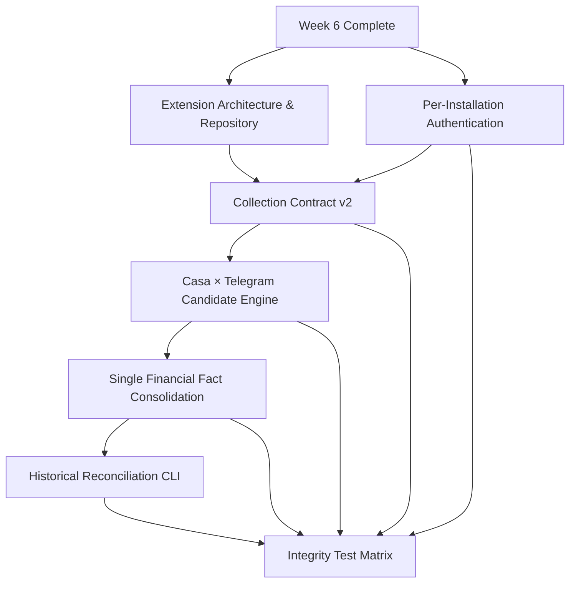

# Week 7: Collection Integrity & Extension Contract — Milestones & GitHub Issues

## Milestone: **Week 7 — Collection Integrity & Extension Contract (Device Pairing + Casa/Telegram Reconciliation)**

**Target Date**: 7 days from Week 6 completion

**Depends on**: Week 5 account ownership and temporal assignment contracts complete; Week 6 intake foundations complete

**Review Workflow**: This ADR is the proposal submitted for administrator review. This pull request does **not** create or edit GitHub issues. The issue set is created only after the proposal is accepted and merged.

**Scope Guard**: Backend/API and the dedicated browser-extension client only. No website frontend work belongs to this milestone.

**Success Criteria**:
- [ ] The browser extension has a dedicated private repository, `wfcgit-hub/bancaemdia-extension`, while `bancaemdia-api` remains the owner of the versioned collection contract
- [ ] The legacy extension is imported with traceable provenance and preserved history; the first distribution path is a reproducible ZIP plus SHA-256 checksum
- [ ] Every extension installation has its own revocable token; one user can pair and manage multiple devices independently
- [ ] Contract v2 supports explicit collection sessions, a `coletar_desde` boundary, batched delivery, per-item acknowledgements, and optional `conta_casa_ref`
- [ ] Casa × Telegram matching produces deterministic, explainable candidates without immediately changing financial totals
- [ ] A confirmed pair becomes exactly one financial fact: the Casa record owns financial truth and Telegram remains linked as tipster/message context
- [ ] Both arrival orders are safe: Casa after Telegram and Telegram after Casa run the same reconciliation rules
- [ ] Historical reconciliation is available through a dry-run-first CLI with a reviewed report before any apply
- [ ] Race, retry, replay, token, boundary, tenant-isolation, and double-counting tests pass in CI

---

## GitHub Issues (7 issues)

### Issue 1: Extension Boundary — API Contract Ownership & Release Compatibility
**Labels**: `week-7`, `extension`, `architecture`, `contract`
**Size**: M (3-4 hours)

**Files**:
- `docs/architecture/browser-extension.md`
- `docs/contracts/coleta-v2.md`
- `docs/runbooks/extension-contract-release.md`
- `openapi/extension-collection-v2.json`
- `tests/contract/test_extension_contract_compatibility.py`

**Tasks**:
- [ ] Record the component boundary explicitly:
  - `bancaemdia-extension` is an untrusted browser client that passively observes responses caused by the user's own navigation and submits sanitized captures inside versioned transport envelopes
  - `bancaemdia-api` authenticates installations, owns the canonical JSON/OpenAPI contract, parses and validates captures, deduplicates, reconciles, and materializes financial state
  - No settlement, balance, matching, holder, or financial-total rule is implemented only in the extension
- [ ] Register the already-created private `wfcgit-hub/bancaemdia-extension` repository and its preserved subtree history as the client of this contract; repository migration, TypeScript scaffold, build, ZIP, and client CI belong only to the central `[Extension] Repository Scaffold` issue in ADR 024
- [ ] Establish API-owned contract publishing:
  - Canonical schemas and examples live in `bancaemdia-api`
  - API CI validates runtime/schema equality and compatibility rules
  - Extension CI consumes a pinned released contract version/hash rather than maintaining a divergent hand-written contract
  - Compatibility tests cover current (`N`) and previous (`N-1`) contract versions
  - Breaking changes require a new major contract version and a documented coexistence/deprecation window
- [ ] Define the release compatibility record: API contract version, minimum/maximum extension version, schema hash, deprecation date, and rollback behavior
- [ ] Define the metadata that the client release must publish—artifact version, checksum, supported contract/browser versions, permission set, and known bookmaker coverage—without implementing the client build in this issue
- [ ] Record non-negotiable trust rules in the API contract: no credentials/session material, no automated bookmaker actions, exact-host provenance, bounded payloads, and explicit failure on unknown versions
- [ ] Add contract fixtures that a mock client and ADR 024 client issues can consume without importing backend code
- [ ] Make the dependency explicit: this API issue owns contract publication; ADR 024 Issues 1–6 own all extension-repository implementation

**Acceptance**: The architecture and compatibility tests identify one owner for every responsibility, publish one API-owned N/N-1 contract and mock fixture set, and leave repository scaffold, build, ZIP, permissions, and client storage exclusively to the mapped ADR 024 issues

---

### Issue 2: Extension Authentication — Per-Installation Pairing, Rotation, Revocation & Multiple Devices
**Labels**: `week-7`, `extension`, `auth`, `security`
**Size**: L (5-6 hours)

**Files**:
- `src/bancaemdia/api/v1/coleta_pairing.py`
- `src/bancaemdia/models/coleta_instalacao.py`
- `src/bancaemdia/repositories/coleta_instalacao.py`
- `src/bancaemdia/services/coleta_tokens.py`
- `alembic/versions/*_coleta_instalacoes.py`
- `tests/integration/coleta/test_pairing.py`
- `tests/security/test_coleta_tokens.py`

**Tasks**:
- [ ] Replace the “one live token per user” assumption with a first-class `ColetaInstalacao` model:
  - `id`, `usuario_id`, `instalacao_publica_id`, `nome_dispositivo`, `token_hash`, `token_prefix`, `criada_em`, `pareada_em`, `ultimo_uso_em`, `rotacionada_em`, `revogada_em`
  - Unique `(usuario_id, instalacao_publica_id)` and RLS by `usuario_id`
  - Multiple active installations are allowed for the same user
- [ ] Issue a high-entropy token and store only a keyed cryptographic hash suitable for lookup and constant-time verification; return plaintext exactly once at pair/rotate time
- [ ] Implement short-lived, single-use pairing codes:
  - Authenticated user requests a code with a 30-minute maximum lifetime
  - Extension exchanges code + locally generated `instalacao_publica_id` + device label for its token
  - Store only the pairing-code hash; successful exchange, expiry, or revocation makes the code unusable
  - Rate-limit code creation and exchange; do not reveal whether another user's code exists
- [ ] Add backend endpoints (website UI is out of scope):
  - `POST /api/v1/coleta/pairing-codes`
  - `POST /api/v1/coleta/pair`
  - `GET /api/v1/coleta/instalacoes`
  - `POST /api/v1/coleta/instalacoes/{id}/rotate`
  - `DELETE /api/v1/coleta/instalacoes/{id}` for revocation
- [ ] Authenticate collection requests with the installation token and attach both `usuario_id` and `instalacao_id` to request context
- [ ] Make rotation and revocation atomic:
  - Rotation invalidates the prior token and emits an audit event
  - Revocation affects only the selected installation; other paired devices remain active
  - A revoked/rotated token returns a generic `401` and can never create a collection or session
- [ ] Apply least-privilege token scope: installation tokens can call collection/session/status endpoints only, never normal user or admin endpoints
- [ ] Redact token/code values from logs, traces, exception payloads, metrics labels, and audit diffs
- [ ] Record safe audit metadata for pair, rotate, revoke, successful authentication, and repeated rejected authentication
- [ ] Provide a migration path for legacy `ColetaToken` records without silently sharing one credential across multiple future devices

**Acceptance**: User A can pair two devices, rotate one, and revoke the other without affecting unrelated devices; pairing codes are expiring/single-use, plaintext secrets are never persisted or logged, concurrent exchange yields one active token, and every token is tenant-bound and fails after rotation or revocation

---

### Issue 3: Collection Contract v2 — Sessions, `coletar_desde`, Batch Delivery & Per-Item ACK
**Labels**: `week-7`, `coleta-casa`, `api`, `contract`, `idempotency`
**Size**: L (6-8 hours)

**Files**:
- `src/bancaemdia/api/v1/coleta_sessoes.py`
- `src/bancaemdia/api/v1/coleta.py`
- `src/bancaemdia/schemas/coleta_v2.py`
- `src/bancaemdia/models/coleta_sessao.py`
- `src/bancaemdia/domain/coleta_casa.py`
- `alembic/versions/*_coleta_contract_v2.py`
- `openapi/extension-collection-v2.json`
- `tests/contract/test_coleta_v2.py`

**Tasks**:
- [ ] Add an explicit `ColetaSessao` owned by one installation with:
  - `id`, `usuario_id`, `instalacao_id`, `contrato`, `coletar_desde`, `iniciada_em`, `encerrada_em`, `ultimo_lote_em`
  - `coletar_desde` is supplied/confirmed when the session starts and is immutable afterward
  - Reconnecting resumes the existing open session or starts a new explicit session; it never silently widens the boundary
- [ ] Publish contract v2 with a versioned envelope:
  - Batch: `contrato`, `batch_id`, `session_id`, `sent_at`, `items[]`
  - Item: `client_event_id`, exact hostname, observed request/response metadata, `capturado_em`, raw response payload, client-computed content hash, and optional `conta_casa_ref`
  - Bookmaker, ticket identity, lifecycle state, and canonical content hash are derived/verified by the API parser; client hints may be retained for diagnostics but are never authoritative
  - Define maximum items and maximum encoded bytes per batch; reject oversized batches before enqueueing
- [ ] Specify and contract-test the client delivery guarantees consumed by ADR 024 Issue 4, without implementing client storage in this API issue:
  - A capture is durably queued client-side before delivery and uses a stable `client_event_id`
  - Batches are bounded and each item remains queued until its own durable ACK
  - Retry/backoff and permanent-rejection semantics are machine-readable
  - An ACK for an older content version cannot authorize deletion of a newer capture for the same bookmaker ticket
- [ ] Enforce the boundary server-side:
  - An item whose source occurrence/ticket time is earlier than `coletar_desde` is acknowledged as `ignored_before_boundary`
  - `capturado_em` alone must not make an old ticket eligible
  - Missing or untrustworthy source time goes to explicit review; it is never silently treated as a new financial fact
- [ ] Add idempotency at both transport and business levels:
  - `(instalacao_id, client_event_id)` identifies the extension delivery event
  - `(usuario_id, casa_id, identidade)` identifies the bookmaker ticket
  - Same identity + same content hash is a no-op; valid later lifecycle content may advance the stored state; stale content cannot regress it
- [ ] Return a deterministic durable acknowledgement for every item, even when a batch contains mixed outcomes:
  - Submission ACK is `accepted`, `duplicate`, or `rejected`; `accepted` means the server durably owns the item, not that financial processing already succeeded
  - Include `client_event_id`, server/job reference when one exists, stable machine-readable reason, and `retryable` boolean
  - Item status exposes terminal processing outcome such as `materialized`, `updated`, `ignored_before_boundary`, `needs_review`, or `failed`
  - The extension retries only unacknowledged or explicitly retryable items, never the entire accepted subset
- [ ] Validate optional `conta_casa_ref`:
  - It must belong to the authenticated user and match the collected bookmaker
  - It is retained through raw collection and materialization
  - When absent, the backend may resolve only an unambiguous temporally valid account
  - If more than one account can be valid, do not pick the first row: send the item to review
  - The optional field prepares future simultaneous-account collection without enabling that behavior in this milestone
- [ ] Preserve the received raw bookmaker payload byte-for-byte (or losslessly with a verified content hash) for replay and parser evolution
- [ ] Keep contract v1 behavior available for its documented compatibility window; add `N`/`N-1` contract tests that prevent v2 changes from altering v1 silently
- [ ] Emit metrics by contract version and ACK result without using user IDs, ticket IDs, or tokens as metric labels

**Acceptance**: A mixed batch returns one stable ACK per ordered input and each accepted item reaches a terminal status; retries create no duplicate collection/finance, pre-boundary tickets never enter totals, invalid account references fail safely, and v1/v2 suites prove the published schema matches runtime behavior

---

### Issue 4: Casa × Telegram Matching — Deterministic Candidate Engine
**Labels**: `week-7`, `matching`, `telegram`, `coleta-casa`, `domain`
**Size**: L (6-8 hours)

**Files**:
- `src/bancaemdia/domain/cruzamento.py`
- `src/bancaemdia/services/cruzamento_candidatos.py`
- `src/bancaemdia/models/cruzamento_candidato.py`
- `src/bancaemdia/repositories/cruzamento_candidato.py`
- `alembic/versions/*_cruzamento_candidatos.py`
- `tests/unit/test_cruzamento_candidatos.py`
- `tests/fixtures/cruzamento/`

**Tasks**:
- [ ] Replace placeholder `iguais_a_existentes` / `em_duvida` behavior with a deterministic, versioned candidate engine
- [ ] Compare only records belonging to the same user and compatible bookmaker, then score explicit signals:
  - Bookmaker ticket identity when present in both sources (strong proof)
  - Bet occurrence time window, never merely ingestion time
  - Stake in cents and currency
  - Total odd with documented tolerance
  - Event/participants, competition/sport, market, line, selection, and single/multiple structure
  - Lifecycle compatibility (`open`, `settled`, `cancelled`, `cashout`) without treating later settlement as a different bet
- [ ] Normalize only through existing canonical dictionaries; retain every original value used by the explanation
- [ ] Persist `CruzamentoCandidato` with Casa bet/collection reference, Telegram bet reference, algorithm version, score, matched signals, conflicting signals, status, and timestamps
- [ ] Make candidate generation pure and reproducible for the same normalized inputs + algorithm version
- [ ] Define reviewed thresholds:
  - `exact`: deterministic evidence sufficient for automatic consolidation in Issue 5
  - `probable`: create `RevisaoPendente`; do not change financial totals
  - `incompatible`: store diagnostic result/metric where useful, but do not create a visible pair
- [ ] Enforce one-to-one eligibility before marking `exact`; competing candidates, partial/multiple ambiguity, materially different stake/odd, or missing decisive fields are never automatically resolved
- [ ] Exclude records already consolidated with another financial fact
- [ ] Add bounded search windows and supporting indexes so matching does not scan a tenant's complete history
- [ ] Version score/threshold configuration and include a human-readable explanation suitable for review and retroactive reports
- [ ] Build sanitized fixtures for exact, probable, incompatible, multiple-bet, cashout, cancelled, delayed-capture, and same-event/same-stake false-positive cases

**Acceptance**: The same fixture/version always yields the same score, class, and explanation; only decisive one-to-one evidence is auto-eligible, ambiguity makes no financial mutation, cross-tenant/already-consolidated rows are excluded, delayed capture still matches by occurrence time, and the production-sized query stays within its documented budget

---

### Issue 5: Casa × Telegram Consolidation — One Financial Fact, Two Context Sources
**Labels**: `week-7`, `matching`, `data-integrity`, `financeiro`, `transactions`
**Size**: L (6-8 hours)

**Files**:
- `src/bancaemdia/domain/consolidacao_aposta.py`
- `src/bancaemdia/workers/materialization.py`
- `src/bancaemdia/models/aposta_consolidacao.py`
- `src/bancaemdia/repositories/aposta_consolidacao.py`
- `alembic/versions/*_aposta_consolidacoes.py`
- `tests/integration/cruzamento/test_consolidacao.py`

**Tasks**:
- [ ] Model a durable one-to-one consolidation instead of deleting either source:
  - Casa-origin bet/collection is the financial source of truth for stake, odd, status, return, bookmaker identity, and account
  - Telegram-origin bet remains linked as message/media/tipster/source context and stops contributing a second stake, return, balance, exposure, or ROI entry
  - Store relation, decision (`automatic` or `reviewed`), algorithm version, evidence snapshot, actor, and timestamp
- [ ] Make every financial query/projection consume one canonical financial fact per consolidation; do not rely on UI filtering to hide duplicates
- [ ] Preserve provenance and reversibility:
  - Never delete raw collection, Telegram message, event history, or original extracted fields
  - Emit append-only `ApostasConsolidadas` / correction events
  - A reviewed unlink/reclassification rebuilds the affected projection without losing source evidence
- [ ] Transfer Telegram context safely:
  - Tipster/message/media references enrich the canonical fact when unambiguous
  - Telegram-derived financial values never overwrite authoritative Casa values
  - Conflicting contextual values remain visible in evidence/review rather than being silently discarded
- [ ] Trigger the same candidate/consolidation flow in both directions:
  - New/updated Casa item searches eligible Telegram records
  - New/updated Telegram record searches eligible Casa records
  - Arrival order does not change the final pair or totals
- [ ] Consolidate `exact` candidates in one transaction with deterministic lock ordering by row ID
- [ ] Send `probable`, competing, and many-to-one/one-to-many cases to `RevisaoPendente`; no automatic financial mutation in those cases
- [ ] Respect account assignment precedence:
  - Explicit valid `conta_casa_ref`
  - Otherwise one unambiguous temporal account at the bet occurrence time
  - Otherwise review; never select an arbitrary account
- [ ] Make the operation idempotent under worker retry and concurrent Casa/Telegram arrival
- [ ] Update settlement/open→settled handling so later Casa state updates the same canonical financial fact without re-enabling the Telegram duplicate
- [ ] Emit reconciliation metrics and structured audit events without high-cardinality or sensitive labels

**Acceptance**: An exact Casa/Telegram pair contributes one stake/result while retaining Telegram context; repeated/concurrent consolidation creates one relation, both arrival orders converge identically, ambiguous pairs stay safe in review, and later settlement plus replay update/reconstruct the same single financial fact

---

### Issue 6: Historical Casa × Telegram Reconciliation CLI — Dry Run, Review & Apply
**Labels**: `week-7`, `matching`, `cli`, `replay`, `data-integrity`
**Size**: M (4-5 hours)

**Files**:
- `src/bancaemdia/cli/reconciliar_casa_telegram.py`
- `scripts/reconciliar_casa_telegram.py`
- `tests/cli/test_reconciliar_casa_telegram.py`
- `docs/runbooks/reconciliacao-historica.md`

**Tasks**:
- [ ] Implement a dry-run-first CLI over existing Casa and Telegram history:
  - Filters: `--usuario-id`, `--desde`, `--ate`, `--casa`, `--algorithm-version`, and bounded `--batch-size`
  - Default invocation is dry-run; it performs no domain/database writes
  - Report exact, probable, incompatible, competing, already-consolidated, and error counts
- [ ] Produce machine-readable JSON/CSV plus a concise terminal summary containing:
  - Stable candidate identifiers, score/classification, matched/conflicting signals, projected action, and reason
  - Current totals and projected totals by user/house before any apply
  - Algorithm/contract version, filters, generated timestamp, source high-water mark, and report SHA-256
- [ ] Require an explicit apply command referencing the reviewed report/hash; reject apply when filters, algorithm version, or source high-water mark no longer match
- [ ] In apply mode:
  - Automatically consolidate only report entries classified `exact`
  - Create review entries for `probable`/competing cases
  - Process deterministic chunks with checkpoints and safe resume
  - Use the same domain service and locking path as online consolidation, not a second implementation
- [ ] Keep the run idempotent: rerunning or resuming the same approved report performs no duplicate consolidation or duplicate financial mutation
- [ ] Add pre/post integrity checks for bet count, financial-fact count, total stake, total return, profit, and unresolved value
- [ ] Abort and roll back the current chunk on invariant failure; retain completed-chunk audit records and a clear restart point
- [ ] Document backup, review, apply, rollback/reprojection, and post-run validation procedures

**Acceptance**: Dry-run changes no rows and emits a stable checksummed report; apply accepts the exact reviewed report once, rejects stale/modified input, survives interruption idempotently, reconciles identically after replay, and never turns probable/competing matches into financial changes

---

### Issue 7: Collection Integrity Test Matrix — Races, Retry, Replay & Financial Invariants
**Labels**: `week-7`, `testing`, `data-integrity`, `concurrency`, `extension`
**Size**: L (6-8 hours)

**Files**:
- `tests/integration/coleta/test_contract_v2_integrity.py`
- `tests/integration/coleta/test_concurrency.py`
- `tests/integration/cruzamento/test_bidirectional_races.py`
- `tests/replay/test_collection_replay.py`
- `tests/security/test_collection_tenant_isolation.py`
- `tests/fixtures/coleta_v2/`

**Tasks**:
- [ ] Build a test matrix for authentication and device lifecycle:
  - Concurrent reuse of one pairing code creates one token
  - Multiple installations remain isolated during rotate/revoke
  - Revoked/rotated token requests cannot race into a committed collection
  - Tokens cannot access normal user APIs or another tenant
- [ ] Test contract v2 delivery/idempotency:
  - Duplicate item within one batch, across batches, and across retries
  - Ten concurrent requests with the same `client_event_id`
  - Partial mixed-result batch and retry of only retryable/unacknowledged items
  - Oversized/malformed batch rejected without partial unintended commit
  - Raw payload hash/provenance preserved
- [ ] Test lifecycle ordering:
  - `open → settled`, duplicate settled, stale open after settled, cancelled, and cashout
  - Out-of-order worker delivery cannot regress the canonical state or create another financial fact
- [ ] Test session boundaries:
  - Source occurrence before, exactly at, and after `coletar_desde`
  - Old ticket captured today remains outside the new session
  - Missing/untrustworthy occurrence time goes to review
  - Reconnect cannot silently alter the boundary
- [ ] Test account-reference safety:
  - Valid optional `conta_casa_ref`
  - Wrong user, wrong bookmaker, expired interval, absent reference with one valid account, and absent reference with multiple valid accounts
  - Ambiguity never falls back to “first active account”
- [ ] Test matching/consolidation races:
  - Casa and Telegram arrive simultaneously
  - Casa first and Telegram first
  - Two workers propose the same pair
  - Two Casa records compete for one Telegram record and vice versa
  - Update/settlement races with initial consolidation
- [ ] Assert the core invariant after every scenario:
  - One bookmaker bet identity corresponds to at most one canonical financial fact per user
  - A consolidated Casa/Telegram pair contributes exactly one stake/return/profit
  - Raw source records and audit history remain available
- [ ] Run replay after each representative failure/retry fixture and compare canonical output + financial totals to the online result
- [ ] Inject transaction rollback between collection, candidate creation, and consolidation; verify no half-linked or half-counted state remains
- [ ] Add randomized/property-based interleavings for duplicate, update, and arrival order where practical
- [ ] Include the suite in required CI with PostgreSQL/Redis and publish invariant diagnostics on failure

**Acceptance**: The complete suite passes repeatedly in parallel CI; ten concurrent duplicate deliveries yield one lineage and at most one financial fact, every arrival/retry/replay order converges to centavo-exact totals, cross-tenant actions all fail, and injected faults expose either a full commit or no commit

---

## Dependency Graph

---

## Suggested Execution Order (Day by Day)

| Day | Issues | Notes |
|-----|--------|-------|
| 1 | 1, 2 | Repository/contract boundary and installation security can begin in parallel |
| 2 | 2, 3 | Finish device lifecycle, then implement sessions and the v2 envelope |
| 3 | 3, 4 | Stabilize per-item ACK/idempotency before candidate generation |
| 4 | 4 | Validate deterministic candidates and false-positive fixtures |
| 5 | 5 | Consolidate only exact matches into one financial fact |
| 6 | 6 | Reuse the online domain path for reviewed historical reconciliation |
| 7 | 7 | Run race/retry/replay matrix and close every financial invariant |

---

## Administrator Review Gate

Before these issue bodies are created in GitHub, the administrator must approve this ADR through the pull request. Approval confirms:

- The extension belongs in `wfcgit-hub/bancaemdia-extension`, separate from the API and from the website frontend
- The API repository owns collection contract v2 and its compatibility policy
- ZIP + SHA-256 is the initial distribution mechanism; store publication is not part of Week 7
- Collection starts at an explicit `coletar_desde` boundary
- `conta_casa_ref` is optional preparation for future simultaneous-account support; Week 7 does not claim to solve automatic simultaneous-account identification
- Automatic reconciliation is restricted to exact, one-to-one evidence; ambiguity always goes to review
- Casa owns the one financial fact and Telegram remains attached as contextual/tipster provenance

Merging the proposal documents agreement with the roadmap; it does not itself create, close, or modify any GitHub issue.
