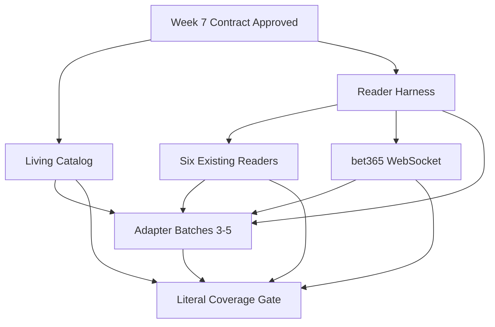

# Week 8: Bookmaker Coverage — Milestone & GitHub Issues

## Milestone: **Week 8 — Bookmaker Coverage (Living Catalog + Reader Quality + Every Accessible Domain)**

**Target Date**: iterative after Week 7; the milestone closes by coverage evidence, not by an arbitrary domain count
**Depends on**: Week 7 extension pairing, durable collection, Casa × Telegram matching, and the extension repository contract being approved
**Scope boundary**: backend and extension integration only; no website frontend work
**Success Criteria**:
- [ ] A versioned catalog tracks each bookmaker by brand and exact domain, independently from its legal entity
- [ ] Regulatory status and technical support status are separate, auditable fields
- [ ] Federal, court-authorized, state/DF, and user-confirmed accessible sources can all add candidates without falsely classifying them
- [ ] Every reader runs against sanitized raw fixtures and an expected canonical result
- [ ] The six inherited readers have regression coverage before new adapters are added
- [ ] bet365 WebSocket traffic is captured passively without credentials, cookies, or wagering automation
- [ ] New adapters are delivered in reviewable batches of 3–5 domains, grouped by platform when possible
- [ ] The milestone cannot be marked complete while any domain the user can open and log into remains without verified support

---

## GitHub Issues (6 issues)

### Issue 1: Bookmaker Catalog — Brand + Domain + Independent Regulatory and Support Status
**Labels**: `week-8`, `bookmaker-coverage`, `catalog`, `compliance`
**Size**: L (5-6 hours)

**Files**:
- `src/bancaemdia/coleta/catalogo.py`
- `src/bancaemdia/models/casa_dominio.py`
- `src/bancaemdia/api/v1/admin/casas.py`
- `src/bancaemdia/api/v1/coleta_catalogo.py`
- `src/bancaemdia/services/catalogo_assinatura.py`
- `scripts/sincronizar_catalogo_casas.py`
- `tests/unit/coleta/test_catalogo_casas.py`
- `tests/contract/test_catalogo_extensao.py`
- `docs/runbooks/catalogo-casas.md`

**Tasks**:
- [ ] Model a catalog entry by `marca + hostname_exato`; do not treat a legal company, platform provider, or wildcard domain as one technical integration
- [ ] Store regulatory evidence separately from technical support:
  - Regulatory: `fonte`, `jurisdicao`, `situacao`, `url_fonte`, `consultado_em`, `hash_snapshot`, optional validity dates
  - Technical: `nao_avaliado | precisa_captura | em_desenvolvimento | suportado | bloqueado_externo | regressao`
- [ ] Ingest the official SPA/MF national authorization page and downloadable spreadsheet from `gov.br`, preserving a dated snapshot and source hash
- [ ] Ingest the separate SPA/MF list of authorizations granted by court order; never mix it with the ordinary national list
- [ ] Add a source registry for state and Federal District regulators because there is no single authoritative national feed for state-only authorizations
- [ ] Permit a manual candidate when the user can open and log into a domain; record who confirmed access, exact hostname, date, jurisdiction if known, and evidence without secrets
- [ ] Keep `desconhecido` as a valid regulatory state for an accessible manual entry; technical accessibility must never be presented as legal authorization
- [ ] Exclude mere applicants from the authorized set and retain suspended, revoked, expired, redirected, and domain-changed records for audit history
- [ ] Normalize redirects to the final exact hostname while preserving aliases and the redirect chain; never grant a broad `*.example` scope from one verified host
- [ ] Add an idempotent sync command with dry-run diff (`added`, `changed`, `removed_from_source`, `manual_unchanged`) and no destructive deletion
- [ ] Expose an admin-only read API/export for the coverage campaign; all writes remain audited and RLS-safe
- [ ] Publish an installation-authenticated, read-only technical projection for ADR 024 Issue 5 with `catalog_version`, issue/expiry time, exact host pattern, adapter/schema version, support/rollout state, minimum extension version, and no provider credentials or unnecessary regulatory/person data
- [ ] Serialize the technical projection canonically and sign it with a configured asymmetric key; include `key_id`, support current/next trust roots for rotation, publish ETag/cache rules, and retain a last-known-good version for bounded offline use
- [ ] Treat the extension manifest as a build-time upper bound: the runtime catalog may disable or narrow declared `optional_host_permissions`, but a new exact domain absent from the manifest requires a reviewed extension build/release and explicit browser grant before support can become active
- [ ] Add contract fixtures shared with the central `[Extension] Host Permissions` issue and tests for expiry, bad signature, key rotation, downgrade, revoked host, unsupported client version, and cross-environment catalogs
- [ ] Document the authoritative federal, judicial, and each configured state/DF source URL and its expected refresh method

**Acceptance**: A dry run produces an auditable brand-by-domain catalog from federal, judicial, configured state/DF, and manual accessible sources; legal evidence never silently changes technical status; and the client projection is signed, versioned, rotation-tested, exact-host-only, and incapable of granting a host outside the reviewed manifest build

---

### Issue 2: Reader Harness — Sanitized Fixtures, Golden Results & Schema-Drift Detection
**Labels**: `week-8`, `bookmaker-coverage`, `readers`, `testing`
**Size**: L (5-6 hours)

**Files**:
- `src/bancaemdia/coleta/readers/base.py`
- `src/bancaemdia/coleta/readers/registry.py`
- `src/bancaemdia/coleta/readers/errors.py`
- `tests/coleta/harness.py`
- `tests/fixtures/coleta/`
- `tests/coleta/test_reader_contract.py`

**Tasks**:
- [ ] Define one reader contract from a captured envelope to canonical bets, including `marca`, exact `hostname`, source endpoint/frame, capture time, external identity, state, stake, odds, return, selections, and raw schema version
- [ ] Require each adapter fixture set to contain sanitized raw input plus an explicit golden canonical output; fixtures must contain no token, cookie, account identifier, personal data, or reusable session material
- [ ] Cover relevant lifecycle states: open, settled green/red, void, cashout, partial result where supported, and an explicitly unsupported sample
- [ ] Cover single and multiple bets, decimals and Brazilian currency formatting, missing optional fields, repeated capture, and open → settled update
- [ ] Validate deterministic identity and content hashes so replaying a fixture is an idempotent no-op and an updated state modifies the same bet
- [ ] Introduce typed errors (`schema_drift`, `unsupported_market`, `incomplete_payload`, `wrong_host`, `unsafe_payload`) instead of silently returning an empty result
- [ ] Quarantine unknown schema versions and emit an observable metric/event without materializing partial financial data
- [ ] Produce a machine-readable contract report per adapter: fixture count, covered states, last real capture date, pass/fail, and drift reason
- [ ] Add a fixture-sanitization test that fails CI on common credential, cookie, email, phone, CPF, and account-number patterns
- [ ] Add the harness to CI and make a reader change fail when its golden output changes without an explicitly reviewed fixture update

**Acceptance**: Every registered reader passes the same deterministic contract suite, unsafe fixtures fail CI, and a breaking payload change is reported as schema drift instead of creating incomplete or duplicate financial records

---

### Issue 3: Existing Readers — Regression Baseline for Six Bookmakers
**Labels**: `week-8`, `bookmaker-coverage`, `readers`, `regression`
**Size**: L (6-8 hours)

**Files**:
- `src/bancaemdia/coleta/readers/betano.py`
- `src/bancaemdia/coleta/readers/superbet.py`
- `src/bancaemdia/coleta/readers/betmgm.py`
- `src/bancaemdia/coleta/readers/betfair.py`
- `src/bancaemdia/coleta/readers/kambi.py`
- `src/bancaemdia/coleta/readers/altenar.py`
- `tests/fixtures/coleta/{betano,superbet,betmgm,betfair,kto,esportiva}/`
- `tests/coleta/test_readers_existentes.py`

**Tasks**:
- [ ] Port or normalize the inherited readers for Betano, Superbet, BetMGM, Betfair, KTO on Kambi, and Esportiva on Altenar onto the common reader contract
- [ ] Verify each exact production hostname against the catalog; a fixture from one hostname must not silently authorize another brand or mirror
- [ ] Obtain at least one fresh, sanitized, user-provided capture per bookmaker rather than trusting only legacy payloads
- [ ] Preserve legacy fixtures for historical replay and label their capture date/schema; do not overwrite them with current samples
- [ ] Add golden fixtures for every lifecycle/state that the captured platform actually exposes, including multiple and cashout where available
- [ ] Prove open → settled identity stability and duplicate no-op behavior for all six readers
- [ ] Verify amounts remain centavo-exact and that locale conversion never uses binary floating point for financial values
- [ ] Fail explicitly when a legacy reader cannot interpret the current payload; route the collection to review and mark that domain `regressao`
- [ ] Publish the generated contract report and update each domain's technical status only after CI and a real sanitized sample pass

**Acceptance**: Betano, Superbet, BetMGM, Betfair, KTO/Kambi, and Esportiva/Altenar each pass the shared harness using a fresh sanitized capture while all legacy fixtures remain replayable

---

### Issue 4: bet365 Reader — Passive WebSocket Capture + Stateful Reconstruction
**Labels**: `week-8`, `bookmaker-coverage`, `bet365`, `websocket`
**Size**: L (6-8 hours)

**Files**:
- `src/bancaemdia/coleta/readers/bet365.py`
- `src/bancaemdia/coleta/readers/websocket.py`
- `tests/fixtures/coleta/bet365/`
- `tests/coleta/test_bet365_reader.py`
- `docs/runbooks/bet365-capture.md`

**Tasks**:
- [ ] Document, from sanitized real captures, which WebSocket frames build the user's open and settled bet history; do not assume the legacy protocol is still current
- [ ] Accept an ordered envelope of relevant frames from the extension and reconstruct a snapshot without depending on cookies, auth headers, local-storage tokens, or account identifiers
- [ ] Handle frame fragmentation, keep-alives, repeated snapshots, incremental updates, reconnects, and out-of-order delivery with bounded state and expiry
- [ ] Ignore unrelated live-score/odds traffic and whitelist only the minimal message shapes required for the user's own bet records
- [ ] Create a stable external identity across open → settled updates and keep content hashing separate from identity hashing
- [ ] Add sanitized golden fixtures for single, multiple, open, green/red, void, and cashout when those states are observable in the user's captures
- [ ] Detect protocol/schema drift explicitly, quarantine the batch, and mark bet365 as `regressao` without materializing guessed values
- [ ] Enforce passive capture: no bet placement, clicks, credential collection, login inference, anti-bot bypass, or page modification
- [ ] Record browser/site version, exact hostname, capture date, and fixture sanitization evidence in the reader report

**Acceptance**: A sanitized sequence of real bet365 WebSocket frames deterministically produces idempotent canonical bets and open → settled updates, while unrelated frames and schema drift produce no financial writes

---

### Issue 5: Adapter Campaign — Dynamic Batches of 3–5 Domains by Platform
**Labels**: `week-8`, `bookmaker-coverage`, `adapters`, `campaign`
**Size**: L (6-8 hours per generated batch)

**Files**:
- `docs/bookmaker-coverage/batches/`
- `src/bancaemdia/coleta/readers/`
- `tests/fixtures/coleta/`
- `scripts/relatorio_cobertura_casas.py`
- `.github/ISSUE_TEMPLATE/bookmaker-adapter-batch.md`

**Tasks**:
- [ ] Generate the next batch from catalog entries with status `precisa_captura` or `em_desenvolvimento`, prioritizing shared platforms/protocols and never popularity alone
- [ ] Keep each delivery unit to 3–5 exact domains; list brand, hostname, source of candidacy, platform hypothesis, and current evidence in the batch issue
- [ ] Require the user to log in and produce only the minimum sanitized captures needed for each domain; document precise capture steps and missing states
- [ ] Reuse a platform reader only after fixtures prove the payload contract is compatible; brand similarity or a common vendor name is not proof
- [ ] For every domain, add host routing, adapter/reader, sanitized raw fixtures, golden outputs, drift behavior, and contract report
- [ ] Track inaccessible, geo-blocked, maintenance, or account-unavailable domains as evidence-backed blockers with a recheck date; do not mark them supported
- [ ] Split an outlier protocol into its own follow-up issue rather than making a batch unreviewable
- [ ] Update technical support status only after the exact hostname passes CI and a replay against its real sanitized capture
- [ ] Repeat batches until the literal coverage gate in Issue 6 has no accessible/login-capable pending domain

**Acceptance**: Each batch closes only when 3–5 named exact domains have independently passing real fixtures and reports, or each unfinished domain is split into a traceable blocker/follow-up without being labeled supported

---

### Issue 6: Literal Coverage Gate — Every Domain the User Can Open and Log Into
**Labels**: `week-8`, `bookmaker-coverage`, `validation`, `release-gate`
**Size**: L (5-6 hours, repeated until green)

**Files**:
- `scripts/validar_cobertura_total.py`
- `docs/bookmaker-coverage/COVERAGE.md`
- `docs/bookmaker-coverage/evidence/`
- `tests/integration/coleta/test_coverage_gate.py`
- `.github/workflows/bookmaker-coverage.yml`

**Tasks**:
- [ ] Define the target set as the union of federal, court-authorized, all configured state/DF sources, and manual domains the user confirms can be opened and logged into on their computer
- [ ] Evaluate each exact final hostname independently, including alternate domains and brands owned by the same legal entity
- [ ] Require, for every accessible/login-capable domain: technical status `suportado`, a recent sanitized real capture, passing reader contract, and a documented capture date
- [ ] Do not permit waivers based on low popularity, shared ownership, assumed shared platform, or lack of automated discovery
- [ ] Permit `bloqueado_externo` only with dated evidence that the user cannot currently open or log in (for example geo-block, closed registration, maintenance, or unavailable account) and schedule revalidation
- [ ] Treat `desconhecido`, `nao_avaliado`, `precisa_captura`, `em_desenvolvimento`, and `regressao` as gate failures whenever the user can access the domain
- [ ] Verify the catalog has no domain with technical support inherited from a wildcard, redirect alias, or another brand's fixture
- [ ] Produce a human-readable matrix and JSON artifact containing totals, blockers, last capture age, missing states, reader version, and source evidence
- [ ] Run the gate in CI as an informational report during the rolling campaign and as a required check when the milestone is proposed for completion
- [ ] Keep legal/regulatory wording factual: the gate proves technical coverage of the defined accessible set, not authorization, endorsement, or permanence

**Acceptance**: The milestone report has zero accessible/login-capable domains outside `suportado`, every supported hostname has recent sanitized evidence and passing tests, and all currently inaccessible domains have dated blocker evidence instead of being silently omitted

---

## Dependency Graph

## Authoritative Source Policy

- National ordinary authorizations: SPA/MF [`Empresas autorizadas`](https://www.gov.br/fazenda/pt-br/composicao/orgaos/secretaria-de-premios-e-apostas/transparencia-ativa-processos-de-autorizacao-de-apostas-de-quota-fixa/empresas-autorizadas) page and the current downloadable spreadsheet linked by that official page
- Court-ordered national authorizations: the separate SPA/MF [`Autorizadas por determinação judicial`](https://www.gov.br/fazenda/pt-br/composicao/orgaos/secretaria-de-premios-e-apostas/transparencia-ativa-processos-de-autorizacao-de-apostas-de-quota-fixa/autorizadas-por-determinacao-judicial) page
- State and Federal District authorizations: the official regulator or lottery source configured for each jurisdiction, with source URL and dated snapshot
- Manual accessible candidates: exact domains confirmed by the user, recorded as technical candidates without manufacturing a regulatory classification
- Mere applications, news articles, affiliate lists, search-engine results, and platform marketing pages are never authoritative authorization evidence
