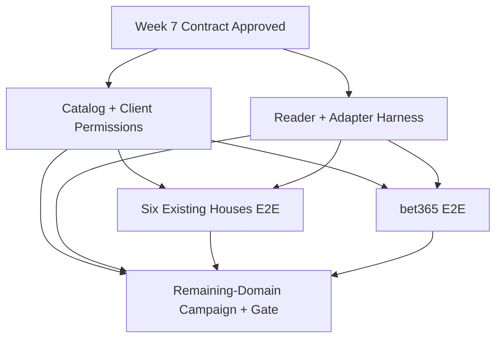

# Week 8: Bookmaker Coverage — Milestone & GitHub Issues

## Milestone: **Week 8 — Bookmaker Coverage (Living Catalog + Reader Quality + Every Accessible Domain)**

**Target Date**: iterative after Week 7; the milestone closes by coverage evidence, not by an arbitrary domain count
**Depends on**: Week 7 extension pairing, durable collection, Casa × Telegram matching, and the extension repository contract being approved
**Scope boundary**: backend and extension integration only; no website frontend work
**Tracking rule**: each central issue below is a vertical delivery and may be completed by linked pull requests in both `bancaemdia-api` and `wfcgit-hub/bancaemdia-extension`; routine backend/client halves are not separate issues
**Success Criteria**:
- [ ] A versioned catalog tracks each bookmaker by brand and exact domain, independently from its legal entity
- [ ] Regulatory status and technical support status are separate, auditable fields
- [ ] Federal, court-authorized, state/DF, and user-confirmed accessible sources can all add candidates without falsely classifying them
- [ ] The extension can request only reviewed exact-host permissions present in its installed manifest and the signed runtime catalog
- [ ] Every reader and client adapter runs against sanitized raw fixtures and an expected contract result
- [ ] The six inherited integrations have end-to-end regression coverage before new adapters are added
- [ ] bet365 WebSocket traffic is captured passively and reconstructed without credentials, cookies, or wagering automation
- [ ] New adapters are delivered in reviewable batches of 3–5 domains, grouped by proven platform compatibility when possible
- [ ] The milestone cannot be marked complete while any domain the user can open and log into remains without verified end-to-end support

---

## GitHub Issues (5 issues)

### Issue 1: Bookmaker Catalog & Client Permissions — Signed Exact-Host Control
**Labels**: `week-8`, `bookmaker-coverage`, `catalog`, `permissions`, `security`, `compliance`
**Size**: L (8-10 hours)

**Files**:
- API repository:
  - `src/bancaemdia/coleta/catalogo.py`
  - `src/bancaemdia/models/casa_dominio.py`
  - `src/bancaemdia/api/v1/admin/casas.py`
  - `src/bancaemdia/api/v1/coleta_catalogo.py`
  - `src/bancaemdia/services/catalogo_assinatura.py`
  - `scripts/sincronizar_catalogo_casas.py`
  - `tests/unit/coleta/test_catalogo_casas.py`
  - `tests/contract/test_catalogo_extensao.py`
  - `docs/runbooks/catalogo-casas.md`
- Extension repository (`wfcgit-hub/bancaemdia-extension`):
  - `manifest.json`
  - `src/background/catalog.ts`
  - `src/background/permissions.ts`
  - `src/contracts/catalog.ts`
  - `tests/integration/permissions.test.ts`
  - `docs/adrs/004-host-permissions.md`

**Tasks**:
- [ ] Model a catalog entry by `marca + hostname_exato`; do not treat a legal company, platform provider, or wildcard domain as one technical integration
- [ ] Store regulatory evidence separately from technical support:
  - Regulatory: `fonte`, `jurisdicao`, `situacao`, `url_fonte`, `consultado_em`, `hash_snapshot`, optional validity dates
  - Technical: `nao_avaliado | precisa_captura | em_desenvolvimento | suportado | bloqueado_externo | regressao`
- [ ] Ingest the official SPA/MF national authorization page and downloadable spreadsheet from `gov.br`, preserving a dated snapshot and source hash
- [ ] Ingest the separate SPA/MF list of authorizations granted by court order; never mix it with the ordinary national list
- [ ] Add a source registry for state and Federal District regulators because there is no single authoritative national feed for state-only authorizations
- [ ] Maintain a 26-state + Federal District source matrix: each jurisdiction records its official regulator/lottery source, or dated evidence that no applicable list was found or the source was unavailable, plus a recheck date; an unconfigured jurisdiction cannot disappear from coverage totals
- [ ] Permit a manual candidate when the user can open and log into a domain; record who confirmed access, exact hostname, date, jurisdiction if known, and evidence without secrets
- [ ] Keep `desconhecido` as a valid regulatory state for an accessible manual entry; technical accessibility must never be presented as legal authorization
- [ ] Exclude mere applicants from the authorized set and retain suspended, revoked, expired, redirected, and domain-changed records for audit history
- [ ] Normalize redirects to the final exact hostname while preserving aliases and the redirect chain; never grant a broad `*.example` scope from one verified host
- [ ] Add an idempotent sync command with dry-run diff (`added`, `changed`, `removed_from_source`, `manual_unchanged`) and no destructive deletion
- [ ] Expose an admin-only read API/export for the coverage campaign; all writes remain audited and RLS-safe
- [ ] Publish an installation-authenticated, read-only technical projection with `catalog_version`, issue/expiry time, exact host pattern, adapter/schema version, support/rollout state, minimum extension version, and no provider credentials or unnecessary regulatory/person data
- [ ] Serialize the technical projection canonically and sign it with a configured asymmetric key; include `key_id`, support current/next trust roots for rotation, publish ETag/cache rules, and retain a last-known-good version for bounded offline use
- [ ] Generate a reviewed build-time `optional_host_permissions` upper bound from exact catalog hosts; at runtime request one declared host only after explicit user action
- [ ] Treat the runtime catalog as narrowing-only: it may disable a declared host but can never grant an origin absent from the installed manifest
- [ ] Require a new reviewed extension build/release, version bump, and explicit browser grant before activating any newly cataloged exact domain that the installed manifest does not declare
- [ ] Never request `<all_urls>` or infer that one approved brand/domain authorizes sister brands, redirects, mirrors, or an entire top-level wildcard
- [ ] Verify catalog signature/integrity, expiry, environment, and downgrade rules before applying it in the extension
- [ ] Reconcile granted permissions with the active catalog and stop capture immediately when a host is revoked or marked `regressao`
- [ ] Preserve locally queued envelopes from a formerly allowed host for safe upload while preventing any new capture there
- [ ] Show permission state using extension-owned UI only; no website frontend work belongs to this issue
- [ ] Add shared contract fixtures and tests for add/remove/redirect/domain change, stale/offline catalog, bad signature, key rotation, downgrade, revoked host, unsupported extension version, permission denial, and cross-environment catalogs
- [ ] Keep regulatory status informational and separate: extension capture is controlled exclusively by technical support plus explicit browser permission
- [ ] Document the authoritative federal, judicial, and each configured state/DF source URL and its expected refresh method

**Acceptance**: A dry run produces an auditable brand-by-domain catalog from federal, judicial, configured state/DF, and manual accessible sources; legal evidence never silently changes technical status; and the extension captures only on an exact host present in both the signed, valid runtime catalog and the installed build's reviewed `optional_host_permissions`, after explicit user grant

---

### Issue 2: Reader & Adapter Harness — Golden Results, Safe Fixtures & Schema Drift
**Labels**: `week-8`, `bookmaker-coverage`, `readers`, `adapters`, `testing`, `security`
**Size**: L (8-10 hours)

**Files**:
- API repository:
  - `src/bancaemdia/coleta/readers/base.py`
  - `src/bancaemdia/coleta/readers/registry.py`
  - `src/bancaemdia/coleta/readers/errors.py`
  - `tests/coleta/harness.py`
  - `tests/fixtures/coleta/`
  - `tests/coleta/test_reader_contract.py`
- Extension repository (`wfcgit-hub/bancaemdia-extension`):
  - `src/adapters/types.ts`
  - `src/adapters/registry.ts`
  - `src/adapters/sanitize.ts`
  - `src/adapters/matchers.ts`
  - `tests/adapters/contract.ts`
  - `tests/fixtures/`
  - `docs/ADAPTER_AUTHORING.md`

**Tasks**:
- [ ] Define one API reader contract from a captured envelope to canonical bets, including `marca`, exact `hostname`, source endpoint/frame, capture time, external identity, state, stake, odds, return, selections, and raw schema version
- [ ] Define one typed extension adapter contract for exact hostnames, capture channel (`fetch`, `xhr`, `websocket`), endpoint/frame matching, sanitization, schema version, and envelope metadata
- [ ] Keep business parsing and financial materialization in the backend; extension adapters identify and sanitize transport payloads only
- [ ] Route by final exact hostname and adapter version in both registries; reject ambiguous matches and never select a first/default adapter
- [ ] Require each integration fixture set to contain sanitized raw input, expected client envelope, and explicit golden canonical output; fixtures must contain no token, cookie, account identifier, personal data, or reusable session material
- [ ] Cover relevant lifecycle states: open, settled green/red, void, cashout, partial result where supported, and an explicitly unsupported sample
- [ ] Cover single and multiple bets, decimals and Brazilian currency formatting, missing optional fields, repeated capture, and open → settled update
- [ ] Validate deterministic identity and content hashes so replaying a fixture is an idempotent no-op and an updated state modifies the same bet
- [ ] Provide reusable extension helpers for safe JSON/text decoding, size limits, field allow/deny lists, content hashing, and structured redaction
- [ ] Introduce typed backend errors (`schema_drift`, `unsupported_market`, `incomplete_payload`, `wrong_host`, `unsafe_payload`) instead of silently returning an empty result
- [ ] Fail closed on unknown client schema/content type and quarantine unknown backend schema versions; emit observable drift diagnostics without forwarding guessed payloads or materializing partial financial data
- [ ] Add one shared client contract harness that every adapter must pass and one backend reader harness that consumes its sanitized envelope
- [ ] Produce a machine-readable capability/contract report per integration: fixture count, covered states, last real capture date, client/backend versions, pass/fail, and drift reason
- [ ] Add fixture safety scanning that fails CI on cookies, bearer tokens, emails, phones, CPF, account numbers, high-entropy session-like values, and other credential-shaped content
- [ ] Add both harnesses to their repositories' CI; changing an envelope or golden output requires an explicitly reviewed fixture/version update
- [ ] Document how to add one exact domain, collect the minimum sample, sanitize it, write fixtures, declare permissions, and coordinate its extension adapter with its backend reader version

**Acceptance**: Any new exact-domain integration can be added through the documented adapter/reader contracts; unsafe fixtures and ambiguous routing fail CI; schema drift is quarantined; and the client-to-backend golden replay is deterministic without moving canonical financial parsing into the extension

---

### Issue 3: Existing Six Bookmakers — End-to-End Regression Baseline
**Labels**: `week-8`, `bookmaker-coverage`, `readers`, `extension`, `regression`
**Size**: XL (12-16 hours)

**Files**:
- API repository:
  - `src/bancaemdia/coleta/readers/{betano,superbet,betmgm,betfair,kambi,altenar}.py`
  - `tests/fixtures/coleta/{betano,superbet,betmgm,betfair,kto,esportiva}/`
  - `tests/coleta/test_readers_existentes.py`
- Extension repository (`wfcgit-hub/bancaemdia-extension`):
  - `src/adapters/{betano,superbet,betmgm,betfair,kambi,altenar}.ts`
  - `tests/fixtures/{betano,superbet,betmgm,betfair,kto,esportiva}/`
  - `tests/adapters/existing-six.test.ts`

**Tasks**:
- [ ] Port or normalize the inherited backend readers and passive client transport matchers for Betano, Superbet, BetMGM, Betfair, KTO/Kambi, and Esportiva/Altenar onto the common contracts
- [ ] Confirm each exact current production hostname and endpoint with a fresh sanitized capture supplied by the user; a fixture from one hostname must not authorize another brand or mirror
- [ ] Preserve dated legacy fixtures for historical replay and regression, but do not treat them as proof that a current site still works or overwrite them with current samples
- [ ] Capture only response bodies required by the matching backend reader; remove headers, cookies, session fields, user identifiers, and unrelated account data
- [ ] Add end-to-end golden fixtures for every lifecycle/state the captured platform actually exposes, including initial history, repeated observation, open → settled, multiple, and cashout where available
- [ ] Prove stable external identity and duplicate no-op behavior from extension envelope through backend materialization for all six integrations
- [ ] Verify amounts remain centavo-exact and locale conversion never uses binary floating point for financial values
- [ ] Coordinate exact-host catalog entries, client adapter/schema versions, backend reader versions, and generated capability reports
- [ ] Verify one failing adapter/reader is quarantined independently and cannot stop capture, upload, or processing for the other houses
- [ ] Fail explicitly when a legacy integration cannot interpret the current payload; route the collection to review and mark only that exact domain `regressao`
- [ ] Mark a hostname `suportado` only after extension tests, backend golden-reader tests, and one end-to-end sanitized real replay all pass

**Acceptance**: Betano, Superbet, BetMGM, Betfair, KTO/Kambi, and Esportiva/Altenar each produce safe versioned envelopes from fresh real captures and pass deterministic extension-to-backend replay without session data, duplicate financial facts, or cross-adapter failure, while legacy fixtures remain replayable

---

### Issue 4: bet365 — Passive WebSocket Capture & Stateful End-to-End Reconstruction
**Labels**: `week-8`, `bookmaker-coverage`, `extension`, `bet365`, `websocket`, `security`
**Size**: XL (12-16 hours)

**Files**:
- API repository:
  - `src/bancaemdia/coleta/readers/bet365.py`
  - `src/bancaemdia/coleta/readers/websocket.py`
  - `tests/fixtures/coleta/bet365/`
  - `tests/coleta/test_bet365_reader.py`
  - `docs/runbooks/bet365-capture.md`
- Extension repository (`wfcgit-hub/bancaemdia-extension`):
  - `src/injected/websocket-bridge.ts`
  - `src/adapters/bet365.ts`
  - `src/contracts/websocket-envelope.ts`
  - `tests/fixtures/bet365/`
  - `tests/integration/bet365-websocket.test.ts`
  - `docs/adrs/005-websocket-capture.md`

**Tasks**:
- [ ] Document, from sanitized real captures, which WebSocket frames build the user's open and settled bet history; do not assume the legacy protocol is still current
- [ ] Instrument WebSocket observation in page world without changing constructor semantics, send behavior, event delivery, or data returned to site code
- [ ] Match only the documented exact bet365 host and minimum frame signatures needed for the user's bet history; ignore unrelated odds, live-score, and other connection traffic before persistence
- [ ] Forward ordered, bounded, timestamped frame envelopes with connection-local sequence IDs so the backend can reconstruct state
- [ ] Accept those envelopes in the backend and reconstruct snapshots without depending on cookies, auth headers, local-storage tokens, handshake secrets, or account identifiers
- [ ] Handle the text/binary formats actually observed, frame fragmentation metadata, keep-alives, repeated snapshots, incremental updates, reconnects, duplicate/out-of-order frames, and service-worker suspension with bounded state and expiry
- [ ] Remove or reject handshake URLs/parameters, cookies, auth tokens, account identifiers, and unrelated frame fields before the extension outbox
- [ ] Do not transmit frames sent by the page unless a reviewed real sample proves they are strictly required; passive receive-side capture is the default
- [ ] Create a stable external identity across open → settled updates and keep content hashing separate from identity hashing
- [ ] Add sanitized golden fixtures for single, multiple, open, green/red, void, and cashout when those states are observable in the user's captures
- [ ] Detect unknown frame signatures/protocol drift, pause and quarantine only the bet365 integration, mark its exact domain `regressao`, and never forward or materialize guessed values
- [ ] Enforce passive capture end to end: no bet placement, clicks, credential collection, login inference, anti-bot bypass, page modification, or unrelated outgoing actions
- [ ] Add transparency tests proving site WebSocket behavior is unchanged and unrelated connections/frames never enter the outbox
- [ ] Record browser/site version, exact hostname, capture date, adapter/reader versions, and fixture sanitization evidence in the capability report

**Acceptance**: Relevant sanitized real bet365 frames reach the durable outbox in deterministic order and reconstruct idempotent canonical bets plus open → settled updates without changing site behavior; credentials, outgoing actions, unrelated traffic, and unknown schemas produce no financial write

---

### Issue 5: All Remaining Bookmakers — Adapter Campaign, Manual Evidence & Literal Coverage Gate
**Labels**: `week-8`, `bookmaker-coverage`, `extension`, `adapters`, `campaign`, `validation`, `release-gate`
**Size**: XL (iterative; reviewable PR batches of 3–5 exact domains)

**Files**:
- API repository:
  - `docs/bookmaker-coverage/batches/`
  - `docs/bookmaker-coverage/COVERAGE.md`
  - `docs/bookmaker-coverage/evidence/`
  - `src/bancaemdia/coleta/readers/`
  - `tests/fixtures/coleta/`
  - `scripts/relatorio_cobertura_casas.py`
  - `scripts/validar_cobertura_total.py`
  - `tests/integration/coleta/test_coverage_gate.py`
  - `.github/workflows/bookmaker-coverage.yml`
- Extension repository (`wfcgit-hub/bancaemdia-extension`):
  - `src/adapters/`
  - `tests/fixtures/`
  - `docs/runbooks/manual-capture.md`
  - `docs/runbooks/sanitization.md`
  - `docs/templates/bookmaker-capture.md`
  - `scripts/validate-fixture-safety.ts`
  - `scripts/build-coverage-report.ts`
  - `.github/workflows/fixture-safety.yml`

**Tasks**:
- [ ] Define the target set as the union of federal, court-authorized, the complete state/DF source matrix, and manual domains the user confirms can be opened and logged into on their computer
- [ ] Generate the next reviewable PR batch from entries with status `precisa_captura` or `em_desenvolvimento`, prioritizing proven shared platforms/protocols and never popularity alone
- [ ] Keep each routine delivery unit to 3–5 exact domains and track it as a checklist/linked PR inside this central campaign issue; list brand, hostname, source of candidacy, platform hypothesis, and current evidence
- [ ] Define a user-assisted capture protocol for one exact domain: grant permission, open the user's own bet history, capture only minimum required states, disable capture, review locally, sanitize, and submit evidence
- [ ] Never ask the user to share a password, cookie, bearer token, full HAR, browser profile, private key, reusable session, or unsanitized personal/account data
- [ ] Provide capture checklists for single, multiple, open, settled green/red, void, and cashout; mark unavailable states truthfully instead of fabricating fixtures
- [ ] Require the user to produce only the minimum sanitized captures needed for each domain and document precise steps plus missing states
- [ ] Run automated secret/PII detection and mandatory human review before any fixture enters Git history
- [ ] Record brand, exact final hostname/redirect chain, platform hypothesis, browser/extension version, capture date, adapter/reader versions, sanitization version, and candidacy evidence
- [ ] Reuse a platform adapter/reader only after fixtures prove the payload contract is compatible; shared ownership, brand similarity, or a common vendor name is not proof
- [ ] For every domain, add exact-host routing and permission, client adapter, backend reader, sanitized raw fixture, expected envelope, golden output, drift behavior, capability report, and end-to-end replay
- [ ] Update technical support status only after the exact hostname passes client CI, backend CI, and replay against its real sanitized capture
- [ ] Evaluate alternate domains and brands owned by the same legal entity independently; technical support must never be inherited from a wildcard, redirect alias, or another brand's fixture
- [ ] Track inaccessible, geo-blocked, maintenance, closed-registration, or account-unavailable domains as `bloqueado_externo` only with dated evidence and a recheck date; do not mark them supported or silently omit them
- [ ] Treat `desconhecido`, `nao_avaliado`, `precisa_captura`, `em_desenvolvimento`, and `regressao` as gate failures whenever the user can access and log into the domain
- [ ] Do not permit waivers based on low popularity, shared ownership, assumed platform, or lack of automated discovery
- [ ] Preserve locally queued evidence safely when a host is disabled; never resume new capture until catalog, permission, and integration status are valid again
- [ ] Split only a proven outlier protocol into its own follow-up issue; routine batches and backend/client halves remain within this campaign to avoid recreating micro-issues
- [ ] Generate a human-readable matrix and JSON artifact with totals, blockers, last capture age, missing states, adapter/reader versions, source evidence, and cross-repository PR references
- [ ] Run the literal coverage gate in CI as informational during the rolling campaign and as a required check when milestone completion is proposed
- [ ] Repeat reviewable batches until every accessible/login-capable exact domain is `suportado` with a recent sanitized real capture and passing end-to-end replay
- [ ] Keep legal/regulatory wording factual: the gate proves technical coverage of the defined accessible set, not authorization, endorsement, or permanence

**Acceptance**: The milestone report has zero accessible/login-capable exact domains outside `suportado`; every supported hostname has explicit permission, recent secret-free evidence, passing client and backend contracts, and deterministic end-to-end replay; and every currently inaccessible domain has dated blocker evidence plus a recheck date

---

## Dependency Graph

## Authoritative Source Policy

- National ordinary authorizations: SPA/MF [`Empresas autorizadas`](https://www.gov.br/fazenda/pt-br/composicao/orgaos/secretaria-de-premios-e-apostas/transparencia-ativa-processos-de-autorizacao-de-apostas-de-quota-fixa/empresas-autorizadas) page and the current downloadable spreadsheet linked by that official page
- Court-ordered national authorizations: the separate SPA/MF [`Autorizadas por determinação judicial`](https://www.gov.br/fazenda/pt-br/composicao/orgaos/secretaria-de-premios-e-apostas/transparencia-ativa-processos-de-autorizacao-de-apostas-de-quota-fixa/autorizadas-por-determinacao-judicial) page
- State and Federal District authorizations: the official regulator or lottery source configured for each jurisdiction, with source URL and dated snapshot
- Manual accessible candidates: exact domains confirmed by the user, recorded as technical candidates without manufacturing a regulatory classification
- Mere applications, news articles, affiliate lists, search-engine results, and platform marketing pages are never authoritative authorization evidence
