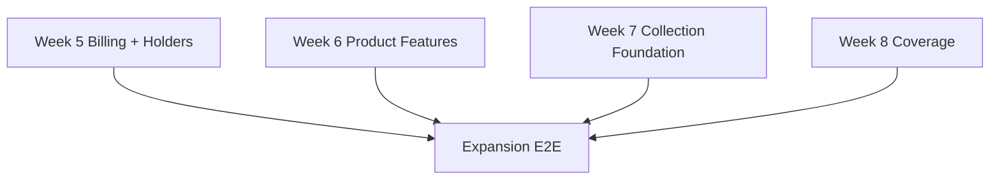

# Week 9: Expansion Validation — Milestone & GitHub Issue

## Milestone: **Week 9 — End-to-End Expansion Validation**

**Target Date**: after Weeks 5–8 are individually complete
**Depends on**: billing/trial, holders, Telegram bot, calculators, collection matching, extension contract, and bookmaker coverage milestones
**Scope boundary**: backend and extension integration only; no website frontend work
**Success Criteria**:
- [ ] The safe first-release rule of one active account per bookmaker remains explicit and enforced
- [ ] Ambiguous account attribution fails into review and cannot silently affect holder/account profit
- [ ] Future simultaneous-account support remains a documented deferred decision, not executable Week 9 scope
- [ ] The complete expansion has an automated end-to-end matrix for happy paths, retries, ambiguity, isolation, replay, and financial reconciliation

---

## GitHub Issues (1 issue)

### Issue 1: Expansion E2E Validation — Billing, Holders, Bot, Calculators, Extension & Coverage
**Labels**: `week-9`, `testing`, `e2e`, `validation`
**Size**: L (6-8 hours)

**Files**:
- `tests/e2e/expansion/`
- `tests/e2e/expansion/conftest.py`
- `tests/fixtures/e2e/expansion/`
- `scripts/validar_expansao.py`
- `.github/workflows/expansion-e2e.yml`
- `docs/runbooks/expansion-validation.md`

**Tasks**:
- [ ] Build one deterministic test environment with PostgreSQL, Redis/workers, fake clock, provider sandbox/contract stub, Telegram webhook fixture, and extension HTTP fixtures
- [ ] Validate billing: signup starts exactly seven cardless days, duplicate/out-of-order webhooks are idempotent, price is configuration, cancellation/retry reconcile, and expiry blocks new operations while preserving read/export access
- [ ] Validate holders: manual X → Y switch at effective time `T`, bets resolve by occurrence time, old open bets remain with X, profit/turnover/ROI reconcile by account and holder, and unassigned totals remain visible
- [ ] Validate Telegram intake: one photo creates one draft, missing fields are requested individually without asking for resend, corrections patch the draft, confirm materializes once, and cancel/continue/retry remain idempotent
- [ ] Validate calculators with Decimal/golden cases, cent allocation, invalid inputs, and deterministic results; include the line calculator only after its separate model/data decision is approved
- [ ] Validate extension pairing, token rotation/revocation, durable outbox batches, ACK retry, collection boundary, schema-drift quarantine, and the signed-catalog flow from reviewed manifest upper bound through explicit exact-host grant and later revocation
- [ ] Validate Casa × Telegram matching in both arrival orders so one real bet contributes exactly one financial fact and Telegram remains contextual provenance
- [ ] Validate the six existing readers, bet365 WebSocket reconstruction, and every currently supported catalog domain against sanitized fixtures
- [ ] Verify the one-active-account-per-bookmaker constraint remains enabled; absent, invalid, or ambiguous account references go to review and never select the first account or infer a bookmaker login
- [ ] Run RLS/cross-tenant, replay, concurrency, duplicate delivery, worker crash, and out-of-order scenarios across the combined flow
- [ ] Reconcile final bankroll, cash movements, bet profit, holder/account totals, and unmatched/review totals to centavo-exact expected values
- [ ] Generate an artifact listing every scenario, trace/correlation IDs, financial diff, fixture versions, and any coverage domain excluded only as `bloqueado_externo` with dated evidence and a recheck date; an accessible/login-capable domain cannot be excluded
- [ ] Make the workflow required before declaring the expansion production-ready; live bets, real payment charges, credentials, and unsanitized captures are forbidden in CI

**Acceptance**: The combined expansion suite passes with centavo-exact reconciliation, zero duplicate financial facts, cross-tenant isolation, deterministic replay, enforced single-account safety, and documented evidence for every billing, holder, bot, calculator, extension, matching, and coverage scenario

---

## Dependency Graph

## Deferred-Scope Decision

The first safe release intentionally permits one active account per bookmaker. The schema and collection contracts may remain collection-based and reserve an optional explicit account reference, but this milestone does **not** authorize, schedule, or implement simultaneous-account support.

If that capability is prioritized later, it requires a new reviewed ADR and issue. The design must reuse the existing opaque, revocable `ColetaInstalacao`; bind `installation/profile + exact bookmaker domain` temporally and explicitly to a user-owned `ContaCasa`; preserve binding history and an append-only rebinding audit; preview the financial impact before a binding change; validate ownership, domain, interval, and revocation server-side; test two profiles concurrently; and fail closed to `RevisaoPendente` whenever the binding is absent or ambiguous. Login inference from username, email, CPF, cookies, tokens, DOM text, account balance, or any session detail remains permanently out of scope.
