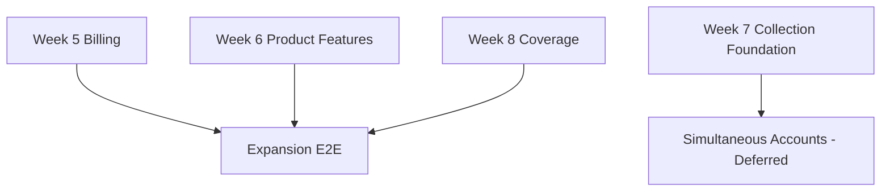

# Week 9: Future Concurrency & Expansion Validation — Milestone & GitHub Issues

## Milestone: **Week 9 — Future Concurrency + End-to-End Validation**

**Target Date**: after Weeks 5–8 are individually complete
**Depends on**: billing/trial, holders, Telegram bot, calculators, collection matching, extension contract, and bookmaker coverage milestones
**Scope boundary**: backend and extension integration only; no website frontend work
**Success Criteria**:
- [ ] The currently safe rule of one active account per bookmaker remains explicit until simultaneous-account support is implemented
- [ ] Future simultaneous accounts resolve through an explicit extension installation/browser-profile binding, never by inspecting or inferring the login
- [ ] Ambiguous account attribution fails into review and cannot silently affect holder/account profit
- [ ] The complete expansion has an automated end-to-end matrix for happy paths, retries, ambiguity, isolation, replay, and financial reconciliation

---

## GitHub Issues (2 issues)

### Issue 1: Multiple Simultaneous Accounts — Explicit Installation/Profile Resolution (Deferred)
**Labels**: `week-9`, `holders`, `extension`, `deferred`
**Size**: L (6-8 hours)

**Files**:
- `src/bancaemdia/models/coleta_instalacao.py`
- `src/bancaemdia/models/vinculo_instalacao_conta.py`
- `src/bancaemdia/coleta/resolucao_conta.py`
- `src/bancaemdia/api/v1/coleta_instalacoes.py`
- `alembic/versions/*_extension_account_binding.py`
- `tests/integration/coleta/test_multiplas_contas_simultaneas.py`
- `docs/adrs/NNN-multiple-simultaneous-bookmaker-accounts.md`

**Tasks**:
- [ ] Keep the first release constrained to one active account per bookmaker and document this as a deliberate safety rule, not a permanent schema assumption
- [ ] Extend and reuse Week 7's opaque, revocable `ColetaInstalacao`; do not create a parallel installation identity, token lifecycle, or inferred login record
- [ ] Model a temporal, explicit binding from `coleta_instalacao + casa/dominio` to `conta_casa`, preserving history when the user changes the selected account
- [ ] Allow two simultaneous accounts at the same bookmaker only when their captures arrive through distinct explicit bindings or an explicit per-capture selection
- [ ] Never infer the account from username, email, CPF, cookie, token, DOM text, account balance, or any other login/session detail
- [ ] Include a non-secret binding reference in the authenticated, versioned collection envelope and validate ownership, domain, validity interval, and revocation server-side; authentication remains the Week 7 installation token over TLS, not a second undefined signature scheme
- [ ] Fail closed to `RevisaoPendente` when the binding is absent, expired, revoked, cross-tenant, or ambiguous; never choose the first active account
- [ ] Ensure rebinding at time `T` affects only captures whose bookmaker event/capture resolution belongs to the new interval and never rewrites settled history silently
- [ ] Provide preview + confirmation before a binding change, including counts of pending captures that would become ambiguous
- [ ] Reuse Week 7 installation audit events and add bind, unbind, and rebind events without logging provider secrets or browsing data
- [ ] Add concurrency tests for two profiles capturing the same bookmaker at the same time, retries, profile rebinding, revocation, and out-of-order delivery
- [ ] Implement only after the single-account flow and extension pairing are stable; approval of this issue does not remove the initial one-account constraint

**Acceptance**: Two simultaneous accounts for one bookmaker are attributed only through distinct user-approved bindings, ambiguous or revoked bindings create review items with no financial materialization, and no test or production path infers the bookmaker login

---

### Issue 2: Expansion E2E Validation — Billing, Holders, Bot, Calculators, Extension & Coverage
**Labels**: `week-9`, `testing`, `e2e`, `validation`
**Size**: L (6-8 hours)

**Files**:
- `tests/e2e/expansion/`
- `tests/e2e/expansion/conftest.py`
- `tests/fixtures/e2e/expansion/`
- `scripts/validar_expansao.py`
- `.github/workflows/expansion-e2e.yml`
- `docs/runbooks/expansion-validation.md`

**Tasks**:
- [ ] Build one deterministic test environment with PostgreSQL, Redis/workers, fake clock, provider sandbox/contract stub, Telegram webhook fixture, and extension HTTP fixtures
- [ ] Validate billing: signup starts exactly seven cardless days, duplicate/out-of-order webhooks are idempotent, price is configuration, cancellation/retry reconcile, and expiry blocks new operations while preserving read/export access
- [ ] Validate holders: manual X → Y switch at effective time `T`, bets resolve by occurrence time, old open bets remain with X, profit/turnover/ROI reconcile by account and holder, and unassigned totals remain visible
- [ ] Validate Telegram intake: one photo creates one draft, missing fields are requested individually without asking for resend, corrections patch the draft, confirm materializes once, and cancel/continue/retry remain idempotent
- [ ] Validate calculators with Decimal/golden cases, cent allocation, invalid inputs, and deterministic results; include the line calculator only after its separate model/data decision is approved
- [ ] Validate extension pairing, token rotation/revocation, durable outbox batches, ACK retry, collection boundary, exact-host routing, and schema-drift quarantine
- [ ] Validate Casa × Telegram matching in both arrival orders so one real bet contributes exactly one financial fact and Telegram remains contextual provenance
- [ ] Validate the six existing readers, bet365 WebSocket reconstruction, and every currently supported catalog domain against sanitized fixtures
- [ ] Validate optional simultaneous-account support, when enabled, with two browser profiles and explicit bindings; keep the feature flag off until its own issue passes
- [ ] Run RLS/cross-tenant, replay, concurrency, duplicate delivery, worker crash, and out-of-order scenarios across the combined flow
- [ ] Reconcile final bankroll, cash movements, bet profit, holder/account totals, and unmatched/review totals to centavo-exact expected values
- [ ] Generate an artifact listing every scenario, trace/correlation IDs, financial diff, fixture versions, and any coverage domains excluded by evidence
- [ ] Make the workflow required before declaring the expansion production-ready; live bets, real payment charges, credentials, and unsanitized captures are forbidden in CI

**Acceptance**: The combined expansion suite passes with centavo-exact reconciliation, zero duplicate financial facts, cross-tenant isolation, deterministic replay, and documented evidence for every billing, holder, bot, calculator, extension, matching, and coverage scenario

---

## Dependency Graph

## Deferred-Scope Decision

The system is prepared for a future many-accounts-per-bookmaker model, but the first safe release intentionally allows one active account per bookmaker. Multiple simultaneous accounts become available only after the extension can provide a user-approved installation/profile binding. Login inference is permanently out of scope.
