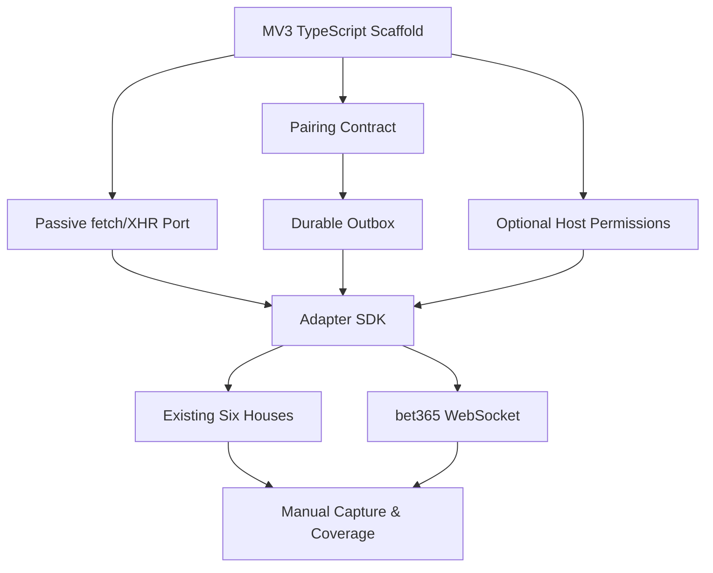

# `wfcgit-hub/bancaemdia-extension` — Proposed Client Work in the Central Backlog

This backlog is kept in the `bancaemdia-api` roadmap PR so the administrator can review the complete product expansion in one place. The private repository [`wfcgit-hub/bancaemdia-extension`](https://github.com/wfcgit-hub/bancaemdia-extension) already exists with the original subtree history, repository documentation, tests, and CI scaffold.

After this proposal PR is approved and merged, these nine bodies become **central issues in `pradyumna-001/bancaemdia-api`**, using the `[Extension]` title prefix below. GitHub Issues remain disabled in the extension repository; implementation pull requests there reference and close the central issue as `pradyumna-001/bancaemdia-api#N`.

**Repository boundary**: this is a Chrome/Chromium extension client, not website frontend. The API remains responsible for authentication decisions, tenant isolation, durable ingestion, canonical readers, matching, materialization, and financial truth.

---

## Milestone Mapping

| Issues | Central milestone | Required API-side dependency |
|--------|-------------------|------------------------------|
| 1–4 | Week 7 — Collection Integrity & Extension Contract | Week 7 API contract, pairing, and ACK work as named below |
| 5–9 | Week 8 — Bookmaker Coverage | Week 8 signed catalog, reader, adapter, and literal-coverage work as named below |

This mapping is part of each issue proposal. The `week-*` pseudo-label below matches the milestone to assign when the central issue is created.

## Proposed GitHub Issues (9 issues)

### Issue 1: [Extension] Repository Scaffold — MV3 + TypeScript + CI
**Labels**: `week-7`, `extension`, `setup`, `mv3`, `ci`
**Size**: M (3-4 hours)

**Files**:
- `manifest.json`
- `package.json`
- `tsconfig.json`
- `vite.config.ts`
- `src/background/`
- `src/content/`
- `src/injected/`
- `src/contracts/`
- `tests/`
- `.github/workflows/ci.yml`
- `docs/adrs/001-repository-boundaries.md`

**Tasks**:
- [ ] Audit and complete the existing standalone Manifest V3 repository, migrating the preserved JavaScript prototype to strict TypeScript with a reproducible lockfile
- [ ] Separate service worker, isolated content script, page-world injected bridge, adapters, contracts, and storage into explicit modules
- [ ] Use the same project discipline as `bancaemdia-api`: source/tests/docs/scripts layout, ADRs, runbooks, `.env.example` when needed, contribution guide, and small reviewable commits
- [ ] Configure lint, format, typecheck, unit tests, production build, dependency audit, and packed-artifact upload in CI
- [ ] Keep the initial manifest minimal: no wildcard host access, no cookies permission, no browsing-history permission, and no remote executable code
- [ ] Document the trust boundary: capture only the authenticated user's own bet records; never place bets, click controls, collect credentials, or bypass site protections
- [ ] Add environment configuration for local/staging/production API origins without embedding secrets in the bundle
- [ ] Generate a deterministic unpacked build and a versioned ZIP artifact suitable for manual Chrome installation/review
- [ ] Add a redacted logging helper that defaults to metadata-only logs and rejects raw headers/cookies/tokens

**Acceptance**: CI produces a reproducible MV3 ZIP from strict TypeScript, all quality checks pass, and the installed empty extension requests no bookmaker host access or sensitive browser permission by default

---

### Issue 2: [Extension] Legacy Port — Passive fetch/XHR Capture Without Session Data
**Labels**: `week-7`, `extension`, `porting`, `capture`, `security`
**Size**: L (5-6 hours)

**Files**:
- `src/injected/network-bridge.ts`
- `src/content/bridge.ts`
- `src/background/capture-router.ts`
- `src/contracts/captured-envelope.ts`
- `tests/unit/network-bridge.test.ts`
- `tests/integration/passive-capture.test.ts`
- `docs/adrs/002-passive-capture-trust-model.md`

**Tasks**:
- [ ] Inventory the legacy `planilhador-apostas/extensao` behavior and port only passive fetch/XHR response observation that is still required
- [ ] Inject the smallest page-world bridge needed to observe allowlisted responses and pass structured-clone-safe messages to the isolated content script
- [ ] Validate message source, extension nonce, exact hostname, endpoint matcher, method, content type, payload size, and adapter identifier before forwarding
- [ ] Build a versioned envelope with capture ID, installation ID, exact hostname, captured-at time, endpoint metadata, adapter/schema version, and raw body
- [ ] Strip request/response headers, cookies, authorization fields, storage tokens, credential-shaped fields, and unrelated personal data before persistence
- [ ] Preserve the minimum raw payload required for backend replay while keeping its hash and sanitization version
- [ ] Never patch the response seen by the page, automate navigation, click bet controls, infer login identity, or call private bookmaker endpoints on its own
- [ ] Bound payload/body size and message rate; reject unknown endpoints and record only redacted diagnostic metadata
- [ ] Add tests proving page behavior is unchanged and cookie/auth/session material never enters the envelope or logs

**Acceptance**: An allowlisted fixture response is captured once into a sanitized versioned envelope without altering the page, while unknown endpoints and any credential/session material are rejected before local storage

---

### Issue 3: [Extension] Pairing Contract — One-Time Code + Revocable Installation Identity
**Labels**: `week-7`, `extension`, `pairing`, `auth`, `security`
**Size**: M (3-4 hours)

**Files**:
- `src/background/pairing.ts`
- `src/background/api-client.ts`
- `src/storage/installation.ts`
- `src/contracts/pairing.ts`
- `tests/integration/pairing.test.ts`
- `docs/adrs/003-versioned-collection-contract.md`
- `docs/runbooks/pairing.md`

**Tasks**:
- [ ] Implement the API-approved one-time pairing flow; the short code expires, is single-use, and is never stored after exchange
- [ ] Create a random opaque installation identity independent from Chrome profile name, bookmaker login, email, CPF, or device fingerprint
- [ ] Store the issued collection credential only in extension-local storage and expose no token to page-world code
- [ ] Attach installation, contract version, and request idempotency metadata to every authenticated API request
- [ ] Support token rotation, explicit disconnect/revoke, expired credentials, and server-side revocation with a clear local state
- [ ] Require TLS and the configured API origin; reject redirects to an unapproved origin and redact auth data from errors
- [ ] Keep captured items queued when pairing expires, but do not transmit until the user pairs again
- [ ] Add contract tests against the backend pairing schema and failure cases: wrong/expired/reused code, cross-user token, revocation, rotation, and retry
- [ ] Document recovery without asking the user to export or disclose bookmaker credentials

**Acceptance**: A one-time code pairs exactly one opaque installation, authenticated requests survive safe token rotation, revocation stops future sends, and no pairing or collection credential is visible to bookmaker pages or logs

---

### Issue 4: [Extension] Durable Outbox — Batches, ACKs, Retry & Local Deduplication
**Labels**: `week-7`, `extension`, `outbox`, `reliability`, `idempotency`
**Size**: L (5-6 hours)

**Files**:
- `src/background/outbox.ts`
- `src/background/uploader.ts`
- `src/storage/outbox-store.ts`
- `src/contracts/ingestion.ts`
- `tests/unit/outbox.test.ts`
- `tests/integration/retry-ack.test.ts`
- `docs/runbooks/outbox-recovery.md`

**Tasks**:
- [ ] Persist sanitized envelopes in an IndexedDB outbox before attempting network delivery
- [ ] Use stable capture IDs and content hashes so service-worker suspension, browser restart, reconnect, and repeated observation do not create new logical captures
- [ ] Send bounded batches with contract version, sequence metadata, and idempotency keys accepted by the backend
- [ ] Delete an item only after an explicit per-item ACK; keep retryable items and quarantine permanent contract/schema rejections
- [ ] Implement capped exponential backoff with jitter, network/offline awareness, and backend `Retry-After` support
- [ ] Bound storage by item count, bytes, and age without silently dropping unsent financial captures; surface a clear paused/full state
- [ ] Preserve capture ordering per hostname where lifecycle reconstruction requires it while allowing fair progress across hosts
- [ ] Expose metadata-only diagnostics: pending, retrying, acknowledged, quarantined, oldest age, and last redacted error
- [ ] Test worker suspension mid-send, partial batch ACK, duplicate ACK, timeout after server commit, browser restart, 401/429/5xx, and poison item isolation

**Acceptance**: Every accepted capture is eventually ACKed exactly once from the user's perspective across retries and browser restarts, and no unsent item is deleted or hidden by a partial batch failure

---

### Issue 5: [Extension] Host Permissions — Runtime Catalog + `optional_host_permissions`
**Labels**: `week-8`, `extension`, `permissions`, `catalog`, `security`
**Size**: M (3-4 hours)

**Files**:
- `manifest.json`
- `src/background/catalog.ts`
- `src/background/permissions.ts`
- `src/contracts/catalog.ts`
- `tests/integration/permissions.test.ts`
- `docs/adrs/004-host-permissions.md`

**Tasks**:
- [ ] Consume the signed/versioned technical catalog produced by Week 8 API Issue 1, containing exact approved host patterns, adapter versions, rollout flags, and minimum extension version
- [ ] Generate a reviewed build-time `optional_host_permissions` upper bound from exact catalog hosts; at runtime request only one declared host after an explicit user action
- [ ] Treat the runtime catalog as narrowing-only: it may disable a declared host but can never grant an origin absent from the installed manifest
- [ ] Require a new reviewed extension build/release, version bump, and explicit browser grant before activating any newly cataloged exact domain that the installed manifest does not declare
- [ ] Never request `<all_urls>` or infer that one approved brand/domain authorizes sister brands, redirects, mirrors, or an entire top-level wildcard
- [ ] Verify catalog signature/integrity, expiry, environment, and downgrade rules before applying it
- [ ] Reconcile granted permissions with the active catalog and stop capture immediately when a host is revoked or marked regression
- [ ] Preserve locally queued envelopes from a formerly allowed host for safe upload, while preventing any new capture there
- [ ] Show permission state using extension-owned UI only; no website frontend work is part of this issue
- [ ] Test add/remove/redirect/domain-change, stale/offline catalog, signature failure, unsupported extension version, and permission denial
- [ ] Keep regulatory status informational and separate: extension capture is controlled exclusively by technical support plus explicit browser permission

**Acceptance**: The extension captures only on an exact host present in both the signed runtime catalog and the installed build's reviewed `optional_host_permissions`, after explicit user grant; new domains require a new build, revocation stops capture without losing the outbox, and no wildcard/legal-company relationship broadens access

---

### Issue 6: [Extension] Adapter SDK — Exact-Host Routing + Sanitization Contract
**Labels**: `week-8`, `extension`, `adapters`, `sdk`, `testing`
**Size**: L (5-6 hours)

**Files**:
- `src/adapters/types.ts`
- `src/adapters/registry.ts`
- `src/adapters/sanitize.ts`
- `src/adapters/matchers.ts`
- `tests/adapters/contract.ts`
- `tests/fixtures/`
- `docs/ADAPTER_AUTHORING.md`

**Tasks**:
- [ ] Define a typed adapter interface for exact hostnames, capture channel (`fetch`, `xhr`, `websocket`), endpoint/frame matching, sanitization, schema version, and envelope metadata
- [ ] Keep business parsing and financial materialization in the backend; extension adapters identify and sanitize transport payloads only
- [ ] Route by final exact hostname and adapter version; reject ambiguous matches and never select a first/default adapter
- [ ] Provide reusable safe helpers for JSON/text decoding, size limits, field allow/deny lists, content hash, and structured redaction
- [ ] Add one contract harness that every adapter must pass with sanitized input fixtures and expected envelope output
- [ ] Fail closed on unknown schema/content type and mark the capture diagnostic as drift without forwarding guessed/partial data
- [ ] Add fixture safety scanning for cookies, bearer tokens, emails, phones, CPF, account numbers, and high-entropy session-like values
- [ ] Document how to add a domain, collect a minimal sample, sanitize it, write fixtures, declare permissions, and coordinate its backend reader version
- [ ] Generate an adapter capability report consumable by the central coverage gate

**Acceptance**: Any new adapter can be added through the documented SDK and common tests, exact-host ambiguity and unsafe fixtures fail CI, and the client never performs canonical financial parsing

---

### Issue 7: [Extension] Existing Six Bookmakers — Betano, Superbet, BetMGM, Betfair, KTO & Esportiva
**Labels**: `week-8`, `extension`, `adapters`, `regression`, `porting`
**Size**: L (6-8 hours)

**Files**:
- `src/adapters/betano.ts`
- `src/adapters/superbet.ts`
- `src/adapters/betmgm.ts`
- `src/adapters/betfair.ts`
- `src/adapters/kambi.ts`
- `src/adapters/altenar.ts`
- `tests/fixtures/{betano,superbet,betmgm,betfair,kto,esportiva}/`
- `tests/adapters/existing-six.test.ts`

**Tasks**:
- [ ] Port the passive transport matchers for Betano, Superbet, BetMGM, Betfair, KTO/Kambi, and Esportiva/Altenar through the Adapter SDK
- [ ] Confirm each exact current hostname and endpoint with a fresh sanitized capture supplied by the user
- [ ] Preserve dated legacy fixtures for regression but do not treat them as proof that the current site still works
- [ ] Capture only response bodies required by the matching backend reader; remove headers, cookies, session fields, user identifiers, and unrelated account data
- [ ] Coordinate extension adapter/schema versions with the backend reader contract and catalog entry for each exact host
- [ ] Test initial history, repeated observation, open → settled refresh, multiple/cashout transport where observable, and schema drift
- [ ] Verify one failing adapter is quarantined independently and cannot stop capture/upload for the other houses
- [ ] Mark a hostname technically supported only after extension tests, backend golden-reader tests, and one end-to-end sanitized replay all pass

**Acceptance**: All six named bookmaker integrations produce safe versioned envelopes from fresh real captures and pass extension-to-backend replay without session data, duplication, or cross-adapter failure

---

### Issue 8: [Extension] bet365 — Passive WebSocket Frame Bridge
**Labels**: `week-8`, `extension`, `bet365`, `websocket`, `security`
**Size**: L (6-8 hours)

**Files**:
- `src/injected/websocket-bridge.ts`
- `src/adapters/bet365.ts`
- `src/contracts/websocket-envelope.ts`
- `tests/fixtures/bet365/`
- `tests/integration/bet365-websocket.test.ts`
- `docs/adrs/005-websocket-capture.md`

**Tasks**:
- [ ] Instrument WebSocket observation in page world without changing constructor semantics, send behavior, event delivery, or the data returned to site code
- [ ] Match only the documented bet365 host and minimum frame signatures required for the user's bet history; ignore odds/live-score noise before persistence
- [ ] Forward ordered, bounded, timestamped frame envelopes with connection-local sequence IDs so the backend can reconstruct state
- [ ] Handle text/binary formats actually observed in sanitized captures, reconnects, duplicate frames, fragmentation metadata, and service-worker suspension
- [ ] Remove or reject handshake URLs/parameters, cookies, auth tokens, account identifiers, and unrelated frame fields before the outbox
- [ ] Do not transmit frames sent by the page unless a reviewed real sample proves they are strictly required; passive receive-side capture is the default
- [ ] Detect unknown frame signatures and pause only the bet365 adapter as schema drift rather than forwarding guessed data
- [ ] Add tests proving WebSocket behavior remains transparent to the site and that unrelated connections/frames never enter the outbox
- [ ] Coordinate fixture/version compatibility with the backend bet365 stateful reader issue

**Acceptance**: Relevant sanitized bet365 frames reach the durable outbox in deterministic order without changing the site's socket behavior, while credentials, outgoing actions, unrelated traffic, and unknown schemas never leave the page context

---

### Issue 9: [Extension] Manual Capture Protocol — Sanitized Evidence + Literal Coverage Campaign
**Labels**: `week-8`, `extension`, `bookmaker-coverage`, `fixtures`, `operations`
**Size**: L (5-6 hours)

**Files**:
- `docs/runbooks/manual-capture.md`
- `docs/runbooks/sanitization.md`
- `docs/templates/bookmaker-capture.md`
- `scripts/validate-fixture-safety.ts`
- `scripts/build-coverage-report.ts`
- `.github/workflows/fixture-safety.yml`

**Tasks**:
- [ ] Define a user-assisted protocol for one exact domain: enable permission, open own bet history, capture minimum required states, disable capture, review locally, sanitize, and submit evidence
- [ ] Never ask the user to share password, cookie, bearer token, full HAR, browser profile, private key, reusable session, or unsanitized personal/account data
- [ ] Provide capture checklists for single, multiple, open, settled green/red, void, and cashout; mark unavailable states truthfully instead of fabricating fixtures
- [ ] Run automated secret/PII detection plus a mandatory human review before any fixture enters Git history
- [ ] Record brand, exact hostname/final redirect, platform hypothesis, browser/extension version, capture date, adapter version, and sanitization version
- [ ] Generate per-domain evidence compatible with the API repository's catalog and literal coverage gate
- [ ] Work in campaign batches of 3–5 domains grouped by proven platform compatibility; create a separate issue for any outlier protocol
- [ ] Track domains the user cannot currently open/log into with dated reason and recheck date, without marking them supported
- [ ] Repeat until every domain the user can open and log into has an extension adapter, backend reader, sanitized real fixture, and passing end-to-end replay
- [ ] Document future cross-repository references: extension adapter issue ↔ API reader/batch issue ↔ catalog domain; add links only after issue URLs exist

**Acceptance**: The protocol yields reviewable, secret-free evidence for each exact domain and the generated report accounts for every user-accessible/login-capable domain without treating inaccessible, untested, or assumed-similar sites as supported

---

## Proposed Dependency Graph

## Central-Tracker Review Rule

Until the administrator approves and merges this roadmap PR, this document is the single review source. After merge:

1. Create these nine `[Extension]` issues in `pradyumna-001/bancaemdia-api` from these bodies.
2. Keep GitHub Issues disabled in `wfcgit-hub/bancaemdia-extension`.
3. Each extension pull request references the real central issue URL/number and may close it cross-repository.
4. Add links between related API-side and extension-client central issues only after their final numbers exist.
5. Never use guessed issue numbers or links before the central tracker exposes the final URLs.
